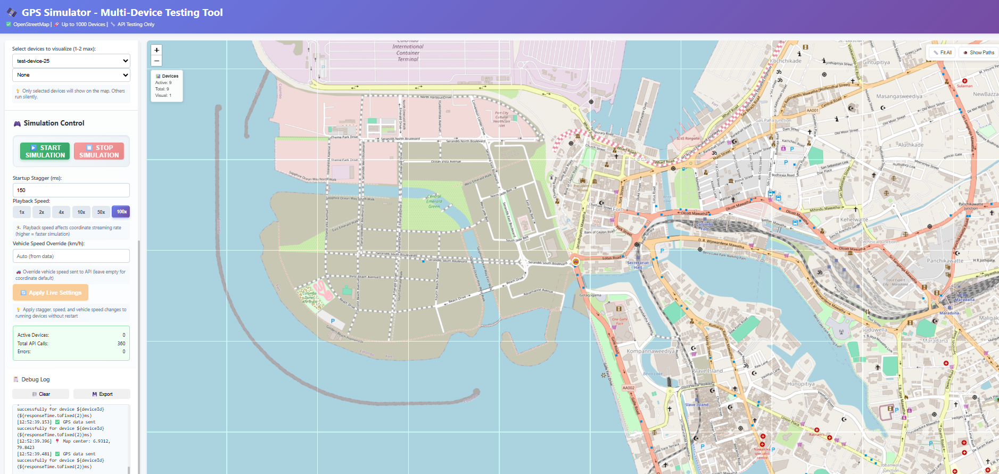
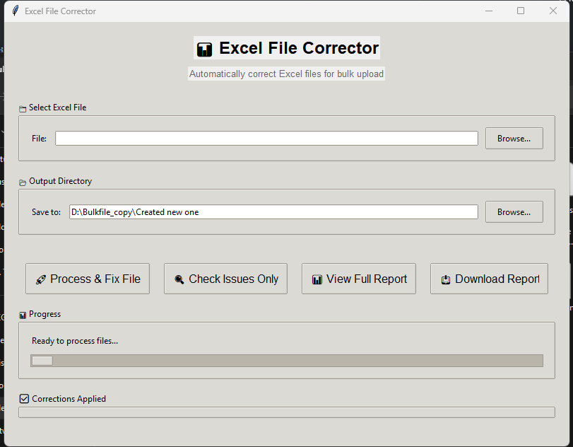

# QA Automation Portfolio

**Bathiya Lakruwan**  
Associate Software QA Engineer | 2+ Years Experience  
📧 bathiyalakruwan99@gmail.com | 🌐 [bathiya-qa.vercel.app](https://bathiya-qa.vercel.app/)

[](LICENSE)
[](https://www.python.org/)
[](https://developer.mozilla.org/en-US/docs/Web/JavaScript)
[](https://www.typescriptlang.org/)

---

## About This Repository

I build QA tools and automation frameworks to solve real testing problems. Most of these were built during my work at **Haulmatic Technologies** (Transport Management Systems) and **IFS R&D International** (ERP systems).

**Quick stats:**
- 1000+ GPS devices simulated (no physical hardware needed)
- 50% reduction in customer upload errors
- 90% faster test case creation with AI
- 1000+ test cases managed across projects
- 10+ tools built and in use

---

## Featured Projects

### GPS Testing Suite
Web-based tool that simulates up to 1000 GPS devices simultaneously. Eliminates need for physical GPS hardware when testing location-based features.

**Why it exists:** Our TMS needed multi-device GPS testing, but physical devices don't scale.

**Tech:** JavaScript, Leaflet.js, OpenStreetMap, real-time APIs

[View code →](gps-testing-suite/)



---

### Route Optimizer
Next.js app that solves the Traveling Salesman Problem for validating route optimization algorithms. Handles 50+ locations with 2-opt and 3-opt optimization.

**The challenge:** Manual validation of complex routes wasn't practical. Needed automated comparison.

**Tech:** Next.js, TypeScript, React, OSRM (real road distances)

[View code →](route-optimizer/) | *Deploy to Vercel for live demo*


---

### Excel Validator
Python tool that validates and auto-corrects Excel files before TMS upload. Reduced customer errors by 50%+.

**Problem:** Customers uploading bad Excel files → support team flooded with tickets.

**Solution:** Desktop validator with Tkinter GUI and auto-correction.

**Tech:** Python, Pandas, Tkinter, OpenPyXL

[View code →](bulkfile-generator/excel-corrector/)



---

### AI Test Case Generator
Uses Jira MCP, Figma MCP, RTMS mind mapping, and AI to auto-generate test cases. Reduced creation time from 2-4 hours to 30 minutes (90% savings).

**Workflow:** Jira MCP → Figma MCP → RTMS Mind Maps → AI → Manual Review → CSV → Testiny

**Tech:** Jira MCP, Figma MCP, RTMS, ChatGPT/Claude, Python

[View code →](test-cases-creation-automatic/)

---

## Other Tools

Quick utilities built for specific testing needs:

| Tool | What It Does | Tech |
|------|--------------|------|
| [Geo Coordinate Converter](geo-coordinate-converter/) | Address ↔ GPS conversion, batch processing | Python, Geocoding APIs |
| [Excel Diff Tool](excel-master-diff/) | Compare Excel files sheet-by-sheet | Python, Pandas |
| [Excel Job Highlighter](excel-job-highlighter/) | Color-code rows by job ID | Python, OpenPyXL |
| [Order Data Generator](order-data-generator/) | Generate realistic test order data | Python, Faker |
| [Agent & MCP Works](agent-and-mcp-works/) | AI-powered QA workflows | MCP, Prompt Engineering |

---

## Professional Experience

### Haulmatic Technologies (Jul 2024 – Present)
**Associate Software QA Engineer**

Working on Transport Management System (TMS) QA:
- Built GPS simulation suite (500+ devices)
- Created route optimization testing tool
- Developed Excel validator (50% error reduction)
- AI-powered test case generation (90% time savings)
- UI/API automation with Playwright & Selenium (POM)
- Manage 1000+ test cases (Testiny-Jira integration)

**Tech:** Playwright, Selenium, Python, JavaScript, Next.js, Testiny, Jira

---

### IFS R&D International (Mar 2023 – Feb 2024)
**Undergraduate QA Trainee**

Worked on IFS Apps 10 testing:
- System testing across releases (21R2–24R1) in 5+ environments
- Enhanced Cypress automation with Cucumber BDD
- Built Page Designer test suite (200+ scenarios)
- Fixed 30+ legacy Cypress issues
- Introduced test tagging system for better filtering

**Tech:** Cypress, Cucumber (BDD), Kendo UI, OData, Jira

---

## Tech Stack

**Test Automation:** Playwright, Selenium, Cypress, BDD (Cucumber), POM design

**Languages:** Python, JavaScript, TypeScript, SQL, HTML/CSS

**Frameworks:** Next.js, React, Flask, Pandas, Leaflet.js, Tkinter

**Tools:** Testiny, Jira, Postman, Git/GitHub, VS Code, Cursor AI

**AI/Emerging:** ChatGPT/Claude integration, Prompt engineering, MCP workflows

---

## Documentation

- **[PROJECTS.md](PROJECTS.md)** - Detailed project descriptions with challenges and learnings
- **[SKILLS.md](SKILLS.md)** - Complete technical skills breakdown
- **[LICENSE](LICENSE)** - MIT License

---

## Quick Start

Clone and explore:

```bash
git clone https://github.com/bathiyalakruwan99/testing-tool.git
cd testing-tool

# GPS Testing Suite
cd gps-testing-suite
open dashboard.html

# Route Optimizer
cd route-optimizer
npm install && npm run dev

# Excel Corrector
cd bulkfile-generator/excel-corrector
pip install -r requirements.txt
python excel_corrector_gui.py
```

Each tool has its own README with setup instructions.

---

## What I'm Working On

- Deploy Route Optimizer to Vercel (live demo)
- Add CI/CD integration (GitHub Actions)
- Improve GPS suite error handling at scale
- Explore AI for test data generation

---

## Contact

**Email:** bathiyalakruwan99@gmail.com  
**Website:** [bathiya-qa.vercel.app](https://bathiya-qa.vercel.app/)  
**LinkedIn:** [linkedin.com/in/bathiyalakruwan](https://www.linkedin.com/in/bathiyalakruwan/)  
**Location:** Badulla / Colombo, Sri Lanka

Currently open to **Senior QA Engineer** and **SDET** roles.

---

## License

MIT License - use this code however you want. See [LICENSE](LICENSE) for details.

---

*Built to solve real QA problems. If you're facing similar challenges, feel free to use or adapt any of this code.*
