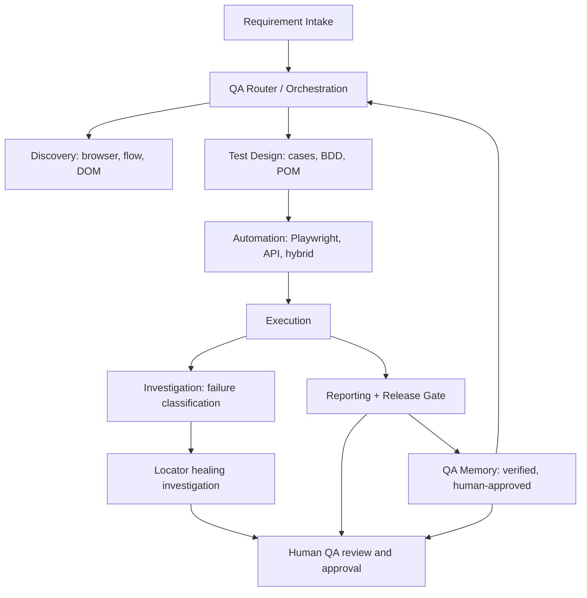
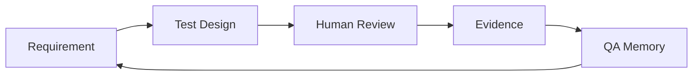
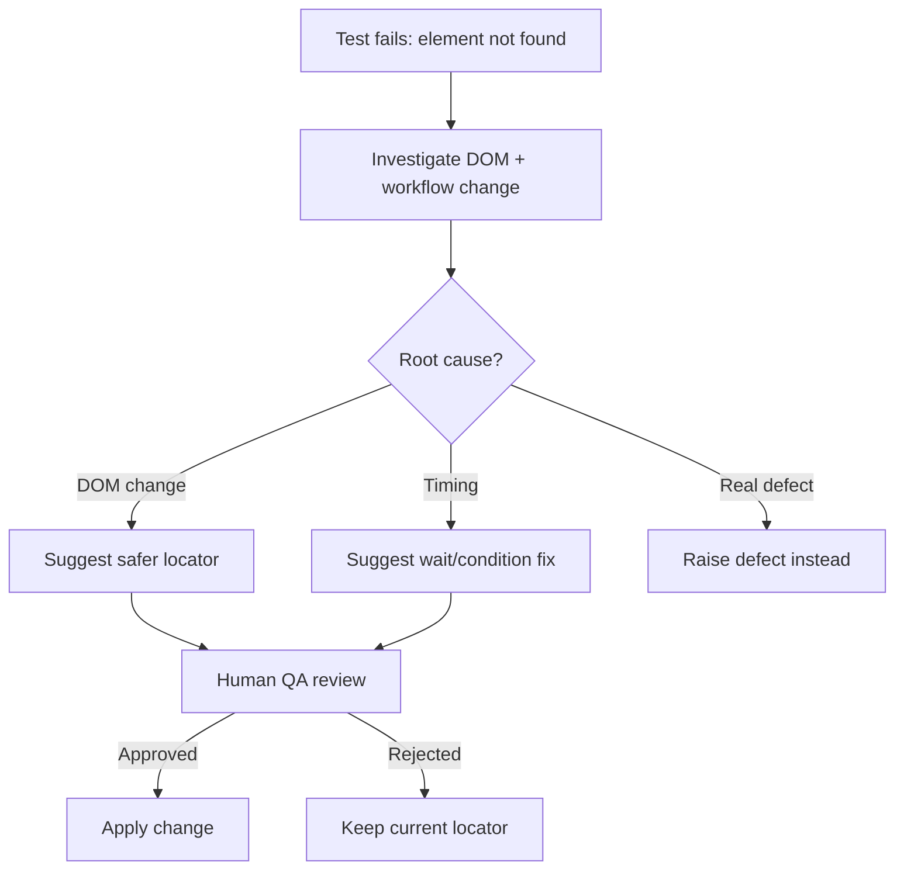
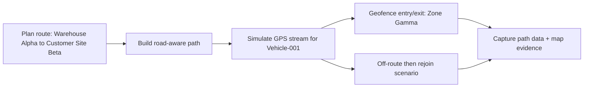
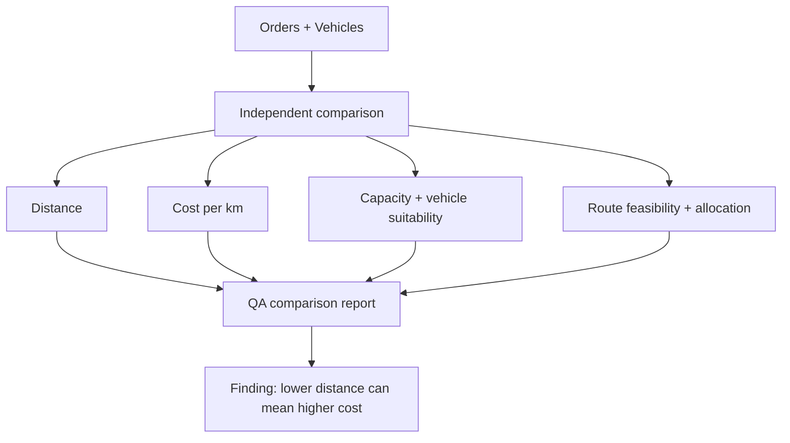
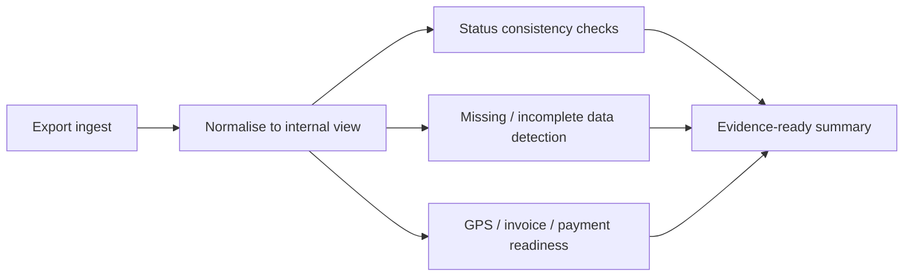

# Bathiya Lakruwan — Software Quality Assurance Engineer

**Manual QA | Automation QA | Product QA | API Testing | Web + Mobile Testing**

I am a Software Quality Assurance Engineer with hands-on experience in end-to-end product validation, automation testing, API testing, data validation, regression testing, release QA, and production issue reproduction.

My current work focuses on Transport and Supply Chain TMS workflows, including Job Master, GPS Live Map, Control Tower, Work Orders, Optimizer, Contracts, Invoicing, reporting, and Android mobile-assistance workflows.

I build reusable QA automation structures using Playwright, TypeScript, Cypress, Selenium, BDD/Cucumber, Page Object Model, API clients, Postman/Newman, k6, Python, SQL, and MongoDB validation.

This repository showcases QA tools, automation utilities, and AI-assisted QA workflows that I designed and built. Public content is sanitized to protect confidential employer systems, production data, customer information, credentials, and proprietary logic. Each project clearly states its public availability: either a sanitized technical overview, a public-safe reference implementation, or a documented QA workflow.

[](https://www.python.org/)
[](https://www.typescriptlang.org/)
[](https://playwright.dev/)

Open to **Software QA Engineer, Automation QA Engineer, Senior QA Engineer, and SDET-track opportunities**.

Contact: bathiyalakruwan99@gmail.com · [Portfolio site](https://bathiya-qa.vercel.app/) · [LinkedIn](https://www.linkedin.com/in/bathiyalakruwan99/) · [GitHub](https://github.com/bathiyalakruwan99)

---

## What I Bring to QA Teams

- **Product & Release QA:** End-to-end validation of web, mobile, workflow, reporting, invoicing, contract, optimizer, and operational-platform features.
- **Automation QA:** Playwright, TypeScript, Cypress, Selenium, BDD/Cucumber, Page Object Model, fixtures, reusable test flows, and structured reporting.
- **API & Hybrid Testing:** REST API validation, authentication, negative scenarios, JSON/schema validation, API + UI verification, Postman/Newman, and Playwright API testing.
- **Data & Reporting Validation:** SQL queries, MongoDB checks, Excel validation, report verification, calculation checks, and data-integrity testing.
- **GPS & Map Validation:** GPS coordinate testing, live map validation, geofence checks, vehicle movement simulation, route-path comparison, and location-based workflow testing.
- **Performance & CI-Ready Testing:** k6 smoke/load/stress structures, Newman execution workflows, report artifacts, and CI execution monitoring exposure.
- **AI-Assisted QA:** Requirement-to-test-case workflows, QA knowledge memory, evidence-based validation rules, locator/test-healing concepts, and release-regression planning.

---

## How to Review This Portfolio

Start with the **Smart QA Agent OS** for the flagship automation framework and AI QA operating model.
Then review the **GPS Simulator & Geofence Validation Suite** and **Route Optimizer Validation Workbench** for domain-specific testing tools.
Use the **Bulk Upload Validator** and **Job Master Data Validation & Release Evidence Tool** to review reporting and data-validation capability.

For a guided tour, see [`docs/portfolio-overview.md`](docs/portfolio-overview.md). For my testing approach see [`docs/qa-approach.md`](docs/qa-approach.md). For the confidentiality boundaries used in this repo see [`docs/confidentiality.md`](docs/confidentiality.md).

---

## Featured QA Projects

| Project | What I Built | Status | Public Availability |
|---|---|---|---|
| [Smart QA Agent OS — QA Automation & AI-Assisted Testing Prototype](smart-qa-agent-os/) | A QA automation framework plus a modular AI-assisted QA operating model (agents, skills, rules, memory) with a human QA engineer responsible for every decision | Prototype + actively used practices | Reference architecture + public-safe examples |
| [GPS Simulator & Geofence Validation Suite](gps-simulation-validation-suite/) | A web-based QA toolkit to simulate GPS activity, build movement paths, validate geofence events, and test multi-vehicle scenarios | Internal QA Tool | Sanitized public overview |
| [Route Optimizer Validation Workbench](route-optimizer-validation-workbench/) | An independent QA comparison tool that validates route-optimizer output across distance, capacity, cost, allocation, suitability, and feasibility | Internal QA Tool | Sanitized public overview |
| [Job Master Data Validation & Release Evidence Tool](job-master-validation-tool/) | A data-validation tool that processes job/work-order exports, flags exceptions, and produces release-evidence summaries | Internal QA Tool | Sanitized public overview |
| [Bulk Upload Validator & Synthetic Test Data Generator](bulk-upload-validator/) | A QA utility that validates bulk-upload data, classifies issues, and generates safe synthetic test datasets | Internal QA Tool | Sanitized public overview |
| [AI-Assisted Test Design Pipeline](ai-assisted-test-design/) | A pipeline that drafts structured test cases with AI, then requires QA review and approval before they enter the suite | Human-Reviewed QA Workflow | Sanitized public overview |
| [Jira QA Evidence & Release Readiness Tools](jira-tools/) | Python tools that collect Jira ticket data, build release-readiness views, track status history, and generate QA evidence | Public-Safe Utility | Public-safe utility collection |

Each project states what I built, its status, and what is publicly available. Source code for internal tools is not public because it contains confidential implementation details and employer-owned logic; the public pages document the capability, QA approach, and fictional examples only.

---

### 1. Smart QA Agent OS — Automation Framework + AI QA Operating Model

> **Flagship project** — the highlight of this portfolio.

A sanitized public reference implementation of an enterprise-style QA automation and release-validation workflow, **plus a modular AI QA operating model**. This is the most comprehensive project in the portfolio, combining a working automation framework with a structured AI-assisted QA architecture.

#### What makes this the flagship

This project demonstrates the full breadth of modern QA engineering in one place:

- **Automation framework** with Playwright + TypeScript (POM, BDD, API, hybrid tests, fixtures, test data)
- **AI QA Operating Model** with specialised agents, shared skill groups, quality rule categories, and memory categories
- **Evidence-first methodology** where every test result, defect, and memory update requires traceable evidence
- **End-to-end workflow** from requirement intake through release-gate decision, with continuous learning feedback loops
- **Supporting tooling** including a module template, prompt templates, QA graph visualizer, utility scripts, and sample QA output

#### Automation framework side

| Layer | What it demonstrates |
|---|---|
| Playwright + TypeScript | POM, BDD/Cucumber-style, fixtures, reusable test flows |
| UI testing | Page Objects, component objects, locator strategy, DOM capture |
| API testing | API client wrappers, contract validation, auth handling |
| Hybrid testing | API + UI combined workflows (create via API, verify via UI) |
| Performance | k6 smoke, load, stress, and soak test scripts |
| Postman/Newman | Collection-based API regression with CI execution |
| Evidence | Traces, screenshots, network logs, structured reports |
| Release gate | Evidence-based go/no-go decision flow with risk summary |

#### AI QA Operating Model side

A modular operating model that separates capability areas by maturity (Actively Used, Implemented Prototype, In Development, Learning, Planned) and keeps a human QA engineer responsible for every final decision. It covers orchestration, discovery, test design, execution, healing investigation, reporting, release, and continuous learning. Locator/test-healing is used as a guided, human-reviewed investigation workflow, not a fully autonomous runtime auto-healer.

#### End-to-end QA workflow

```
Requirement → QA Router → Discovery (browser, flow, DOM)
  → Test Planning (risk-based, test cases, BDD, POM)
  → Automation (Playwright, API, hybrid)
  → Execution → Healing (guided, human-reviewed)
  → Investigation (failure classification, defect files)
  → Reporting (evidence, release gate)
  → Memory Curation (verified learnings only, human-approved)
  → Continuous Learning (next regression is smarter)
```

#### Key principles

- **No imagined behaviour**: every test, assertion, and conclusion must be backed by browser evidence, executed tests, or approved requirement docs
- **Human QA at the center**: agents support QA work, they do not replace QA judgement
- **Evidence-first**: no evidence = not verified, no execution = not passed, no browser = not tested
- **Controlled continuous learning**: memory is updated only after human review, with status and evidence for every entry
- **Safe healing**: locator changes for monetary or critical fields always require human QA review

- [Open project →](smart-qa-agent-os/)
- [AI QA Operating Model overview →](smart-qa-agent-os/ai-qa-operating-model.md)
- [Specialised QA Agent Catalog →](smart-qa-agent-os/docs/agents-catalog.md)

---

### 2. GPS Simulator & Geofence Validation Suite — Internal QA Tool

**Problem:** GPS, live-map, geofence, and vehicle-tracking features must be tested at fleet scale without physical hardware, and the hardest scenarios, off-route drivers, GPS jumps, rejoin behaviour, and multi-vehicle scenario coverage, must be reproducible on demand.

**What I built:** A web-based QA toolkit for GPS stream simulation, road-aware vehicle movement patterns, route/path testing, geofence entry/exit validation, multi-vehicle test scenarios, and live-map QA evidence.

**QA value:** Makes off-route, detour, geofence-edge, rejoin, and scenario-based testing deterministic and repeatable; produces path data and map evidence that travels cleanly into defect reports.

**Scale:** Designed and tested for multi-device simulation, including controlled runs at up to 1,000 simulated device streams in QA scenarios.

**Public scope:** Uses fictional entities only (`Vehicle-001`, `Warehouse Alpha`, `Customer Site Beta`, `Zone Gamma`). Source code, real map data, and endpoint structures are not public.

[Open sanitized overview →](gps-simulation-validation-suite/)

---

### 3. Route Optimizer Validation Workbench — Internal QA Tool

**Problem:** Optimizer output is easy to ship and hard to verify. Lower distance does not always mean lower cost. A route with the shortest distance might pick the wrong vehicle, exceed capacity, miss a delivery window, or split a single drop across multiple loads.

**What I built:** An independent QA comparison tool that takes the same inputs as the product optimizer and compares output across distance, vehicle suitability, capacity validation, cost-per-kilometre, multi-stop behaviour, order allocation, and route feasibility.

This workbench does not replace a product optimizer. It provides an independent QA comparison layer for verifying that optimizer output is operationally sensible and internally consistent.

**QA value:** Provides a defensible, explainable expected result per scenario; catches the cost-vs-distance trap; surfaces capacity and vehicle-suitability issues; creates a repeatable and explainable comparison process for route-optimizer validation.

> Lower total distance does not always mean lower operating cost. QA validation must consider vehicle suitability, capacity, cost per kilometre, load allocation, route feasibility, and operational constraints.

[Open sanitized overview →](route-optimizer-validation-workbench/)

---

### 4. Job Master Data Validation & Release Evidence Tool — Internal QA Tool

**Problem:** Releases must be validated against large job and work-order exports covering jobs, loads, GPS, invoices, and payments. Manual reconciliation is slow and error-prone.

**What I built:** A data-validation tool that processes job and work-order exports, normalizes records, runs QA checks for status consistency, missing/incomplete data detection, and readiness, and produces an actionable exception summary.

**QA value:** Automates repeated consistency, completeness, and readiness checks across large exports; surfaces exceptions that manual review would miss; produces clean evidence for release reviews. Uses fictional records (`DEMO-JOB-1001`, `DEMO-LOAD-2001`).

[Open sanitized overview →](job-master-validation-tool/)

---

### 5. Bulk Upload Validator & Synthetic Test Data Generator — Internal QA Tool

**Problem:** Customers uploading bulk data to a platform regularly hit validation errors. Support gets flooded with tickets that are really data-quality problems, not product defects.

**What I built:** A QA utility that validates upload files, classifies data-quality issues (auto-correctable vs needs review), and generates safe synthetic test datasets for regression, negative, workflow, and performance testing.

**QA value:** Removes a common class of false defects; designed to reduce upload-related support effort by identifying data-quality issues before platform submission; provides QA with a reusable validation approach and production-data-free test data.

[Open sanitized overview →](bulk-upload-validator/)

---

### 6. AI-Assisted Test Design Pipeline — Human-Reviewed QA Workflow

**Problem:** Writing comprehensive test cases for new features is slow and repetitive, which slows the release cycle.

**What I built:** A pipeline that drafts structured test cases with AI, then requires QA review and approval before they enter the suite: AI Draft → QA Review and Refinement → QA Approval → Test Management Import. A QA engineer reviews, corrects, expands, prioritises, and approves all final test cases. QA approval is mandatory.

**QA value:** Faster first-pass drafting, more consistent structure, and more QA time available for risk analysis and exploratory testing, while keeping a defensible authoring trail.

[Open sanitized overview →](ai-assisted-test-design/) · [Detailed case study →](case-studies/ai-assisted-test-design.md)

---

### 7. Jira QA Evidence & Release Readiness Tools — Public-Safe Utility

**Problem:** QA teams spend meaningful time turning ticketing-system data into a shape that supports release decisions. Doing that by hand across many work streams is slow and error-prone.

**What I built:** Python tools that collect Jira ticket data into sanitized local structures, build release-readiness views, track status history, and map items to required regression coverage, without exposing any real ticket data, project keys, or credentials.

**QA value:** Provides repeatable, evidence-friendly views of release readiness and keeps a defensible audit trail for go/hold decisions.

[Open public-safe utility →](jira-tools/) · [Detailed case study →](case-studies/jira-qa-workflow-automation.md)

---

### Additional Case Study: AI and MCP QA Workflows

AI-assisted QA workflows for structured data analysis, validation, and cross-system reconciliation concepts, with human QA review at every decision point.

[Open case study →](case-studies/ai-mcp-qa-workflows.md)

---

## QA Workflow Diagrams

Diagrams and synthetic reports only. No source code, real data, endpoints, or screenshots. All names are fictional (`Vehicle-001`, `Warehouse Alpha`, `Customer Site Beta`, `Zone Gamma`, `Order DEMO-1001`, `DEMO-JOB-1001`).

### Smart QA Agent OS Architecture


```mermaid
flowchart TB
    Req[Requirement Intake] --> Router[QA Router / Orchestration]
    Router --> Discovery[Discovery: browser, flow, DOM]
    Router --> Design[Test Design: cases, BDD, POM]
    Design --> Auto[Automation: Playwright, API, hybrid]
    Auto --> Exec[Execution]
    Exec --> Invest[Investigation: failure classification]
    Invest --> Heal[Locator healing investigation]
    Exec --> Report[Reporting + Release Gate]
    Report --> Memory[QA Memory: verified, human-approved]
    Memory --> Router
    Heal --> Review[Human QA review and approval]
    Report --> Review
    Memory --> Review
```

### Requirement → Test Design → Human Review → Evidence → Memory


```mermaid
flowchart LR
    R[Requirement] --> TD[Test Design]
    TD --> HR[Human Review]
    HR --> EV[Evidence]
    EV --> MEM[QA Memory]
    MEM --> R
```

### Locator Healing Investigation Flow


```mermaid
flowchart TD
    Fail[Test fails: element not found] --> Inv[Investigate DOM + workflow change]
    Inv --> Cause{Root cause?}
    Cause -->|DOM change| Sug[Suggest safer locator]
    Cause -->|Timing| Wait[Suggest wait/condition fix]
    Cause -->|Real defect| Def[Raise defect instead]
    Sug --> Rev[Human QA review]
    Wait --> Rev
    Rev -->|Approved| Apply[Apply change]
    Rev -->|Rejected| Keep[Keep current locator]
```

### GPS Simulation Flow


```mermaid
flowchart LR
    Plan[Plan route: Warehouse Alpha to Customer Site Beta] --> Build[Build road-aware path]
    Build --> Sim[Simulate GPS stream for Vehicle-001]
    Sim --> Geo[Geofence entry/exit: Zone Gamma]
    Sim --> Off[Off-route then rejoin scenario]
    Geo --> Ev[Capture path data + map evidence]
    Off --> Ev
```

### Route Validation Flow


```mermaid
flowchart TD
    In[Orders + Vehicles] --> Cmp[Independent comparison]
    Cmp --> Dist[Distance]
    Cmp --> Cost[Cost per km]
    Cmp --> Cap[Capacity + vehicle suitability]
    Cmp --> Feas[Route feasibility + allocation]
    Dist --> Rep[QA comparison report]
    Cost --> Rep
    Cap --> Rep
    Feas --> Rep
    Rep --> Find[Finding: lower distance can mean higher cost]
```

### Job Master Validation Pipeline


```mermaid
flowchart LR
    Exp[Export ingest] --> Norm[Normalise to internal view]
    Norm --> Status[Status consistency checks]
    Norm --> Missing[Missing / incomplete data detection]
    Norm --> Ready[GPS / invoice / payment readiness]
    Status --> Sum[Evidence-ready summary]
    Missing --> Sum
    Ready --> Sum
```

### Synthetic Sample Reports

Fictional, non-runnable examples that show the shape of QA evidence:

- [Synthetic failure-classification report →](assets/sample-artifacts/sample-failure-classification.md)
- [Synthetic release-gate report →](assets/sample-artifacts/sample-release-gate-summary.md)
- [Synthetic QA memory update example →](assets/sample-artifacts/sample-memory-update.md)
- [All synthetic QA artifacts →](assets/sample-artifacts/)

---

## Professional Experience

### Haulmatic Technologies — Software Quality Assurance Engineer
**Jul 2024 – Present**

- Own end-to-end QA for web and Android-assistance applications across core TMS modules: Job Master, GPS Live Map, Control Tower, Work Orders, Optimizer, Contracts, and Invoicing.
- Create and maintain test plans, test scenarios, test cases, and RTMs; execute regression, exploratory, and UAT cycles for production releases.
- Manage the complete defect lifecycle in Jira including reproduction steps, severity prioritization, triage support, verification, and release sign-off.
- Perform REST API validation using Postman and Playwright/Cypress, including negative testing and authentication scenarios.
- Validate GPS, live map, geofence, and route workflows using simulation datasets to reproduce production edge cases.
- Prepared and executed 1,000+ test cases and identified 1,000+ defects across continuous release cycles.
- Built a GPS simulation suite for multi-vehicle GPS, route-path, vehicle-movement, and geofence testing scenarios, tested at up to 1,000 simulated device streams.
- Developed Python and Excel validation utilities to catch customer upload data-quality issues before platform submission, reducing upload-related support effort.
- Automated key UI and API workflows using Playwright and Selenium (POM structure).
- Built a route-optimizer validation workbench that created a repeatable, explainable comparison process for optimizer output.

**Tech:** Jira, Postman, Testiny, Playwright, Selenium, Cypress, k6, Git, Bitbucket, Excel, SQL, MongoDB

---

### IFS R&D International — Software Engineering QA Trainee
**Mar 2023 – Feb 2024**

- IFS Apps 10 system testing across releases (21R2–24R1) in 5+ environments.
- Enhanced Cypress automation with Cucumber BDD for readable, maintainable scenarios.
- Built Page Designer test suite (200+ scenarios) covering conditional logic, layouts, and data binding.
- Stabilized 30+ legacy Cypress issues; introduced a test tagging system for faster regression filtering.
- Contributed to TAR testing using OData methods, streamlining reporting and validation.

**Tech:** Cypress, Cucumber (BDD), Kendo UI, OData, Jira

---

### Team Telous — Product / QA
**Part-time / Project-based | Dec 2023**

- Converted customer feedback into structured test scenarios, validation checklists, and UAT flows.
- Supported QA planning, product validation, UX review, requirement clarification, sprint planning, retesting, and release review.
- Performed SQL-based validation for reports, payments, stock, sales, customer records, and business workflows.

**Tools:** SQL, Excel, Manual Testing, UAT Validation, Requirement Analysis, Product Validation, Release Review

---

## Education & Certifications

**Education**
- B.Sc. (Hons) in Engineering (Information & Communication) — SLTC Research University, Colombo
- Advanced Certificate in HR & Marketing Management — IDM Nations Campus

**Certifications**
- ISTQB Certified Tester – Foundation Level (CTFL) v4.0 — January 2026
- AWS Cloud Architecting — AWS Academy
- CCNA — Cisco Academy

---

## Tech Stack

**Test Automation:** Playwright, Selenium, Cypress, BDD (Cucumber), Page Object Model
**Languages:** TypeScript, JavaScript, Python, Java, SQL, HTML/CSS
**API & Performance:** Postman, Newman, REST APIs, JSON Schema, k6 (smoke/load/stress/soak)
**Data & Reporting:** SQL, MongoDB, Pandas, OpenPyXL, Excel validation
**Tools:** Jira, Testiny, Git/GitHub, Bitbucket, VS Code, Cursor AI
**AI-Assisted QA:** Model Context Protocol (MCP), prompt engineering, requirement-to-test-case workflows

---

## Reproducible Metrics

Numbers below reflect my professional QA work and are explainable in an interview:

- 1,000+ test cases prepared and executed across TMS releases
- 1,000+ defects identified and reported with reproduction evidence
- Built a route-optimizer validation workbench that created a repeatable, explainable comparison process for optimizer output
- Built a bulk-upload validator designed to reduce upload-related support effort by catching data-quality issues before platform submission
- GPS simulation tested at multi-device scale, including up to 1,000 simulated device streams in controlled QA scenarios, without physical hardware

---

## Confidentiality and Responsible Sharing

This portfolio contains sanitized case studies, demo workflows, synthetic data, and high-level architecture examples. It does not include employer source code, production data, credentials, private endpoints, customer information, or proprietary implementation details.

Sample identifiers throughout this repository (`Vehicle-001`, `Warehouse Alpha`, `Customer Site Beta`, `Zone Gamma`, `DEMO-JOB-1001`, `DEMO-LOAD-2001`, etc.) are fictional. Any resemblance to real entities is unintentional. See [`docs/confidentiality.md`](docs/confidentiality.md) for the full policy and [`NOTICE.md`](NOTICE.md) for the portfolio-use notice.

---

## Documentation

- [`docs/portfolio-overview.md`](docs/portfolio-overview.md) — Guided tour of every project
- [`docs/qa-approach.md`](docs/qa-approach.md) — How I plan, execute, and report releases
- [`docs/confidentiality.md`](docs/confidentiality.md) — Confidentiality and sanitization rules
- [`PROJECTS.md`](PROJECTS.md) — Detailed project descriptions
- [`SKILLS.md`](SKILLS.md) — Full technical skills breakdown

---

## Contact

- Email: bathiyalakruwan99@gmail.com
- Website: [bathiya-qa.vercel.app](https://bathiya-qa.vercel.app/)
- LinkedIn: [linkedin.com/in/bathiyalakruwan99](https://www.linkedin.com/in/bathiyalakruwan99/)
- GitHub: [github.com/bathiyalakruwan99](https://github.com/bathiyalakruwan99)
- Location: Badulla / Colombo, Sri Lanka

Open to **Software QA Engineer, Automation QA Engineer, Senior QA Engineer, and SDET-track opportunities**.
