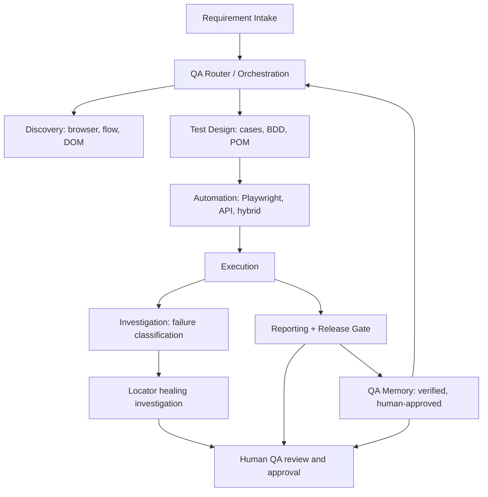
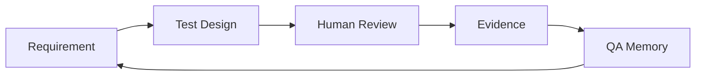
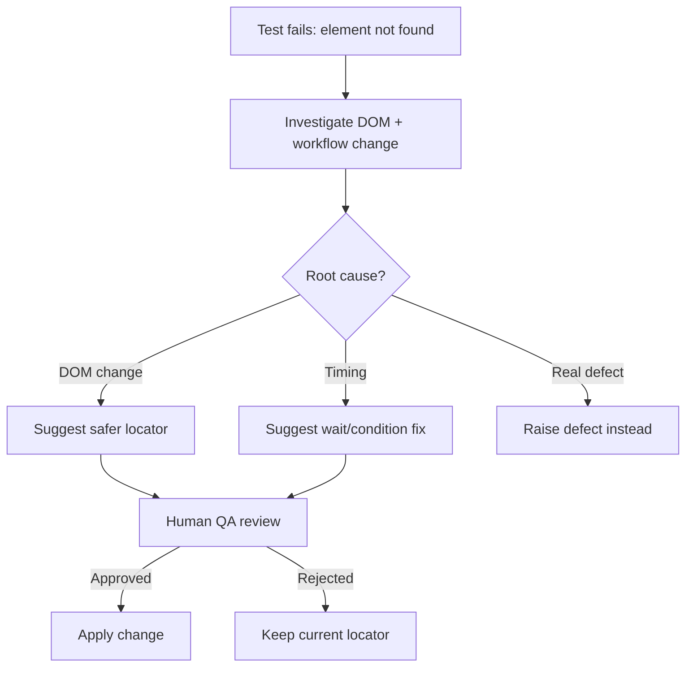
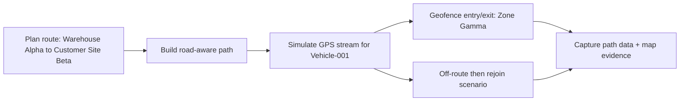
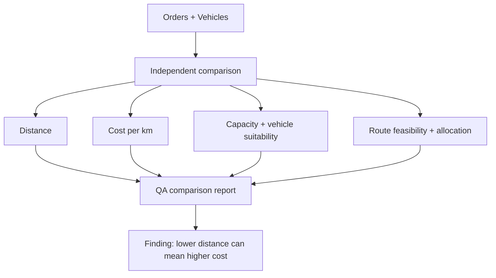
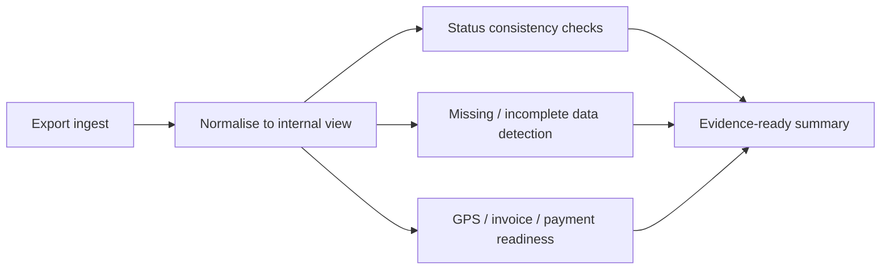

# Bathiya Lakruwan — Software Quality Assurance Engineer

**Manual QA | Automation QA | Product QA | API Testing | Web + Mobile Testing**

I am a Software Quality Assurance Engineer with hands-on experience in end-to-end product validation, automation testing, API testing, data validation, regression testing, release QA, and production issue reproduction.

My current work focuses on Transport and Supply Chain TMS workflows, including Job Master, GPS Live Map, Control Tower, Work Orders, Optimizer, Contracts, Invoicing, reporting, and Android mobile-assistance workflows.

I build reusable QA automation structures using Playwright, TypeScript, Cypress, Selenium, BDD/Cucumber, Page Object Model, API clients, Postman/Newman, k6, Python, SQL, and MongoDB validation.

This repository contains sanitized QA case studies, automation-framework examples, AI-assisted QA operating models, synthetic examples, and high-level QA documentation. It does not include proprietary code, production data, customer information, credentials, internal endpoints, confidential business logic, private prompts, private QA memory, or private implementation details.

[](https://www.python.org/)
[](https://www.typescriptlang.org/)
[](https://playwright.dev/)

Open to **Software QA Engineer, Automation QA Engineer, Senior QA Engineer, and SDET-track opportunities**.

Contact: bathiyalakruwan99@gmail.com · [Portfolio site](https://bathiya-qa.vercel.app/) · [LinkedIn](https://www.linkedin.com/in/bathiyalakruwan99/) · [GitHub](https://github.com/bathiyalakruwan99)

---

## What I Bring to QA Teams

- **Product & Release QA:** End-to-end validation of web, mobile, workflow, reporting, invoicing, contract, optimizer, and operational-platform features.
- **Automation QA:** Playwright, TypeScript, Cypress, Selenium, BDD/Cucumber, Page Object Model, fixtures, reusable test flows, and structured reporting.
- **API & Hybrid Testing:** REST API validation, authentication, negative scenarios, JSON/schema validation, API + UI verification, Postman/Newman, and Playwright API testing.
- **Data & Reporting Validation:** SQL queries, MongoDB checks, Excel validation, report verification, calculation checks, and data-integrity testing.
- **GPS & Map Validation:** GPS coordinate testing, live map validation, geofence checks, vehicle movement simulation, route-path comparison, and location-based workflow testing.
- **Performance & CI-Ready Testing:** k6 smoke/load/stress structures, Newman execution workflows, report artifacts, and CI execution monitoring exposure.
- **AI-Assisted QA:** Requirement-to-test-case workflows, QA knowledge memory, evidence-based validation rules, locator/test-healing concepts, and release-regression planning.

---

## How to Review This Portfolio

Start with the **Smart QA Agent OS** for the flagship automation framework and AI QA operating model.
Then review the **GPS Suite** and **Route Optimizer Validation Engine** for domain-specific testing tools.
Use the **Data Quality Utilities** and **Job Master Processor** to review reporting and data-validation capability.

For a guided tour, see [`docs/portfolio-overview.md`](docs/portfolio-overview.md). For my testing approach see [`docs/qa-approach.md`](docs/qa-approach.md). For the confidentiality boundaries used in this repo see [`docs/confidentiality.md`](docs/confidentiality.md).

---

## Featured QA Projects

| # | Project | What It Demonstrates | Core Stack |
|---|---|---|---|
| 1 | [Smart QA Agent OS / Automation Framework + AI QA Operating Model](smart-qa-agent-os/) | Reusable UI, API, hybrid, performance, evidence, and release-gate QA workflow plus a modular AI QA operating model (agents, skills, rules, memory) | Playwright, TypeScript, BDD, POM, Postman/Newman, k6, AI QA Operating Model |
| 2 | [GPS Simulator and Geofence Validation Suite](gps-testing-suite/) | GPS stream simulation, road-aware vehicle movement, geofence entry/exit validation, and multi-vehicle scenario coverage | JavaScript, Leaflet, OpenStreetMap, OpenRouteService, React/Vite |
| 3 | [Route Optimizer Validation Engine](route-optimizer/) | Independent optimizer validation across cost, vehicle suitability, capacity, feasibility, and order allocation, beyond raw distance | Next.js, TypeScript, public routing/map APIs, Web Workers |
| 4 | [Job Master Data Validation and Evidence Processor](jobmaster/) | Job/work-order data validation, status consistency, missing-data detection, and evidence-ready outputs | Python, Pandas, data validation |
| 5 | [Bulk Upload Data Quality Utilities](bulkfile-generator/) | Bulk upload validation, error highlighting, and synthetic test-data generation | Python, Pandas, data validation |
| 6 | [AI-Assisted Test Design Workflow](case-studies/ai-assisted-test-design.md) | Requirement to approved test case with mandatory human QA review | AI-assisted drafting, MCP, human review |
| 7 | [Jira QA Workflow and Evidence Reporting](case-studies/jira-qa-workflow-automation.md) | Release-readiness and evidence reporting workflow from a ticketing system | QA workflow, evidence reporting |

Each project is presented as a case study with the business problem, QA challenge, approach, capabilities, and QA value. No runnable source code, production data, or confidential implementation details are included.

---

### 1. Smart QA Agent OS — Automation Framework + AI QA Operating Model

> **Flagship project** — the highlight of this portfolio.

A sanitized public reference implementation of an enterprise-style QA automation and release-validation workflow, **plus a modular AI QA operating model**. This is the most comprehensive project in the portfolio, combining a working automation framework with a structured AI-assisted QA architecture.

#### What makes this the flagship

This project demonstrates the full breadth of modern QA engineering in one place:

- **Automation framework** with Playwright + TypeScript (POM, BDD, API, hybrid tests, fixtures, test data)
- **AI QA Operating Model** with specialised agents, shared skill groups, quality rule categories, and memory categories
- **Evidence-first methodology** where every test result, defect, and memory update requires traceable evidence
- **End-to-end workflow** from requirement intake through release-gate decision, with continuous learning feedback loops
- **Supporting tooling** including a module template, prompt templates, QA graph visualizer, utility scripts, and sample QA output

#### Automation framework side

| Layer | What it demonstrates |
|---|---|
| Playwright + TypeScript | POM, BDD/Cucumber-style, fixtures, reusable test flows |
| UI testing | Page Objects, component objects, locator strategy, DOM capture |
| API testing | API client wrappers, contract validation, auth handling |
| Hybrid testing | API + UI combined workflows (create via API, verify via UI) |
| Performance | k6 smoke, load, stress, and soak test scripts |
| Postman/Newman | Collection-based API regression with CI execution |
| Evidence | Traces, screenshots, network logs, structured reports |
| Release gate | Evidence-based go/no-go decision flow with risk summary |

#### AI QA Operating Model side

A modular operating model that separates capability areas by maturity (Actively Used, Implemented Prototype, In Development, Learning, Planned) and keeps a human QA engineer responsible for every final decision. It covers orchestration, discovery, test design, execution, healing investigation, reporting, release, and continuous learning. Locator/test-healing is used as a guided, human-reviewed investigation workflow, not a fully autonomous runtime auto-healer.

#### End-to-end QA workflow

```
Requirement → QA Router → Discovery (browser, flow, DOM)
  → Test Planning (risk-based, test cases, BDD, POM)
  → Automation (Playwright, API, hybrid)
  → Execution → Healing (guided, human-reviewed)
  → Investigation (failure classification, defect files)
  → Reporting (evidence, release gate)
  → Memory Curation (verified learnings only, human-approved)
  → Continuous Learning (next regression is smarter)
```

#### Key principles

- **No imagined behaviour**: every test, assertion, and conclusion must be backed by browser evidence, executed tests, or approved requirement docs
- **Human QA at the center**: agents support QA work, they do not replace QA judgement
- **Evidence-first**: no evidence = not verified, no execution = not passed, no browser = not tested
- **Controlled continuous learning**: memory is updated only after human review, with status and evidence for every entry
- **Safe healing**: locator changes for monetary or critical fields always require human QA review

- [Open project →](smart-qa-agent-os/)
- [AI QA Operating Model overview →](smart-qa-agent-os/ai-qa-operating-model.md)
- [Specialised QA Agent Catalog →](smart-qa-agent-os/docs/agents-catalog.md)

---

### 2. GPS Simulator and Geofence Validation Suite

**Problem:** GPS, live-map, geofence, and vehicle-tracking features must be tested at fleet scale without physical hardware, and the hardest scenarios, off-route drivers, GPS jumps, rejoin behaviour, and multi-vehicle scenario coverage, must be reproducible on demand.

**Solution:** A web-based QA toolkit concept for GPS stream simulation, road-aware vehicle movement patterns, route/path testing, geofence entry/exit validation, multi-vehicle test scenarios, and live-map QA evidence.

**QA value:** Makes off-route, detour, geofence-edge, rejoin, and scenario-based testing deterministic and repeatable; supports high-load, multi-vehicle testing without real hardware; produces path data and map evidence that travels cleanly into defect reports.

**Approach:** Web-based simulation with map rendering, road-aware pathing, and scenario generation. Uses fictional entities only (`Vehicle-001`, `Warehouse Alpha`, `Customer Site Beta`, `Zone Gamma`).

[Open case study →](gps-testing-suite/)

---

### 3. Route Optimizer Validation Engine

**Problem:** Optimizer output is easy to ship and hard to verify. Lower distance does not always mean lower cost. A route with the shortest distance might pick the wrong vehicle, exceed capacity, miss a delivery window, or split a single drop across multiple loads.

**Solution:** A QA reference approach that takes the same inputs as the product optimizer and produces an independent comparison view across route comparison, vehicle suitability, capacity validation, cost-per-kilometre comparison, multi-stop behaviour, order allocation, and route feasibility.

**QA value:** Provides a defensible, explainable expected result per scenario; catches the cost-vs-distance trap; surfaces capacity and vehicle-suitability issues; produces a comparison summary that travels cleanly into defect reports; reduces route/optimizer validation effort by 75%.

> Lower total distance does not always mean lower operating cost. QA validation must consider vehicle suitability, capacity, cost per kilometre, load allocation, route feasibility, and operational constraints.

[Open case study →](route-optimizer/)

---

### 4. Job Master Data Validation and Evidence Processor

**Problem:** Releases must be validated against large job and work-order exports covering jobs, loads, GPS, invoices, and payments. Manual reconciliation is slow and error-prone.

**Solution:** A data-validation workflow that ingests an export, normalises it into a consistent internal view, and runs QA checks for status consistency, missing/incomplete data detection, and GPS/invoice/payment/workflow-readiness, producing evidence-ready outputs.

**QA value:** Cuts data verification from minutes per check to seconds; detects inconsistencies and missing data that manual review would miss; produces clean evidence for defect reports and release reviews. Uses fictional records (`DEMO-JOB-1001`, `DEMO-LOAD-2001`).

[Open case study →](jobmaster/)

---

### 5. Bulk Upload Data Quality Utilities

**Problem:** Customers uploading bulk data to a platform regularly hit validation errors. Support gets flooded with tickets that are really data-quality problems, not product defects.

**Solution:** A data-quality and validation workflow that validates required fields, formats, and duplicates, highlights fields that need human attention, and generates fictional synthetic test data for QA workflows.

**QA value:** Removes a common class of false defects, cuts support load by 50%+ for upload-related tickets, and provides QA with a reusable validation approach to harden new ingestion flows.

[Open case study →](bulkfile-generator/)

---

### 6. AI-Assisted Test Design Workflow

**Problem:** Writing comprehensive test cases for new features is slow and repetitive, which slows the release cycle.

**Solution:** A documented workflow that moves from requirement to risk analysis to a test scenario draft, through mandatory human QA review, to an approved test case and a test-management import concept. AI-assisted drafting supports first-pass test design; a QA engineer reviews, corrects, expands, prioritises, and approves all final test cases.

**QA value:** Cuts time-to-first-draft from hours to minutes per module, improves coverage consistency, and keeps a defensible authoring trail.

[Open case study →](case-studies/ai-assisted-test-design.md) · [Test data and spreadsheet validation →](test-cases-creation-automatic/)

---

### 7. Jira QA Workflow and Evidence Reporting

**Problem:** QA teams spend meaningful time turning ticketing-system data into a shape that supports release decisions. Doing that by hand across many work streams is slow and error-prone.

**Solution:** A high-level workflow that organises ticketing-system data into release-readiness and evidence views, tracks status history, and maps items to required regression coverage, without exposing any ticket data, project keys, or credentials.

**QA value:** Provides repeatable, evidence-friendly views of release readiness and keeps a defensible audit trail for go/hold decisions.

[Open case study →](case-studies/jira-qa-workflow-automation.md) · [Jira QA tools overview →](jira-tools/)

---

### Additional Case Study: AI and MCP QA Workflows

AI-assisted QA workflows for structured data analysis, validation, and cross-system reconciliation concepts, with human QA review at every decision point.

[Open case study →](case-studies/ai-mcp-qa-workflows.md)

---

## QA Workflow Diagrams (Public-Safe Visuals)

Public-safe diagrams and synthetic reports only. No source code, real data, endpoints, or screenshots. All names are fictional (`Vehicle-001`, `Warehouse Alpha`, `Customer Site Beta`, `Zone Gamma`, `Order DEMO-1001`, `DEMO-JOB-1001`).

### Smart QA Agent OS Architecture


```mermaid
flowchart TB
    Req[Requirement Intake] --> Router[QA Router / Orchestration]
    Router --> Discovery[Discovery: browser, flow, DOM]
    Router --> Design[Test Design: cases, BDD, POM]
    Design --> Auto[Automation: Playwright, API, hybrid]
    Auto --> Exec[Execution]
    Exec --> Invest[Investigation: failure classification]
    Invest --> Heal[Locator healing investigation]
    Exec --> Report[Reporting + Release Gate]
    Report --> Memory[QA Memory: verified, human-approved]
    Memory --> Router
    Heal --> Review[Human QA review and approval]
    Report --> Review
    Memory --> Review
```

### Requirement → Test Design → Human Review → Evidence → Memory


```mermaid
flowchart LR
    R[Requirement] --> TD[Test Design]
    TD --> HR[Human Review]
    HR --> EV[Evidence]
    EV --> MEM[QA Memory]
    MEM --> R
```

### Locator Healing Investigation Flow


```mermaid
flowchart TD
    Fail[Test fails: element not found] --> Inv[Investigate DOM + workflow change]
    Inv --> Cause{Root cause?}
    Cause -->|DOM change| Sug[Suggest safer locator]
    Cause -->|Timing| Wait[Suggest wait/condition fix]
    Cause -->|Real defect| Def[Raise defect instead]
    Sug --> Rev[Human QA review]
    Wait --> Rev
    Rev -->|Approved| Apply[Apply change]
    Rev -->|Rejected| Keep[Keep current locator]
```

### GPS Simulation Flow


```mermaid
flowchart LR
    Plan[Plan route: Warehouse Alpha to Customer Site Beta] --> Build[Build road-aware path]
    Build --> Sim[Simulate GPS stream for Vehicle-001]
    Sim --> Geo[Geofence entry/exit: Zone Gamma]
    Sim --> Off[Off-route then rejoin scenario]
    Geo --> Ev[Capture path data + map evidence]
    Off --> Ev
```

### Route Validation Flow


```mermaid
flowchart TD
    In[Orders + Vehicles] --> Cmp[Independent comparison]
    Cmp --> Dist[Distance]
    Cmp --> Cost[Cost per km]
    Cmp --> Cap[Capacity + vehicle suitability]
    Cmp --> Feas[Route feasibility + allocation]
    Dist --> Rep[QA comparison report]
    Cost --> Rep
    Cap --> Rep
    Feas --> Rep
    Rep --> Find[Finding: lower distance can mean higher cost]
```

### Job Master Validation Pipeline


```mermaid
flowchart LR
    Exp[Export ingest] --> Norm[Normalise to internal view]
    Norm --> Status[Status consistency checks]
    Norm --> Missing[Missing / incomplete data detection]
    Norm --> Ready[GPS / invoice / payment readiness]
    Status --> Sum[Evidence-ready summary]
    Missing --> Sum
    Ready --> Sum
```

### Synthetic Sample Reports

Fictional, non-runnable examples that show the shape of QA evidence:

- [Synthetic failure-classification report →](assets/sample-artifacts/sample-failure-classification.md)
- [Synthetic release-gate report →](assets/sample-artifacts/sample-release-gate-summary.md)
- [Synthetic QA memory update example →](assets/sample-artifacts/sample-memory-update.md)
- [All synthetic QA artifacts →](assets/sample-artifacts/)

---

## Professional Experience

### Haulmatic Technologies — Software Quality Assurance Engineer
**Jul 2024 – Present**

- Own end-to-end QA for web and Android-assistance applications across core TMS modules: Job Master, GPS Live Map, Control Tower, Work Orders, Optimizer, Contracts, and Invoicing.
- Create and maintain test plans, test scenarios, test cases, and RTMs; execute regression, exploratory, and UAT cycles for production releases.
- Manage the complete defect lifecycle in Jira including reproduction steps, severity prioritization, triage support, verification, and release sign-off.
- Perform REST API validation using Postman and Playwright/Cypress, including negative testing and authentication scenarios.
- Validate GPS, live map, geofence, and route workflows using simulation datasets to reproduce production edge cases.
- Prepared and executed 1,000+ test cases and identified 1,000+ defects across continuous release cycles.
- Built a GPS simulation suite for high-load, multi-vehicle GPS, route-path, vehicle-movement, and geofence testing scenarios.
- Developed Python and Excel validation utilities, reducing customer upload errors by over 50%.
- Automated key UI and API workflows using Playwright and Selenium (POM structure).
- Built route and optimization validation, reducing route and optimizer testing effort by 75%.

**Tech:** Jira, Postman, Testiny, Playwright, Selenium, Cypress, k6, Git, Bitbucket, Excel, SQL, MongoDB

---

### IFS R&D International — Software Engineering QA Trainee
**Mar 2023 – Feb 2024**

- IFS Apps 10 system testing across releases (21R2–24R1) in 5+ environments.
- Enhanced Cypress automation with Cucumber BDD for readable, maintainable scenarios.
- Built Page Designer test suite (200+ scenarios) covering conditional logic, layouts, and data binding.
- Stabilized 30+ legacy Cypress issues; introduced a test tagging system for faster regression filtering.
- Contributed to TAR testing using OData methods, streamlining reporting and validation.

**Tech:** Cypress, Cucumber (BDD), Kendo UI, OData, Jira

---

### Team Telous — Product / QA
**Part-time / Project-based | Dec 2023**

- Converted customer feedback into structured test scenarios, validation checklists, and UAT flows.
- Supported QA planning, product validation, UX review, requirement clarification, sprint planning, retesting, and release review.
- Performed SQL-based validation for reports, payments, stock, sales, customer records, and business workflows.

**Tools:** SQL, Excel, Manual Testing, UAT Validation, Requirement Analysis, Product Validation, Release Review

---

## Education & Certifications

**Education**
- B.Sc. (Hons) in Engineering (Information & Communication) — SLTC Research University, Colombo
- Advanced Certificate in HR & Marketing Management — IDM Nations Campus

**Certifications**
- ISTQB Certified Tester – Foundation Level (CTFL) v4.0 — January 2026
- AWS Cloud Architecting — AWS Academy
- CCNA — Cisco Academy

---

## Tech Stack

**Test Automation:** Playwright, Selenium, Cypress, BDD (Cucumber), Page Object Model
**Languages:** TypeScript, JavaScript, Python, Java, SQL, HTML/CSS
**API & Performance:** Postman, Newman, REST APIs, JSON Schema, k6 (smoke/load/stress/soak)
**Data & Reporting:** SQL, MongoDB, Pandas, OpenPyXL, Excel validation
**Tools:** Jira, Testiny, Git/GitHub, Bitbucket, VS Code, Cursor AI
**AI-Assisted QA:** Model Context Protocol (MCP), prompt engineering, requirement-to-test-case workflows

---

## Reproducible Metrics

Numbers below are explainable and tied to evidence in this repository:

- 1,000+ test cases prepared and executed across TMS releases
- 1,000+ defects identified and reported with reproduction evidence
- 75% reduction in route/optimizer validation effort
- 50%+ reduction in customer upload errors
- High-load GPS testing scenarios validated without physical hardware

---

## Confidentiality and Responsible Sharing

This portfolio contains sanitized case studies, demo workflows, synthetic data, and high-level architecture examples. It does not include employer source code, production data, credentials, private endpoints, customer information, or proprietary implementation details.

Sample identifiers throughout this repository (`Vehicle-001`, `Warehouse Alpha`, `Customer Site Beta`, `Zone Gamma`, `DEMO-JOB-1001`, `DEMO-LOAD-2001`, etc.) are fictional. Any resemblance to real entities is unintentional. See [`docs/confidentiality.md`](docs/confidentiality.md) for the full policy and [`NOTICE.md`](NOTICE.md) for the portfolio-use notice.

---

## Documentation

- [`docs/portfolio-overview.md`](docs/portfolio-overview.md) — Guided tour of every project
- [`docs/qa-approach.md`](docs/qa-approach.md) — How I plan, execute, and report releases
- [`docs/confidentiality.md`](docs/confidentiality.md) — Confidentiality and sanitization rules
- [`PROJECTS.md`](PROJECTS.md) — Detailed project descriptions
- [`SKILLS.md`](SKILLS.md) — Full technical skills breakdown

---

## Contact

- Email: bathiyalakruwan99@gmail.com
- Website: [bathiya-qa.vercel.app](https://bathiya-qa.vercel.app/)
- LinkedIn: [linkedin.com/in/bathiyalakruwan99](https://www.linkedin.com/in/bathiyalakruwan99/)
- GitHub: [github.com/bathiyalakruwan99](https://github.com/bathiyalakruwan99)
- Location: Badulla / Colombo, Sri Lanka

Open to **Software QA Engineer, Automation QA Engineer, Senior QA Engineer, and SDET-track opportunities**.
