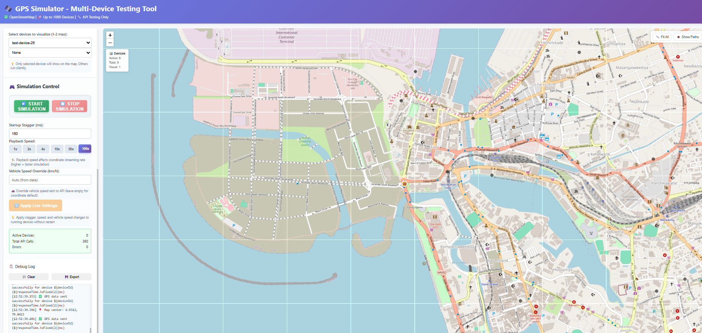
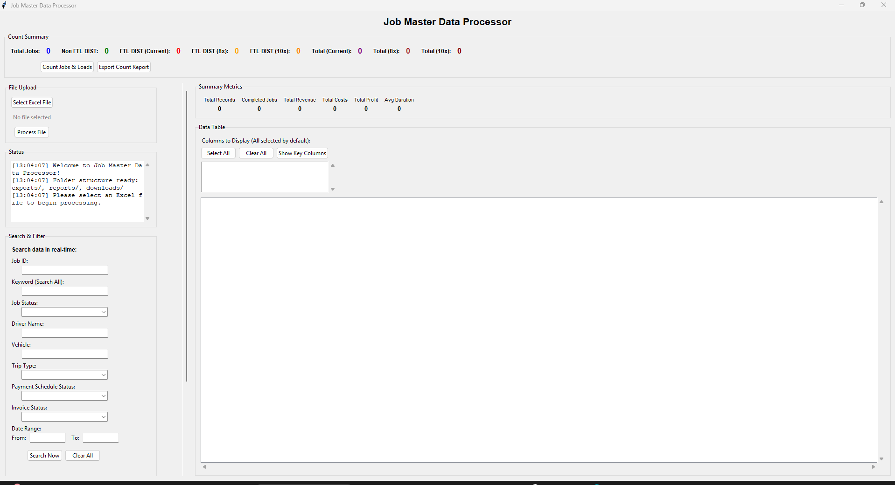

# QA Automation Portfolio

**Bathiya Lakruwan**  
Associate Software QA Engineer | 2+ Years Experience  
📧 bathiyalakruwan99@gmail.com | 🌐 [bathiya-qa.vercel.app](https://bathiya-qa.vercel.app/)

[](LICENSE)
[](https://www.python.org/)
[](https://developer.mozilla.org/en-US/docs/Web/JavaScript)
[](https://www.typescriptlang.org/)

---

## About This Repository

I build QA tools and automation frameworks to solve real testing problems. Most of these were built during my work at **Haulmatic Technologies** (Transport Management Systems) and **IFS R&D International** (ERP systems).

**Quick stats:**
- 9 standalone tools built (plus AI/MCP workflows)
- 1000+ GPS devices simulated (no physical hardware needed)
- 50% reduction in customer upload errors
- 2+ hours saved daily on test data verification
- 90% faster test case creation with AI workflows
- 1000+ test cases managed across projects

---

## Featured Projects

### GPS Testing Suite
Web-based tool that simulates up to 1000 GPS devices simultaneously. Eliminates need for physical GPS hardware when testing location-based features.

**Why it exists:** Our TMS needed multi-device GPS testing, but physical devices don't scale.

**Tech:** JavaScript, Leaflet.js, OpenStreetMap, real-time APIs

[View code →](gps-testing-suite/)



---

### Route Optimizer
Next.js app that solves the Traveling Salesman Problem for validating route optimization algorithms. Handles 50+ locations with 2-opt and 3-opt optimization.

**The challenge:** Manual validation of complex routes wasn't practical. Needed automated comparison.

**Tech:** Next.js, TypeScript, React, OSRM (real road distances)

[View code →](route-optimizer/) | *Deploy to Vercel for live demo*


---

### Excel Validator
Python tool that validates and auto-corrects Excel files before TMS upload. Reduced customer errors by 50%+.

**Problem:** Customers uploading bad Excel files → support team flooded with tickets.

**Solution:** Desktop validator with Tkinter GUI and auto-correction.

**Tech:** Python, Pandas, Tkinter, OpenPyXL

[View code →](bulkfile-generator/excel-corrector/)


---

### Job Master Data Processor
Desktop app for verifying job data from TMS Excel exports. Saves 2+ hours daily on test data verification.

**The testing problem:** Manually filtering Excel exports, calculating expected load counts for validation, and checking GPS/payment/invoice status across hundreds of test cases was taking too long.

**Solution:** Real-time search across all fields, calculates loads with three different methods (including prorated FTL-DISTRIBUTION logic), bulk status checker for 2000+ jobs in 30 seconds.

**QA benefits:**
- Test data verification: 15-20 minutes → 2 minutes
- Load calculation validation (three methods side-by-side)
- Bug reporting with complete job data exports
- Multi-sheet exports for test evidence

**Tech:** Python, Pandas, Tkinter

[View code →](jobmaster/)



---

## AI/MCP Workflows

### AI Test Case Generation Workflow
Automated test case creation using MCP integrations and AI. Reduced creation time from 2-4 hours to 30 minutes (90% savings).

**Process:** Jira MCP → Figma MCP → RTMS Mind Maps → AI → Manual Review → CSV → Testiny

**What it is:** A workflow/process, not a standalone tool. Uses existing platforms (Jira, Figma, AI) with MCP integrations to automate test case generation.

**Tech:** Jira MCP, Figma MCP, RTMS, ChatGPT/Claude, Python

[View workflow docs →](test-cases-creation-automatic/)

### Agent & MCP Works
AI-powered QA workflows and automation processes using Model Context Protocol integrations.

**What it includes:** Various AI workflows for invoice analysis, job progress checking, platform data collection, and other QA tasks.

**Tech:** MCP, Prompt Engineering, AI Agents

[View workflows →](agent-and-mcp-works/)

---

## Other Tools

Quick utilities built for specific testing needs:

| Tool | What It Does | Tech |
|------|--------------|------|
| [Jira QA Tools](jira-tools/) | Sync tickets, ticket history (10+ samples), manifests, reports, 76+ QA prompts | Python, Jira API |
| [Geo Coordinate Converter](geo-coordinate-converter/) | Address ↔ GPS conversion, batch processing | Python, Geocoding APIs |
| [Excel Diff Tool](excel-master-diff/) | Compare Excel files sheet-by-sheet | Python, Pandas |
| [Excel Job Highlighter](excel-job-highlighter/) | Color-code rows by job ID | Python, OpenPyXL |
| [Order Data Generator](order-data-generator/) | Generate realistic test order data | Python, Faker |

---

## Professional Experience

### Haulmatic Technologies (Jul 2024 – Present)
**Associate Software QA Engineer**

Working on Transport Management System (TMS) QA:
- Built GPS simulation suite (1000+ devices)
- Created route optimization testing tool
- Developed Excel validator (50% error reduction)
- Built Job Master data processor (saves 2+ hours daily on test verification)
- Built Jira QA tools (ticket sync, history, manifests, reports)
- Implemented AI/MCP workflows for test case generation (90% time savings)
- UI/API automation with Playwright & Selenium (POM)
- Manage 1000+ test cases (Testiny-Jira integration)

**Tech:** Playwright, Selenium, Python, JavaScript, Next.js, Testiny, Jira

---

### IFS R&D International (Mar 2023 – Feb 2024)
**Software Engineering QA Trainee**

Working on R&D team configuration:
- Worked on IFS Apps 10 testing:
- System testing across releases (21R2–24R1) in 5+ environments
- Enhanced Cypress automation with Cucumber BDD
- Built Page Designer test suite (200+ scenarios)
- Fixed 30+ legacy Cypress issues
- Contributed to TAR testing with O data methods, streamlining reporting and validation tasks
- Introduced a test tagging system for better filtering

**Tech:** Cypress, Cucumber (BDD), Kendo UI, OData, Jira

---

## Tech Stack

**Test Automation:** Playwright, Selenium, Cypress, BDD (Cucumber), POM design

**Languages:** Python, JavaScript, TypeScript, SQL, HTML/CSS, PHP, SQL

**Frameworks:** Next.js, React, Flask, Pandas, Leaflet.js, Tkinter, POM, TestNG, Cucumber BDD, REST APIs, Kendo UI

**Tools:** Testiny, Jira, Postman, Git/GitHub, VS Code, Cursor AI, ChatGPT, Cursor, Copilot, MCP

**AI/Emerging:** ChatGPT/Claude integration, Prompt engineering, MCP workflows

 **Creative & Design**: Figma, Canva, AI Image Generation 

---

## Documentation

- **[PROJECTS.md](PROJECTS.md)** - Detailed project descriptions with challenges and learnings
- **[SKILLS.md](SKILLS.md)** - Complete technical skills breakdown
- **[LICENSE](LICENSE)** - MIT License

---

## Quick Start

Clone and explore:

```bash
git clone https://github.com/bathiyalakruwan99/qa-automation-portfolio.git
cd qa-automation-portfolio

# GPS Testing Suite
cd gps-testing-suite
open dashboard.html

# Route Optimizer
cd route-optimizer
npm install && npm run dev

# Excel Corrector
cd bulkfile-generator/excel-corrector
pip install -r requirements.txt
python excel_corrector_gui.py

# Job Master Data Processor
cd jobmaster
pip install -r requirements.txt
python desktop_app.py

# Jira QA Tools
cd jira-tools
pip install -r requirements.txt
python scripts/export_ticket_history_to_excel.py
```

Each tool has its own README with setup instructions.

---

## What I'm Working On

- Deploy Route Optimizer to Vercel (live demo)
- Add CI/CD integration (GitHub Actions)
- Improve GPS suite error handling at scale
- Explore AI for test data generation

---

## Contact

**Email:** bathiyalakruwan99@gmail.com  
**Website:** [bathiya-qa.vercel.app](https://bathiya-qa.vercel.app/)  
**LinkedIn:** [linkedin.com/in/bathiyalakruwan](https://www.linkedin.com/in/bathiyalakruwan/)  
**Location:** Badulla / Colombo, Sri Lanka

Currently open to **Senior QA Engineer** and **SDET** roles.

---

## License

MIT License - use this code however you want. See [LICENSE](LICENSE) for details.

---

*Built to solve real QA problems. If you're facing similar challenges, feel free to use or adapt any of this code.*
