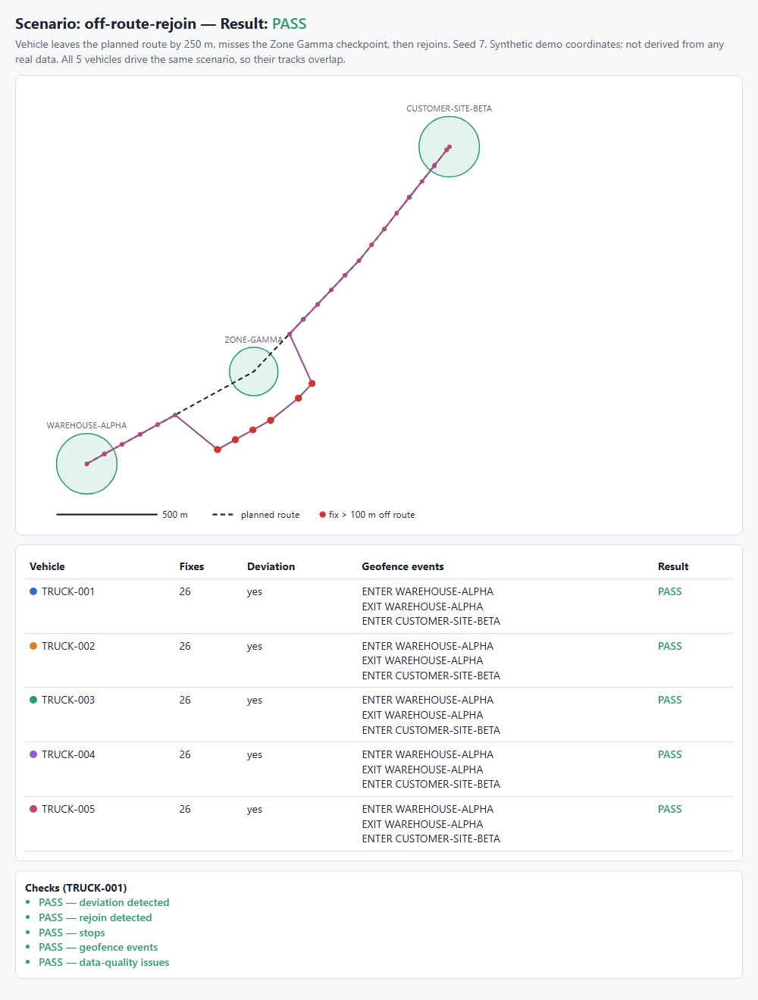

# Bathiya Lakruwan — QA Engineer

**QA Engineer | Automation | Product QA**

Playwright · TypeScript · API Testing · TMS / Logistics · GPS · Data Validation · AI-Assisted QA

[](https://github.com/bathiyalakruwan99/qa-automation-portfolio/actions/workflows/ci.yml)
[](https://github.com/bathiyalakruwan99/qa-automation-portfolio/actions/workflows/playwright-smoke.yml)
[](https://github.com/bathiyalakruwan99/qa-automation-portfolio/actions/workflows/api-regression.yml)
[](https://playwright.dev/)
[](https://www.typescriptlang.org/)
[](https://www.python.org/)
[](https://learning.postman.com/docs/collections/using-newman-cli/command-line-integration-with-newman/)
[](https://k6.io/)

QA Engineer focused on product quality, test automation, data validation and complex logistics workflows (transport management, GPS tracking, route planning).

Contact: [bathiyalakruwan99@gmail.com](mailto:bathiyalakruwan99@gmail.com) · [Portfolio site](https://bathiya-qa.vercel.app/) · [LinkedIn](https://www.linkedin.com/in/bathiyalakruwan99/) · [GitHub](https://github.com/bathiyalakruwan99)

> **Portfolio status (October 2026):** every featured project is now a **runnable, independently built public demo** with automated tests. CI for the framework is verified on GitHub Actions; the workflows for the newer tools are rehearsed locally and get their first GitHub run when merged. The [maturity matrix](#project-maturity) shows exactly what is public code and how mature each part is.

---

## Core Engineering Areas

- Playwright + TypeScript (Page Object Model, fixtures, typed test data, business flows)
- UI, API, and UI + API hybrid testing
- Product, exploratory, regression, and release QA
- Transport Management Systems (TMS) and logistics workflows
- GPS, live-map, and geofence testing
- Route-optimizer output validation
- Data, Excel, and CSV validation
- AI-assisted QA with mandatory human review
- Evidence-based release readiness

---

## Featured Projects

### 1. Smart QA Automation Framework

Runnable Playwright + TypeScript framework with its own fictional logistics app: Page Object Model, components, fixtures, seeded typed data, business flows, typed API clients with contract schemas, UI + API hybrid tests, a state-driven workflow engine with guardrails, and failure classification. A human-governed AI QA operating model sits alongside it.

- **Public today:** `npm test` runs 30 Playwright tests (API, UI, negative, hybrid, state engine; plus an auth setup step) against the local demo app, plus 116 unit tests, a Newman collection, k6 scripts and GitHub Actions workflows.
- **Verified:** locally and on GitHub Actions (CI, smoke and API regression passed on the first run, PR #3); deliberate fault-injection checks show the suites catch planted defects.

[View project →](smart-qa-automation-framework/)


### 2. GPS Simulation & Validation Suite

Approach for testing GPS, live-map and geofence features without hardware: route playback, multi-device simulation, geofence enter/exit and boundary cases, off-route and rejoin scenarios.

- **Public today:** TypeScript simulator + validators, 5 JSON scenarios on synthetic coordinates, CLI with PASS/FAIL exit codes, offline map viewer, 32 tests (GPS-001…010). 1000 vehicles in about 1.7 s; same seed, byte-identical output.

[View project →](gps-simulation-validation-suite/)



### 3. Route Optimizer Validation Workbench

An independent QA validation layer for route-optimizer **output** (not an optimizer): order allocation, duplicates, missing orders, capacity, vehicle suitability, route sanity.

- **Public today:** six TypeScript validators, a clean plan and a plan with one planted defect per validator, CLI report that never says "approved", 19 tests (ROUTE-001…017).

[View project →](route-optimizer-validation-workbench/)

### 4. Data Validation Toolkit

Bulk-upload and job/load reconciliation validation: required fields, duplicates, formats, references, cross-field rules, orphan records, status/progress consistency, structured reports, synthetic data generation.

- **Public today:** a Python bulk upload validator for CSV + XLSX, with a fault-injecting data generator used as a test oracle (36 tests), and a job / load / activity reconciliation tool that deliberately does not infer progress formulas (21 tests).

[View Bulk Upload Validator →](bulk-upload-validator/) · [View Job Data Validation Tool →](job-data-validation-tool/)

### More

| Project | What it covers | Status |
| --- | --- | --- |
| [AI-Assisted Test Design](ai-assisted-test-design/) | Prompt templates, test-case schema, and a validator that rejects invented criteria and self-approved AI drafts | Prototype with runnable tooling (17 tests) |
| [Jira Release-Readiness Tools](jira-tools/) | Offline release readiness, regression mapping, status history over fictional tickets | Runnable demo (19 tests) |
| [AI and MCP QA Workflows](case-studies/ai-mcp-qa-workflows.md) | AI-assisted analysis and reconciliation with human review | Case study |

---

## Quick Start

No accounts, VPN or private configuration needed; every demo runs on its own synthetic data.

```bash
git clone https://github.com/bathiyalakruwan99/qa-automation-portfolio.git
cd qa-automation-portfolio

# Playwright framework + demo app (Node 22.12+)
cd smart-qa-automation-framework && npm ci && npx playwright install chromium && npm test && cd ..

# TypeScript QA tools
cd gps-simulation-validation-suite && npm ci && npm test && npm run gps -- --scenario off-route-rejoin --devices 5 && cd ..
cd route-optimizer-validation-workbench && npm ci && npm test && npm run validate:clean && cd ..

# Python QA tools (3.11+): same pattern in each folder
cd bulk-upload-validator && python -m venv .venv && . .venv/bin/activate && pip install -r requirements-dev.txt && pytest
# Windows (PowerShell): python -m venv .venv; .venv\Scripts\Activate.ps1; pip install -r requirements-dev.txt; pytest
```

The Python folders are `bulk-upload-validator`, `job-data-validation-tool`, `jira-tools` and
`ai-assisted-test-design`. Each README has its own run commands and real sample output.

---

## Project Maturity

What is publicly verifiable in this repository **today**. Labels are updated as each runnable demo lands.

| Area | Public code today | Professional relevance | Public maturity |
| --- | --- | --- | --- |
| Playwright framework (POM, fixtures, flows, local demo app) | Yes | High | Runnable demo |
| API automation (typed clients, schemas, Newman) | Yes | High | Runnable demo |
| UI + API hybrid testing | Yes | High | Runnable demo |
| GPS simulation and validation | Yes | High | Runnable demo |
| Route-output validation | Yes | High | Runnable demo |
| Bulk upload / data validation | Yes | High | Runnable demo |
| Job / load reconciliation | Yes | High | Runnable demo |
| Jira release-readiness tools | Yes (offline) | Medium | Runnable demo |
| AI-assisted QA workflow | Templates, schema, governance validator | High | Prototype (human-reviewed) |
| State-driven workflow engine | Yes | High | Runnable demo (unit + diagnostic tests) |
| k6 performance testing | Scripts against the local demo app; smoke run only | Developing | Learning |
| CI/CD | Checks, smoke, API regression and secret scan (verified on GitHub Actions); QA tools and nightly workflows (rehearsed locally, first GitHub run pending) | Developing | Working knowledge |

Labels used across the repo: **Runnable Demo**, **Reference Implementation**, **Prototype**, **Learning**, **Case Study / Documentation**.

---

## How This Portfolio Is Built

- **Independently recreated.** Public code is written from the general QA problem, never copied from employer systems. Employer source code, data, endpoints, selectors, payloads and business rules are not in this repository.
- **Synthetic data only.** One consistent fictional world: Northstar Logistics, Customer Alpha, Warehouse Alpha, Customer Site Beta, `TRUCK-001`, `DEMO-JOB-1001`.
- **Evidence first.** A test that was not executed is not reported as passed; a CI badge appears only after a real green run.
- **Human QA decides.** AI drafts and assists; humans review, approve and own release decisions.

Details: [`docs/confidentiality.md`](docs/confidentiality.md) · [`docs/qa-approach.md`](docs/qa-approach.md) · [`docs/qa-workflow-diagrams.md`](docs/qa-workflow-diagrams.md) · [`docs/portfolio-overview.md`](docs/portfolio-overview.md)

---

## Professional Experience

### Haulmatic Technologies — Software Quality Assurance Engineer (Jul 2024 – Present)

- End-to-end QA for web and Android-assistance applications across TMS modules (job management, GPS live map, control tower, work orders, optimizer, contracts, invoicing).
- Test plans, scenarios, test cases and RTMs; regression, exploratory and UAT cycles for production releases; full Jira defect lifecycle through release sign-off.
- REST API validation (Postman, Playwright, Cypress) including negative and authentication scenarios.
- Automated key UI and API workflows with Playwright (POM) and Selenium.
- Built internal QA tooling for GPS simulation, route-optimizer output comparison, and upload-data validation.

### IFS R&D International — Software Engineering QA Trainee (Mar 2023 – Feb 2024)

- IFS Apps 10 system testing across releases 21R2–24R1 in 5+ environments.
- Cypress + Cucumber BDD automation; Page Designer suite (200+ scenarios); stabilised 30+ legacy Cypress issues; introduced test tagging.

### Team Telous — Product / QA (Part-time, project-based, Dec 2023)

- Converted customer feedback into structured scenarios, checklists and UAT flows; SQL-based report and workflow validation.

**Professional metrics** (from employment; not reproducible from this public repository): 1,000+ test cases prepared and executed; 1,000+ defects reported with reproduction evidence; GPS simulation exercised at up to 1,000 simulated device streams in controlled QA runs.

---

## Education & Certifications

- B.Sc. (Hons) in Engineering (Information & Communication) — SLTC Research University, Colombo
- Advanced Certificate in HR & Marketing Management — IDM Nations Campus
- ISTQB Certified Tester – Foundation Level (CTFL) v4.0
- AWS Cloud Architecting — AWS Academy
- CCNA — Cisco Academy

---

## Documentation

- [`PROJECTS.md`](PROJECTS.md) — project directory with status labels
- [`SKILLS.md`](SKILLS.md) — skills grouped by evidence level
- [`docs/confidentiality.md`](docs/confidentiality.md) — public/private boundary and sanitization rules
- [`docs/demo-app-design-rationale.md`](docs/demo-app-design-rationale.md) — why the demos run against a local, repository-owned app
- [`NOTICE.md`](NOTICE.md) — portfolio-use notice

---

## Contact

Email: [bathiyalakruwan99@gmail.com](mailto:bathiyalakruwan99@gmail.com) · Website: [bathiya-qa.vercel.app](https://bathiya-qa.vercel.app/) · LinkedIn: [linkedin.com/in/bathiyalakruwan99](https://www.linkedin.com/in/bathiyalakruwan99/) · Location: Badulla / Colombo, Sri Lanka

Open to **QA Engineer, Automation QA Engineer and SDET-track** roles.
