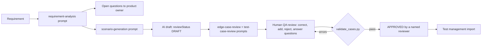

# AI-Assisted Test Design Pipeline

**AI drafts test cases; a human QA engineer reviews, corrects and approves them; a validator makes sure that order
can't be skipped.** This folder holds generic prompt templates, a test-case schema, a governance validator, and a
worked example that goes from requirement to AI draft to human-reviewed set.

## Project Status

**Public implementation:** Prototype workflow with runnable tooling. Four prompt templates, a JSON schema, a Python
validator for the schema and the governance rules, a worked example, 17 pytest tests, ruff lint.

**Professional relevance:** Based on the AI-assisted test design workflow I use in my QA work. The prompts here are
generic templates written for this portfolio; private prompts are not published.

**Confidentiality:** No private prompts, real requirements, ticket content, designs or customer data. The example
requirement is fictional and matches this portfolio's own demo [bulk upload validator](../bulk-upload-validator/). See
[`../docs/confidentiality.md`](../docs/confidentiality.md). Background:
[`../case-studies/ai-assisted-test-design.md`](../case-studies/ai-assisted-test-design.md).

---

## 1. The QA problem

Drafting test cases for every acceptance criterion is slow and repetitive, and AI can produce a useful first draft in
seconds. AI drafts also fail in predictable ways:

- they invent requirements ("convert Fahrenheit automatically");
- they skip criteria, and miss exact boundaries;
- they sound confident when they are guessing;
- they can end up marked "approved" with no human having read them.

## 2. Pipeline



| Step | AI support | Human QA ownership |
| --- | --- | --- |
| Requirement analysis | Lists criteria, ambiguities, missing information | Confirms the criteria; asks the product owner |
| Scenario draft | Drafts positive, negative, boundary and workflow cases | Reviews coverage and accuracy |
| Edge-case and quality review | Suggests gaps and wording fixes | Decides which to add |
| Prioritisation | Suggests a first-pass priority | Sets the final priority |
| Approval | **None** | Approves what enters the suite |

## 3. What is in this folder

| Path | Contents |
| --- | --- |
| [`prompts/`](prompts/) | `requirement-analysis`, `scenario-generation`, `edge-case-review`, `test-case-review` (generic templates with `{{placeholders}}`) |
| [`schemas/test-case.schema.json`](schemas/test-case.schema.json) | Test-case set: traceability to `AC-n`, steps with observable expected results, assumptions, open questions, confidence, review |
| [`tools/validate_cases.py`](tools/validate_cases.py) | Schema validation **plus** governance rules |
| [`governance/human-review.md`](governance/human-review.md) | The rules and the review checklist |
| [`examples/`](examples/) | `requirement.md/.json` → `ai-draft.json` → `reviewed.json` |

## 4. Governance rules enforced in code

| Code | Severity | Rule |
| --- | --- | --- |
| `INVENTED_ACCEPTANCE_CRITERION` | ERROR | A case traces to a criterion the requirement doesn't contain |
| `COVERAGE_GAP` | ERROR | A criterion has no case |
| `APPROVED_WITHOUT_HUMAN_REVIEW` | ERROR | `APPROVED` without a named reviewer and an `approve` decision on every case |
| `APPROVED_WITH_OPEN_UNCERTAINTY` | ERROR | `APPROVED` while a low-confidence case or an open question has no reviewer notes |
| `DUPLICATE_ID`, `WRONG_REQUIREMENT`, `SCHEMA` | ERROR | Basic integrity |
| `POSITIVE_ONLY` | WARNING | A criterion has no negative or boundary case |
| `UNCERTAINTY_NOT_RESOLVED` | WARNING | Low confidence or open questions without notes (an error once APPROVED) |

## 5. Setup and run

```bash
cd ai-assisted-test-design
python -m venv .venv && source .venv/bin/activate      # Windows: .venv\Scripts\activate
pip install -r requirements-dev.txt
pytest                                                   # 17 tests
python tools/validate_cases.py examples/ai-draft.json --requirement examples/requirement.json   # exit 1
python tools/validate_cases.py examples/reviewed.json --requirement examples/requirement.json   # exit 0
```

## 6. Sample output: the AI draft is rejected

The draft marked itself `APPROVED` ([full output](sample-output/ai-draft.validation.txt)):

```text
ai-draft.json: 4 case(s), status APPROVED
  [ERROR] APPROVED_WITHOUT_HUMAN_REVIEW /reviewStatus: APPROVED but not approved by a human reviewer: TC-001, TC-002, TC-003, TC-004
  [ERROR] APPROVED_WITH_OPEN_UNCERTAINTY /reviewStatus: APPROVED while uncertainty is unresolved: TC-003, TC-004
  [ERROR] COVERAGE_GAP AC-4: no test case covers this acceptance criterion
  [ERROR] INVENTED_ACCEPTANCE_CRITERION TC-003: AC-9 is not in REQ-UPLOAD-REEFER; cases may only trace to stated criteria
  [WARNING] POSITIVE_ONLY AC-2: only positive/workflow cases; add a negative or boundary case
  [WARNING] POSITIVE_ONLY AC-3: only positive/workflow cases; add a negative or boundary case
  [WARNING] UNCERTAINTY_NOT_RESOLVED TC-003: low confidence or open questions need reviewer notes before approval
  [WARNING] UNCERTAINTY_NOT_RESOLVED TC-004: low confidence or open questions need reviewer notes before approval
Result: FAIL (4 error(s), 4 warning(s))
```

After human review ([`examples/reviewed.json`](examples/reviewed.json)):
- the invented Fahrenheit case was rejected;
- exact boundary cases (-25 / 8 / -25.1 / 8.1) and a row-and-column case for AC-4 were added;
- the open question was answered and the answer recorded.

The result:

```text
reviewed.json: 6 case(s), status APPROVED
Result: PASS (0 error(s), 0 warning(s))
```

**The reviewed expected results were checked against real behaviour,** by running the cases' inputs through the demo
bulk upload validator. That check caught one more problem: a reviewed case whose title said the opposite of its
expected result. The title was corrected; the behaviour was not assumed.

## 7. Test coverage

AI-001 to AI-011:
- the reviewed set passes, and the self-approved draft fails for each governance reason;
- invented criteria are caught even in drafts;
- coverage gaps;
- approval needs `approve` (not `change`) on every case, while drafts may be unreviewed;
- uncertainty needs reviewer notes;
- positive-only coverage is a warning;
- six malformed-document cases;
- duplicate IDs and the wrong requirement, and CLI exit codes.

One more test checks that the prompts forbid inventing criteria and self-approval.

## 8. Known limitations

- **no model calls:** the templates are for whatever approved AI tool a team uses; this folder contains no API client;
- **the validator checks structure and governance, not truth:** whether an expected result is correct still needs a
  human, or the real system;
- **one requirement per file.**
