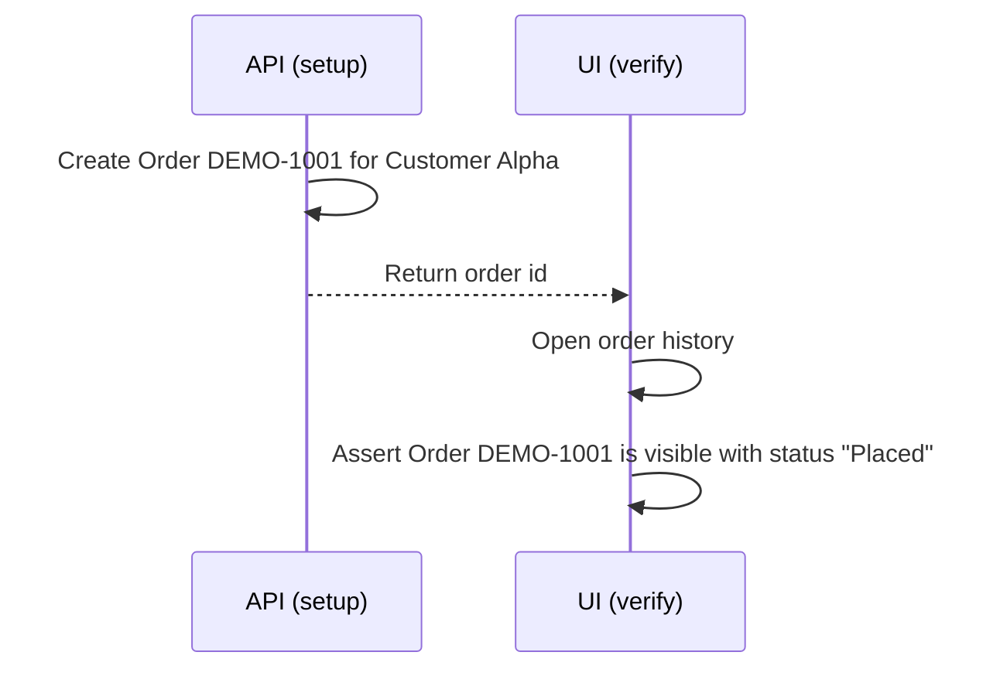

# Sample Hybrid (API + UI) Test Flow (Synthetic)

> Fictional example. Not runnable. Names and data are invented.

| Step | Layer | Why |
|---|---|---|
| Create order | API | Fast, reliable setup without clicking through the UI |
| Verify order | UI | Confirms the customer-facing view reflects the data |

QA value: API setup keeps tests fast and stable; UI verification confirms the user-visible result. The expensive UI path is reserved for what actually needs visual verification.
