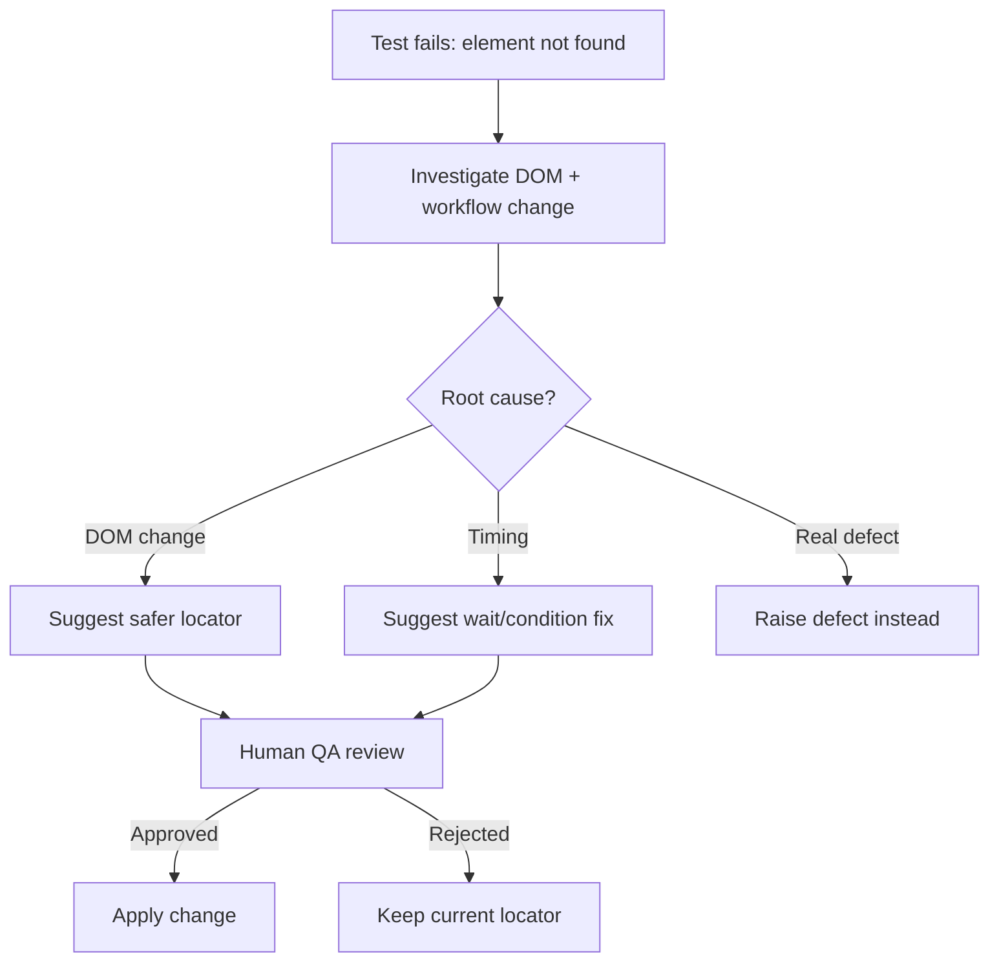

# Sample Locator Healing Flow (Synthetic)

> Fictional example. Locator healing is a guided, human-reviewed investigation workflow, not an autonomous runtime auto-healer.

| Field | Example |
|---|---|
| Failing element | Cart summary total for Order DEMO-1001 |
| Old locator | text-based, fragile |
| Suggested locator | stable test id |
| Decision | Requires human QA approval before adoption |

QA value: instability is investigated and a safer locator is suggested, but no change is applied until a QA engineer reviews and approves it. Monetary or critical fields always require human review.
