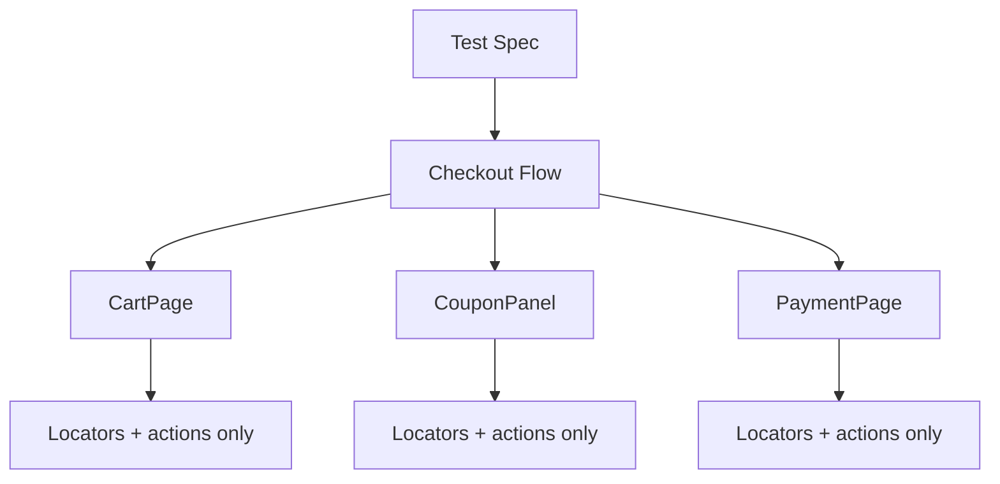

# Sample Page Object Model Responsibilities (Synthetic)

> Fictional example. Not runnable. Illustrates POM responsibility separation only.

| Layer | Responsibility | Does NOT do |
|---|---|---|
| Test Spec | Arrange/act/assert, test data selection | Hold locators |
| Flow | Orchestrate multi-page journeys | Hold assertions |
| Page Object | Locators and page actions | Make assertions or hold test data |

QA value: locators live in one place, so a UI change is fixed once. Test specs stay readable and assertion-focused.
