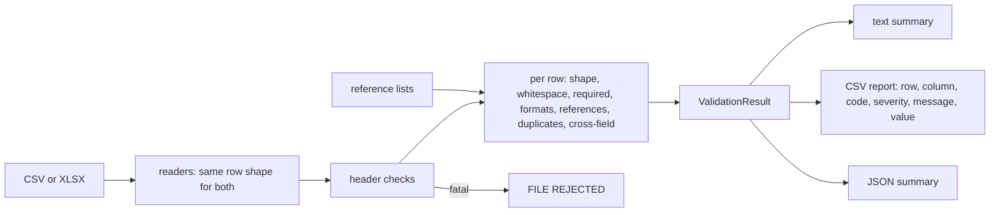

# Bulk Upload Validator & Synthetic Test Data Generator

**Validates bulk-upload files (CSV or XLSX) against a declared schema before they reach a platform, and generates
synthetic test files with recorded faults.** Each finding names the row, column, code and value, so a support
person or customer can fix the file without guessing.

## Project Status

**Public implementation:** Runnable demo. Python package, invented `shipment-upload-v1` schema, CLI, CSV + JSON
reports, a synthetic data generator, 36 pytest tests, ruff lint.

**Professional relevance:** Based on QA problems handled in professional TMS / logistics testing (upload files that
fail for data reasons and get reported as product defects). This public version is independently written for this
portfolio.

**Confidentiality:** The schema, column names, codes and messages are invented for this portfolio. No employer
templates, column names, validation messages, business rules or customer files are used. See
[`../docs/confidentiality.md`](../docs/confidentiality.md).

---

## 1. The QA problem

Bulk uploads fail for data reasons: a missing field, a date like `03/04/2026`, a duplicated reference, a code that
doesn't exist, chilled goods booked without a temperature. When the platform only says "upload failed", these turn
into support tickets and false defect reports. Catching them before upload, with a precise reason per cell,
separates **data problems** from **product defects**.

## 2. What it checks

The schema is data ([`bulk_validator/schema.py`](bulk_validator/schema.py)); validators are generic and read it.

| Family | Codes | Severity |
| --- | --- | --- |
| File / header | `EMPTY_FILE`, `MISSING_COLUMN`, `DUPLICATE_COLUMN` | FATAL: file rejected |
| | `UNKNOWN_COLUMN` (ignored) | WARNING |
| Row shape | `REPEATED_HEADER` (header pasted mid-file) | ERROR |
| | `BLANK_ROW` (skipped) | WARNING |
| Whitespace | `WHITESPACE`: value corrected, then checked | WARNING |
| Required | `REQUIRED_MISSING` (whitespace-only counts as empty) | ERROR |
| Format | `INVALID_NUMBER`, `OUT_OF_RANGE`, `INVALID_DATE` (ISO dates only), `INVALID_EMAIL`, `PATTERN_MISMATCH`, `INVALID_ENUM` (with a case hint) | ERROR |
| Reference | `UNKNOWN_REFERENCE` (customers and locations from `sample-data/reference/`) | ERROR |
| Duplicate | `DUPLICATE_VALUE` (case-insensitive; points to the first row) | ERROR |
| Cross-field | `SAME_ORIGIN_DESTINATION`, `DELIVERY_BEFORE_PICKUP`, `COORDINATE_PAIR_INCOMPLETE`, `REEFER_TEMPERATURE_MISSING` | ERROR |
| | `TEMPERATURE_NOT_APPLICABLE` | WARNING |

**One bad value gives one finding.** A cross-field rule is skipped when one of its input cells already failed its
own check, so an out-of-range latitude is reported once, not also as an "incomplete coordinate pair".

## 3. Architecture



## 4. Setup and run

```bash
cd bulk-upload-validator
python -m venv .venv && source .venv/bin/activate      # Windows: .venv\Scripts\activate
pip install -r requirements-dev.txt
pytest                                                   # 36 tests
ruff check . && ruff format --check .

python -m bulk_validator sample-data/invalid.csv --out output     # exit 1: row errors
python -m bulk_validator sample-data/valid.csv --out output       # exit 0
python -m bulk_validator sample-data/shipments.xlsx --out output  # XLSX works the same way

python generate_demo_data.py --rows 1000 --error-rate 0.05 --seed 7 --out output/generated.csv
```

Exit codes: `0` no errors, `1` row errors, `2` file rejected or bad arguments.

## 5. Synthetic data generator

`generate_demo_data.py` writes valid rows and injects faults at the chosen rate:
- a missing customer, a duplicate reference, an impossible date, an out-of-range coordinate;
- an unknown location, an unsupported vehicle type, a reefer without a temperature;
- delivery before pickup, padded whitespace, a non-numeric weight.

Every injected fault is recorded in a manifest (`<file>.faults.json`), with its row and the finding the validator
must raise. The tests use that manifest as an **independent oracle**: the validator is checked against what was
planted, not against its own opinion.

## 6. Sample output

`python -m bulk_validator sample-data/invalid.csv --out sample-output`
([summary](sample-output/invalid.summary.txt) · [CSV report](sample-output/invalid.validation-report.csv) ·
[JSON](sample-output/invalid.validation-summary.json)):

```text
Validation Summary

File: invalid.csv   Schema: shipment-upload-v1

Rows checked: 17

Valid rows: 4
Rows with errors: 14
Warnings: 4
Errors: 14

Duplicate IDs: 1
Missing required fields: 1
Invalid formats: 6
Invalid references: 1
Cross-field rule breaks: 4
Structural (blank rows, repeated header): 2
```

First lines of the CSV report:

```text
row,column,code,severity,message,value
1,internal_note,UNKNOWN_COLUMN,WARNING,"Column ""internal_note"" is not in shipment-upload-v1; it is ignored",
3,customer_code,REQUIRED_MISSING,ERROR,customer_code is required,
4,shipment_ref,DUPLICATE_VALUE,ERROR,shipment_ref SHP-20001 already used in row 2,SHP-20001
5,pickup_date,INVALID_DATE,ERROR,pickup_date must be a real date in YYYY-MM-DD,2026-02-30
6,dest_lat,OUT_OF_RANGE,ERROR,dest_lat must be between -90 and 90,137.71
```

## 7. Test coverage

| ID | Test |
| --- | --- |
| VAL-001 | Required field, including whitespace-only values |
| VAL-002 | Duplicate ID (case-insensitive), pointing to the first row |
| VAL-003 | Invalid dates (`2026-02-30`, `10/01/2026`, …); a leap day is valid |
| VAL-004 | Coordinates: range edges, non-numbers, incomplete pairs, no cascade |
| VAL-005 | Unknown customer and location references |
| VAL-006 | Unsupported enum, with a case-sensitivity hint for `truck` |
| VAL-007 | Cross-field rules, including boundaries such as same-day delivery |
| VAL-008 | Whitespace corrected and reported; the corrected value still passes |
| VAL-009 | Empty file, header-only file, missing and duplicate columns |
| VAL-010 | A 10,000-row file is validated in a few seconds |

Also tested:
- **Generator oracle (5 seeds × 1000 rows):** every injected fault is found at its row, and no row without an
  injected fault gets an error;
- **CSV vs XLSX parity:** the same data gives identical findings in both formats;
- **The shipped samples:** each code appears once in `invalid.csv`, and the CLI exit codes are correct.

During development, the first run showed one bad latitude producing two findings. The cross-field logic was
fixed so that rules skip inputs that already failed (`test_val_004b` guards this).

## 8. Known limitations

This public implementation intentionally simplifies:

- **one sheet per workbook:** multi-sheet uploads with linked sheets are not modelled;
- **no automatic correction beyond trimming whitespace:** corrections need a human decision;
- **reference lists are local CSV files,** not a live master-data service;
- **no streaming:** very large files (hundreds of MB) are read into memory.
