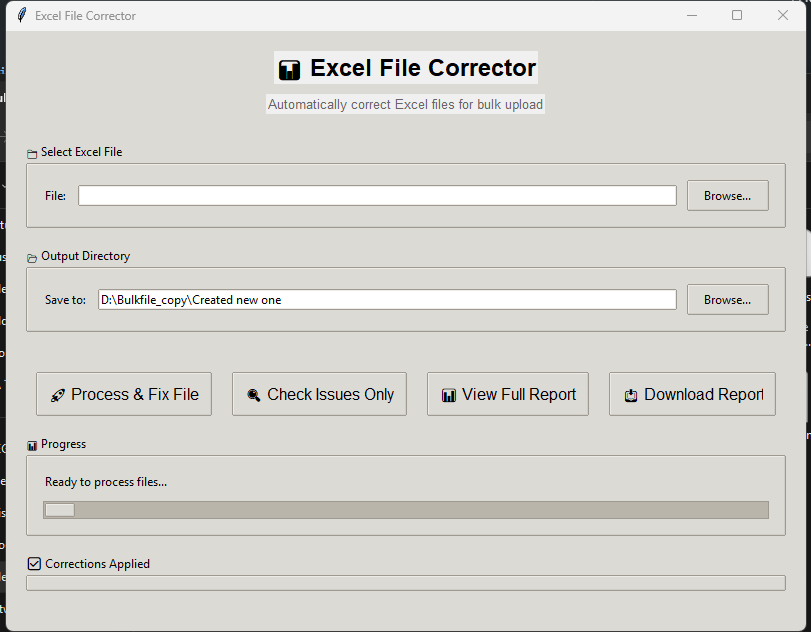

# Excel Validator / Bulk File Generator

Excel file validation and correction tools for TMS data uploads. Reduced customer upload errors by 50%+.

---

## Business Problem

Customers uploading bulk data (organizations, vehicles, drivers, locations) to a TMS regularly hit validation errors — wrong formats, missing fields, duplicate IDs, invalid districts. The support team is then flooded with tickets that are really data-quality problems, not product defects.

## QA Challenge

- Catch data issues **before** they reach the platform
- Auto-correct common, deterministic mistakes
- Highlight errors that need human attention
- Validate large files quickly enough to use in QA and support workflows

## Solution

A Python validator and corrector exposed via three interfaces:

- Desktop GUI (Tkinter)
- Web interface (Flask) with drag-and-drop upload
- Command-line batch processing

[See detailed docs →](excel-corrector/README.md)



## Key Capabilities

- Validates organization details, divisions, HR data, vehicles, and locations
- Auto-corrects status fields, district names, missing NICs, duplicates
- Produces detailed correction reports and timestamped output files
- Error highlighting for fields that need manual review

## Tech Stack

Python 3.7+, Pandas, OpenPyXL, Tkinter, Flask, Werkzeug

## How It Works

### Desktop GUI (recommended)

```bash
cd excel-corrector
pip install -r requirements.txt
python excel_corrector_gui.py
```

### Web interface

```bash
cd excel-corrector
pip install -r requirements.txt
python app.py
# open http://localhost:5000
```

### Command line

```bash
cd excel-corrector
python excel_corrector.py
```

### Example corrections

- `Gampaha` → `Gampaha District`
- Empty NIC → `DUMMYNIC001+org_name`
- Duplicate email → `DUPLICATE1+original@email.com`
- Empty status → `Create`

See [excel-corrector/README.md](excel-corrector/README.md) for the full rule list.

### Project structure

```
bulkfile-generator/
└── excel-corrector/
    ├── excel_corrector.py        # Core engine
    ├── excel_corrector_gui.py    # Desktop GUI
    ├── app.py                    # Web interface
    ├── givenFile/                # Input files
    ├── Created new one/          # Output files
    ├── Error file/               # Error logs
    ├── screenshots/              # Tool screenshots
    └── README.md
```

## Sample Evidence / Screenshots

- GUI screenshot: `excel-corrector/screenshots/main-gui.png`
- Corrected outputs use a timestamped filename: `original_name_corrected_file_YYYYMMDD_HHMMSS.xlsx`

## QA Value

- Removes a common class of false defects driven by bad upload data
- Cuts support load by 50%+ for upload-related tickets
- Provides QA with a reusable validator to harden new ingestion flows

## Limitations

- Validation rules are tuned for TMS organization, division, HR, vehicle, and location sheets
- District mapping is currently Sri Lanka focused
- Heavy customization belongs in a rules-config file rather than code

## Confidentiality Note

Sample inputs and outputs are sanitized or fictional. No real customer files, organization data, or PII are committed. See [`../docs/confidentiality.md`](../docs/confidentiality.md).
