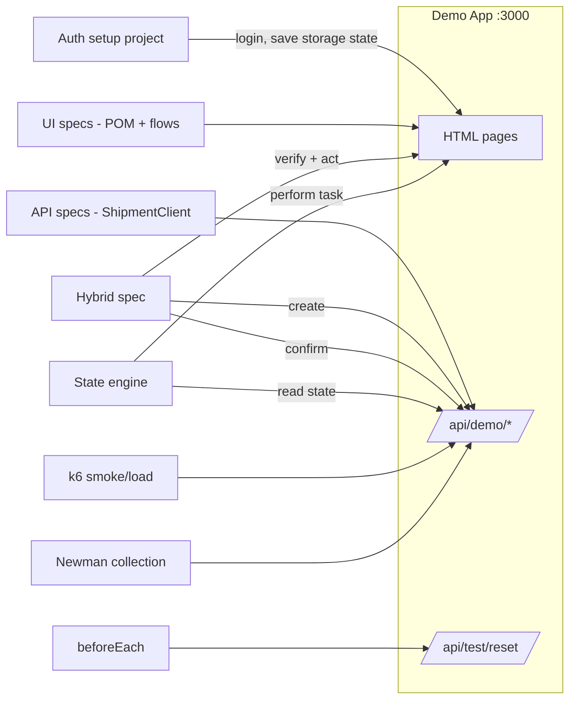

# Demo Web App — Design Rationale

> Status: **Proposed** (Phase 2 of the public engineering upgrade)
> Scope: `smart-qa-automation-framework/demo-app/` and the optional GPS / route viewers

This document explains *why* the public automation demos run against a small, repository-owned web application, and why each design choice was made. It is written as a lightweight Architecture Decision Record so a reviewer can see the reasoning, not only the result.

---

## 1. The problem this solves

An automation portfolio is only credible if a reviewer can **clone it and run the tests**. The previous Playwright demo pointed at `https://demo.invalid` — the structure was visible, but nothing could execute.

Options for a test target:

| Option | Runnable by a reviewer? | Stable over time? | Covers API + UI + negative cases? | Confidentiality risk |
| --- | --- | --- | --- | --- |
| Employer / staging system | No (needs VPN, credentials) | n/a | n/a | **Unacceptable** |
| Public demo website (third-party) | Usually | No — can change, rate-limit or disappear | Rarely (no control over errors or state) | Low, but terms of use may forbid automation |
| API-only local mock | Yes | Yes | API only — no UI or hybrid story | None |
| **Local demo web app owned by this repo** | **Yes** | **Yes** | **Yes** | **None** |

**Decision:** build a small local demo app (guide Option A). It is the only option that is runnable, stable, controllable, and fully synthetic at the same time.

---

## 2. Why a fictional logistics domain

The demo models **Northstar Logistics** — shipments, loads, vehicles and journey tasks — rather than a generic to-do or shopping-cart app.

Reasons:

- **Matches real experience.** The portfolio's story is transport/logistics QA. A logistics demo lets the tests show domain reasoning (vehicle capacity, state progression, delivery completion), not just clicking buttons.
- **Has a real state machine.** Shipments move through ordered states, which is exactly what a state-driven automation engine needs to demonstrate. A to-do app has no meaningful workflow.
- **Independently designed.** The states, endpoints, fields and rules are invented for this portfolio from the general concept of "a shipment moves from creation to delivery". They are deliberately simple and generic.
- **Consistent fiction.** All data uses the same fictional set: `Customer Alpha`, `Warehouse Alpha`, `Customer Site Beta`, `TRUCK-001`, `VAN-001`, `DEMO-SHP-1001`.

---

## 3. Why Express + plain HTML (and not React)

| Concern | Express + static HTML | React + Vite |
| --- | --- | --- |
| CI start-up time | < 1 s, no build | Build step required |
| Dependencies | Very few | Many (bundler, plugins, types) |
| Time for a reviewer to read the whole app | Minutes | Longer |
| What it proves | The **tests** | Front-end skill (not the goal here) |
| Effect on test code | None | None — selectors are the same |

**Decision:** Express serving plain HTML and a small vanilla JS file. The portfolio exists to demonstrate **QA engineering**, so the system under test should be simple enough that attention stays on the automation. If front-end skill becomes a goal later, the UI can be swapped for React without changing a single test, because tests depend only on roles, labels and `data-testid` attributes.

One process serves both the UI and the API on one port, which keeps configuration, CI and `webServer` setup trivial.

---

## 4. Why these specific features exist

Every feature in the app exists because a test needs it. Nothing is added "for realism" alone.

| App feature | Test capability it enables |
| --- | --- |
| Shipment CRUD API (`/api/demo/shipments`) | API client layer, API-001 … API-010 |
| Ordered workflow states with transition rules | State-driven workflow engine; illegal-transition tests |
| `409` on illegal transition (e.g. CREATED → DELIVERED) | Proves the engine **never forces** a workflow to complete |
| `400` missing customer / unsupported vehicle type | Negative input validation |
| `401` missing or wrong token | Authentication testing |
| `404` unknown ID | Error-path testing |
| `409` duplicate reference | Idempotency / duplicate detection |
| `422` vehicle over capacity | Business-rule validation (generic, invented rule) |
| Login page + demo bearer token | Storage-state setup project; auth reuse across UI tests |
| Shipment list with search and status badges | POM, component objects, UI-vs-API reconciliation |
| Detail page with task buttons | Business-flow layer and state engine driving the UI |
| Optional "stuck task" / "unknown state" toggle (test mode only) | Stall detection, max-action guard, typed stop reasons |
| `POST /api/test/reset` (test mode only) | Isolation — every test starts from known seed data |
| `GET /health` | Lets Playwright `webServer` and CI wait until the app is ready |

---

## 5. Why the test-support design looks like this

- **Reset endpoint instead of cleanup-only.** Tests still delete what they create (good habit, shown in `afterEach`), but a reset guarantees a clean store even after a crashed run. It only works when `DEMO_TEST_MODE=1`, mirroring the real-world rule that test hooks must never be exposed in a normal deployment.
- **In-memory store seeded from `seed.json`.** No database to install; data is deterministic and readable; the seed file doubles as documentation of the test data.
- **Playwright `webServer`.** `npm test` starts the app automatically, so there is no hidden manual step — a requirement from the portfolio's quick-start rule.
- **Fake credentials only.** `demo.user@example.test` / `demo-password`. The `.test` domain is reserved and can never be a real mailbox; the password matches nothing real.

---

## 6. Why the selectors are designed for testing

The UI is built with accessible roles, labels and `data-testid` attributes from the start, so tests can follow the preferred locator order:

1. `getByRole`
2. `getByLabel`
3. `getByPlaceholder`
4. `getByTestId`

This demonstrates the locator strategy the portfolio recommends and avoids deep CSS chains, `nth-child` and layout-bound XPath. It also shows a practice worth asking for in real teams: **design the product to be testable**.

---

## 7. How each test layer uses the app

| Layer | What it proves against the demo app |
| --- | --- |
| UI specs | POM, components, fixtures, business flows, typed data |
| API specs | Reusable client, schema validation, positive + negative + auth |
| Hybrid spec | Create by API → act in UI → confirm by API → cleanup |
| State engine | Read state → validate transition → act → re-read → stall guard |
| k6 | Thresholds and the *reasoning* behind them (labelled Learning) |
| Newman | Collection-based API regression in CI |

---

## 8. Why GPS and route tools are libraries, with an optional viewer

The GPS simulator and route-output validator are **Node/TypeScript libraries with a CLI and unit tests**, not web apps.

- Their logic (interpolation, geofence math, capacity and allocation checks) is best proven by fast, deterministic unit tests.
- A CLI with a readable report is the shape a QA utility actually takes in practice.
- `--viewer` writes a self-contained HTML page with an inline SVG map (route, geofences, tracks, off-route fixes). It loads no map tiles or scripts, so it works offline and its screenshots are deterministic. The viewer has its own unit tests, and **no other test depends on it**, so it cannot make the suite flaky.

All coordinates are synthetic, around a public, unrelated reference point, and marked as such.

---

## 9. CI implications

- No secrets, VPN or external services needed — workflows can run on every pull request.
- The app starts in about a second, so smoke runs stay fast.
- Reports (HTML, JSON, traces on failure) are uploaded as artifacts.
- A CI badge is only added after a workflow has **actually run and passed**.

---

## 10. Confidentiality

- The app, its endpoints, fields, states and rules are **independently designed** for this portfolio from a generic problem description.
- No employer source code, endpoints, payload structures, selectors, business rules, formulas or data are used.
- Golden test applied: *could this have been written from the generic description "a shipment moves from creation through a journey to delivery", without seeing any private system?* — **Yes.**

---

## 11. Known limitations (intentional)

The demo intentionally simplifies:

- authentication (one fake user, a static demo token);
- persistence (in-memory, resets on restart);
- route calculation and optimisation (none — out of scope);
- GPS transport (generated data, not a device protocol);
- production-scale observability and performance.

It exists to demonstrate QA engineering patterns, not to reproduce a production transport platform.

---

## 12. Alternatives kept open

| If later… | Then… |
| --- | --- |
| Front-end skill should be shown | Replace `public/` with React + Vite; tests unchanged |
| Persistence testing is needed | Swap the in-memory store for SQLite behind the same interface |
| Contract testing is added | Publish an OpenAPI file for the demo API and validate responses against it |
