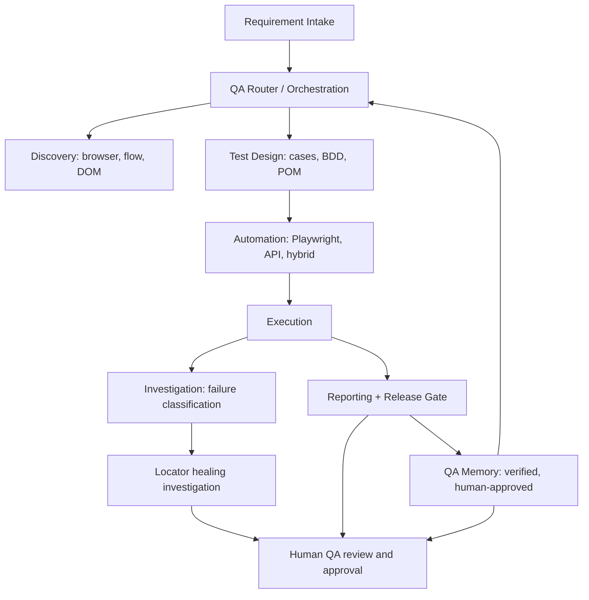
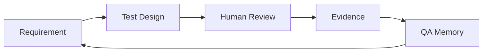
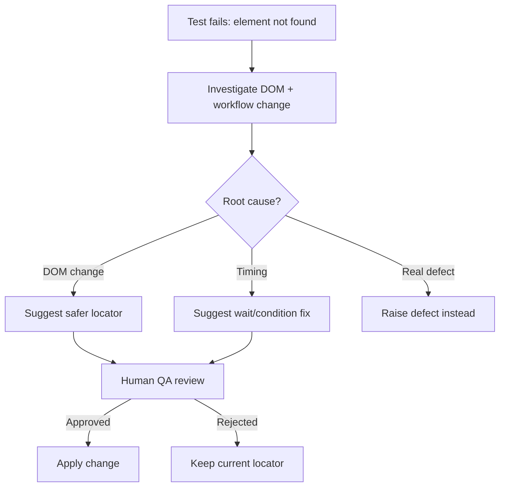
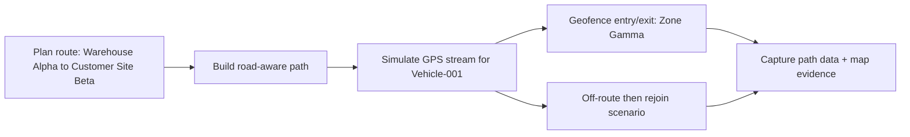
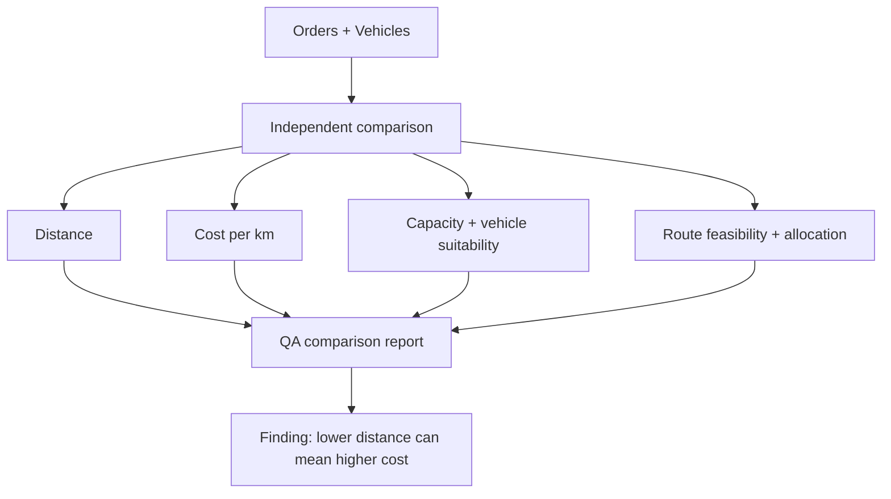
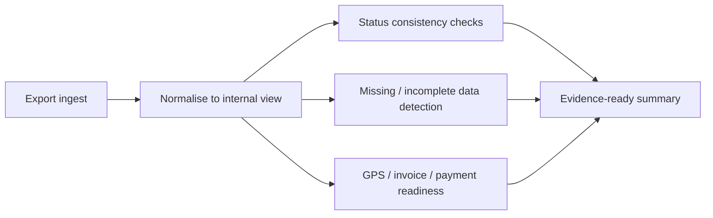

# QA Workflow Diagrams

> Moved from the root README to keep it short. Diagrams show workflow shape only, with fictional names. They describe QA approaches; they are not screenshots or exports from any real system.

Diagrams and synthetic reports only. No source code, real data, endpoints, or screenshots. All names are fictional (`Vehicle-001`, `Warehouse Alpha`, `Customer Site Beta`, `Zone Gamma`, `Order DEMO-1001`, `DEMO-JOB-1001`).

## Smart QA Agent OS Architecture

## Requirement → Test Design → Human Review → Evidence → Memory

## Locator Healing Investigation Flow

## GPS Simulation Flow

## Route Validation Flow

## Job Master Validation Pipeline

## Synthetic Sample Reports

Fictional, non-runnable examples that show the shape of QA evidence:

- [Synthetic failure-classification report →](../assets/sample-artifacts/sample-failure-classification.md)
- [Synthetic release-gate report →](../assets/sample-artifacts/sample-release-gate-summary.md)
- [Synthetic QA memory update example →](../assets/sample-artifacts/sample-memory-update.md)
- [All synthetic QA artifacts →](../assets/sample-artifacts/)
