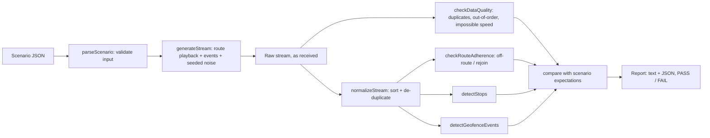

# GPS Simulation & Validation Suite

**A deterministic GPS stream simulator and validator for testing tracking, geofence and live-map features
without hardware.** Scenarios describe a route plus incidents (deviation, rejoin, stops, bad fixes); the
simulator generates the stream a device would send; the validators play the backend and report what should
have been detected, PASS or FAIL against the scenario's expectations.

## Project Status

**Public implementation:** Runnable demo. TypeScript library, 5 JSON scenarios, CLI, 29 automated tests.

**Professional relevance:** Based on QA problems handled in professional TMS / logistics testing (fleet-scale
tracking without devices, geofence edges, off-route behaviour). This public version is independently written
for this portfolio.

**Confidentiality:** No employer code, payload formats, endpoints, device IDs, routes or coordinates. All
coordinates are synthetic points near a public reference location and say so in every scenario file. See
[`../docs/confidentiality.md`](../docs/confidentiality.md).

---

## 1. The QA problem

Tracking features (live maps, geofence alerts, off-route warnings, stop detection) are hard to test:

- real vehicles are slow, expensive and impossible to repeat exactly;
- the interesting cases (a vehicle 10 m inside a fence edge, a detour that skips a checkpoint, a fix that
  arrives late) almost never happen on demand;
- fleets need many devices at once.

## 2. What this tool does

| Capability | How |
| --- | --- |
| Route playback | Densifies a planned route into fixes spaced by speed × sample interval, with timestamps |
| Configurable speed and timing | `speedKmh`, `sampleIntervalS`, staggered fleet starts |
| Position noise | Seeded random offset up to `noiseM` per fix: realistic, but reproducible |
| Deviation and rejoin | `DEVIATE` moves the vehicle sideways by `offsetM`; `REJOIN` brings it back |
| Stop / dwell | `STOP` holds the vehicle in place for `durationS` |
| Unreliable devices | `DUPLICATE` repeats a fix; `OUT_OF_ORDER` delivers a fix after its successor |
| Multi-vehicle | `--devices N` runs N vehicles with their own seed and start time |
| Validation | Geofence ENTER/EXIT with dwell, off-route/rejoin, stops, data-quality issues |
| Determinism | Same scenario + seed → byte-identical results |

## 3. Architecture



| Folder | Responsibility |
| --- | --- |
| `src/geo/` | Haversine distance, bearing, destination point, distance to a route segment |
| `src/simulator/` | Route densification, event injection, seeded noise, stream generation |
| `src/geofence/` | Circle geofences: inside test (boundary inclusive), ENTER/EXIT with dwell |
| `src/validation/` | Data-quality checks, normalisation, off-route/rejoin, stop detection |
| `src/scenarios/` | Scenario schema and validation, fleet runner, expectation checks |
| `src/reporting/` | Text report |
| `scenarios/` | The five demo scenarios |

### Detection rules, and why

| Rule | Default | Why |
| --- | --- | --- |
| Off-route distance | 100 m from the planned route | Wider than GPS noise and lane offsets, narrower than a wrong turn |
| Confirmation | 2 consecutive fixes | One noisy fix must not raise an alert; a real detour persists |
| Stop | within 25 m for ≥ 120 s | A traffic-light pause is not a stop; 2 minutes in one place is |
| Geofence boundary | distance ≤ radius counts as inside | A defined, testable rule for exact-edge fixes |
| Implausible jump | > 160 km/h implied between fixes | Catches teleporting fixes and clock errors |

These are thresholds for this demo. In a real product they come from the requirements, and the tests pin
whichever values were agreed.

## 4. Setup and run

```bash
cd gps-simulation-validation-suite
npm ci
npm test                                                        # 29 tests
npm run gps -- --scenario off-route-rejoin --devices 5 --seed 7  # CLI
npm run gps -- --scenario baseline --devices 1000 --json output/fleet.json
npm run verify                                                  # typecheck + lint + format + tests
```

The CLI exits with `0` on PASS, `1` on FAIL and `2` on bad arguments, so it can gate a pipeline.

## 5. Scenarios

| Scenario | What happens | A correct backend should report |
| --- | --- | --- |
| `baseline` | Warehouse Alpha → Zone Gamma → Customer Site Beta | 5 geofence events in order, no deviation, no stop |
| `off-route-rejoin` | 250 m detour, then back on route | Deviation + rejoin; **Zone Gamma never entered** (the checkpoint was skipped) |
| `short-stop` | 60 s pause and a 5 min stop | Exactly 1 stop (the pause is below the threshold) |
| `geofence-edge` | Route clips one fence 10 m inside its edge, misses another by 30 m | ENTER/EXIT for the first fence only |
| `data-quality` | One duplicated fix, one late fix | `DUPLICATE_POINT` and `OUT_OF_ORDER`; route analysis still correct |

## 6. Sample output

From `npm run gps -- --scenario off-route-rejoin --devices 5 --seed 7`
([full text](sample-output/off-route-rejoin.5-vehicles.txt) · [JSON](sample-output/off-route-rejoin.5-vehicles.json)):

```text
Scenario: off-route-rejoin
Seed: 7

Vehicles: 5
Points generated: 130

TRUCK-001
  Deviation: detected (max 252 m off route)
  Rejoin: detected
  Stops: 0
  Geofence events: ENTER WAREHOUSE-ALPHA, EXIT WAREHOUSE-ALPHA (dwell 20 s), ENTER CUSTOMER-SITE-BETA
  Data quality: clean
  PASS  deviation detected (expected true, got true)
  PASS  rejoin detected (expected true, got true)
  PASS  stops (expected 0, got 0)
  PASS  geofence events (expected [...], got [...])
  PASS  data-quality issues (expected [], got [])
...
2 more vehicle(s): all PASS

Result: PASS
```

A 1000-vehicle `baseline` run (26,000 fixes) completes in about 1.7 s locally, and every vehicle passes.

## 7. Test coverage

| ID | Test |
| --- | --- |
| GPS-001 | Baseline movement: even timing, start/end on the route, spacing matches speed × interval |
| GPS-002 | Off-route: a 250 m deviation is detected; 3 m noise is not |
| GPS-003 | Rejoin: deviation closes when back on route; stays open without a REJOIN |
| GPS-004 | Geofence ENTER fires once on arrival |
| GPS-005 | Geofence EXIT carries the dwell time since ENTER |
| GPS-006 | Edge boundary: 99.9 m inside a 100 m fence, 100.1 m outside; the edge scenario |
| GPS-007 | Stopped vehicle: 5 min stop reported, 60 s pause ignored |
| GPS-008 | Duplicate fix flagged and removed before analysis |
| GPS-009 | Out-of-order fix flagged; normalised stream back in time order |
| GPS-010 | Multi-vehicle: unique IDs, staggered starts, deterministic per seed |

Also: geometry unit tests, an implausible-jump test, scenario-validation tests, and a check that every shipped
scenario passes its own expectations. A negative control (a scenario whose expectation is deliberately wrong)
was run during development and correctly ended in `Result: FAIL` with exit code 1.

## 8. Known limitations

This public implementation intentionally simplifies:

- **straight-line playback:** routes follow straight lines between waypoints, with no road snapping;
- **circle geofences only:** no polygons;
- **no transport protocol:** the stream is generated in memory, and nothing is sent to a device API;
- **flat-earth approximations:** fine at city scale, not for long-haul routes.

It exists to demonstrate GPS QA reasoning, not to reproduce a production tracking platform.
