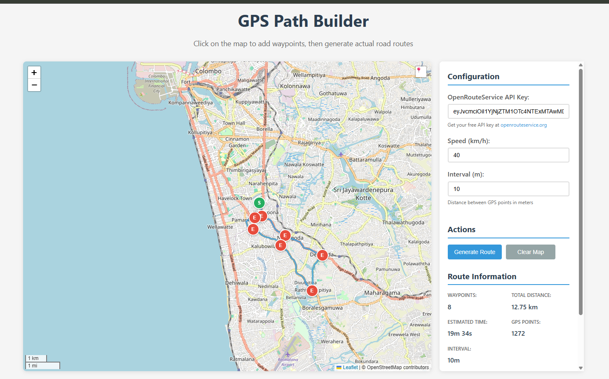
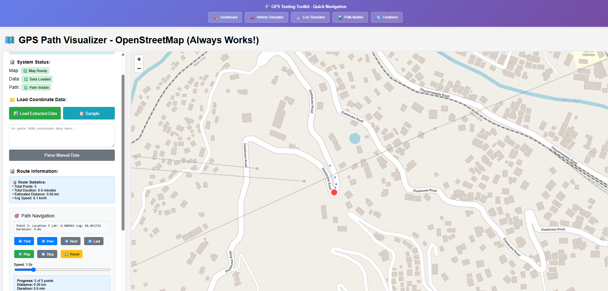

# GPS Testing Suite

Web-based tools for testing GPS and location-based features without physical hardware. Built for Transport Management System QA at Haulmatic Technologies.

**Scale:** Simulates up to 1000 GPS devices simultaneously

---

## What's Included

Four standalone tools plus a unified dashboard:

- **GPS Simulator** - Simulate multiple GPS devices sending real-time data
- **GPS Path Builder** - Create GPS paths using actual road routes
- **GPS Path Visualizer** - Visualize GPS coordinate paths on maps
- **Multi-Device Combiner** - Combine and test multiple device streams
- **Dashboard** - Launch any tool from one page

---

## Screenshots

**GPS Simulator:**


**GPS Path Builder:**


**Path Visualizer:**


**Multi-Device Combiner:**


---

## Demo Videos

See the tools in action:

- [GPS Simulator Demo](videos/GPS%20Simulator%20-%20Multi-Device%20Testing%20Tool.mp4)
- [GPS Path Builder Demo](videos/GPS%20Path%20Builder%20-%20Actual%20Road%20Routes.mp4)
- [Multi-Device Combiner Demo](videos/Multi-Device%20GPS%20Combiner%20Tool.mp4)
- [Path Visualizer Demo](videos/GPS%20Coordinate%20Path%20Visualizer%20-%20OpenStreetMap.mp4)

---

## Why I Built This

Testing GPS features in our TMS required physical GPS devices. That didn't scale - we needed to test scenarios with 50+, 100+, even 1000+ devices simultaneously. Buying that many devices wasn't realistic, and manual testing was too slow.

**Solution:** Build a web-based simulator that generates realistic GPS data and sends it to our API endpoints.

**Impact:** No more physical devices needed. Can test any scale of GPS workflows. QA team saves hours every sprint.

---

## Quick Start

### Using the Dashboard

1. Open `dashboard.html` in your browser
2. Click any tool card to launch it
3. Each tool opens in a new window

### Individual Tools

Each tool works standalone:

```bash
# GPS Simulator
open gps-simulator/index.html

# GPS Path Builder
open gps-path-builder-actual-path/index.html

# Path Visualizer
open GPS-Path-Visualizer/gps%20path%20visualizer.html

# Multi-Device Combiner
open multi-device-gps-combiner/index.html
```

---

## Tool Details

### 1. GPS Simulator

Simulates multiple GPS devices simultaneously. Each device sends coordinates to your API endpoint at configurable intervals.

**Use cases:**
- Multi-device tracking validation
- Load testing GPS endpoints
- Geofencing workflows
- Real-time tracking features

**Tech:** JavaScript, Leaflet.js, OpenStreetMap

[See tool README](gps-simulator/README.md)

---

### 2. GPS Path Builder

Creates GPS paths along actual roads (not straight lines). Uses OpenRouteService API to calculate realistic vehicle routes.

**Use cases:**
- Generate realistic GPS test data
- Create paths for route validation
- Test journey tracking features

**Requires:** OpenRouteService API key (free tier available)

**Tech:** JavaScript, Leaflet.js, OpenRouteService API

[See tool README](gps-path-builder-actual-path/README.md)

---

### 3. GPS Path Visualizer

Load and visualize GPS coordinate files on an interactive map.

**Use cases:**
- Visualize exported GPS data
- Verify coordinate accuracy
- Debug GPS issues

**Tech:** JavaScript, Leaflet.js, OpenStreetMap

[See tool README](GPS-Path-Visualizer/README.md)

---

### 4. Multi-Device GPS Combiner

Combine GPS data from multiple devices and visualize their paths together.

**Use cases:**
- Fleet tracking simulation
- Multi-device coordination testing
- Path comparison and analysis

**Tech:** JavaScript, Leaflet.js, OpenStreetMap

[See tool README](multi-device-gps-combiner/README.md)

---

## Technologies Used

- **HTML5** - Modern web standards
- **JavaScript (ES6+)** - Core functionality
- **Leaflet.js** - Interactive maps
- **OpenStreetMap** - Free map tiles
- **OpenRouteService API** - Route calculation (Path Builder only)

---

## Browser Support

- Chrome 80+
- Firefox 75+
- Safari 13+
- Edge 80+

---

## API Endpoints

All tools use demo/example API endpoints by default:

- Staging: `https://staging-api.example-platform.com/api/telematics/gps-data/v1`
- Production: `https://api.example-platform.com/api/telematics/gps-data/v1`
- Development: `http://localhost:8080/api/telematics/gps-data/v1`

**Note:** Update the URLs in each tool's configuration to point to your actual endpoints.

---

## Use Cases

**What I use this for:**

1. **Load testing** - Simulate up to 1000 devices to test API capacity
2. **Geofencing validation** - Create paths that cross geofence boundaries
3. **Multi-device coordination** - Test fleet tracking features
4. **Route tracking** - Validate journey logging and playback
5. **GPS accuracy** - Test handling of GPS drift and errors
6. **Performance testing** - High-frequency coordinate updates

---

## Folder Structure

```
gps-testing-suite/
├── dashboard.html                  # Main launcher
├── gps-simulator/                  # Multi-device simulator
├── gps-path-builder-actual-path/   # Road-based path creator
├── GPS-Path-Visualizer/            # Coordinate visualizer
├── multi-device-gps-combiner/      # Device data combiner
├── screenshots/                    # Tool screenshots
└── videos/                         # Demo videos
```

---

## Notes

**HTTPS Required:** Some features need HTTPS or localhost for Geolocation API

**API Keys:** GPS Path Builder requires OpenRouteService API key (free at openrouteservice.org)

**Demo Data:** All company names and sensitive info replaced with generic examples

**Internal Use:** Built for QA testing purposes

---

## Troubleshooting

**Maps not loading?**
- Check internet connection (needs OpenStreetMap tiles)
- Ensure JavaScript is enabled

**API calls failing?**
- Update API endpoint URLs in tool configuration
- Check browser console for errors
- Verify endpoints are accessible

**GPS Path Builder not working?**
- Get free API key from OpenRouteService
- Enter key in the tool interface
- Check API rate limits

---

## What I Learned Building This

**Challenges:**
- Managing hundreds of concurrent API requests without overwhelming the server
- Real-time map updates without performance issues (optimized to handle 1000+ devices)
- State management for multiple devices
- Making it work across different browsers

**Solutions:**
- Request queue management using Maps for tracking active API calls
- Batch processing with Promise.allSettled for multiple devices
- Staggered device startup with configurable delays
- Throttled map updates (update every 100ms, not every coordinate)
- Efficient state management with vanilla JS

**Future improvements:**
- Add geofence alert simulation
- Better error handling at scale
- Export/import device configurations
- Historical playback feature

---

*Built to solve real GPS testing challenges. No physical devices required.*
