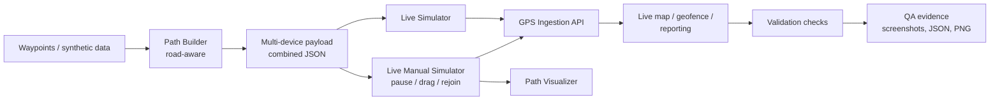

# GPS Simulator and Path Generation Suite

## Overview

A web-based QA toolkit for testing GPS, live-map, geofence, and vehicle-tracking workflows without physical hardware. It lets a QA engineer **generate**, **replay**, **manually steer**, **visualize**, and **combine** synthetic GPS streams, then push them into a target API to exercise location-based features at any scale.

The suite is intentionally a collection of focused tools rather than one large app. Each tool addresses a single QA concern; a central dashboard cross-links the tools so a tester can move between them in one workflow.

## QA Challenge

Location-based features are expensive and slow to validate manually:

- Physical GPS hardware does not scale to fleet-sized scenarios.
- Real road behaviour (turns, stops, speed changes) is hard to reproduce with hand-written coordinates.
- Drivers go off-route, GPS drifts, signals drop, and devices jump — these must be tested deterministically.
- Geofence enter / exit / dwell rules need precise, repeatable input.
- GPS ingestion endpoints must be validated under realistic load.

## Solution Approach

Six standalone HTML/JavaScript tools plus a central dashboard. Two of them are described in detail below because they cover the most valuable QA scenarios: the **road-aware path builder** (deterministic, road-realistic test data) and the **live manual simulator** (interactive off-route / rejoin behaviour).


```mermaid
flowchart LR
    A[Waypoints / synthetic data] --> B[Path Builder<br/>road-aware]
    B --> C[Multi-device payload<br/>combined JSON]
    C --> D[Live Simulator]
    C --> E[Live Manual Simulator<br/>pause / drag / rejoin]
    D --> F[GPS Ingestion API]
    E --> F
    F --> G[Live map / geofence /<br/>reporting]
    G --> H[Validation checks]
    E --> I[Path Visualizer]
    H --> J[QA evidence<br/>screenshots, JSON, PNG]
```

---

## Featured Tools

### 1. GPS Path Builder (Road-Aware)

**Folder:** `gps-path-builder-actual-path/`

A web tool that turns clicked waypoints on a map into a **real driving route** along actual roads, interpolated to a fixed step. This produces realistic, deterministic test input for any downstream simulator or live-map workflow.

#### What it does
- Lets the tester click waypoints on a Leaflet / OpenStreetMap map.
- Calls a public driving-directions service (OpenRouteService) to fetch the actual road geometry between waypoints.
- Interpolates the returned geometry into evenly-spaced GPS points (default 10 m, configurable 1–1000 m).
- Computes a per-point `duration` in milliseconds from a configurable speed (default 40 km/h).
- Renders the planned path on the map with start / end / intermediate markers.
- Exports the result as JSON, ready to feed any of the simulator tools.

#### Key capabilities
- **Road-realistic test data** — points follow real roads, not straight lines.
- **Configurable density** — fewer points for light tests, denser points for high-resolution playback.
- **Configurable speed** — durations match the scenario you want to test (urban, highway, slow last-mile).
- **Spherical interpolation** — SLERP-based interpolation for accurate coordinate spacing.
- **Distance, ETA, and point count** are displayed so QA can confirm the scenario before exporting.
- **Test-friendly DOM** — `data-testid` attributes on every control so the tool is itself testable via Playwright / Cypress / Selenium.
- **API-key handling** — key is supplied at runtime by the tester and stored locally in the browser; **never** committed.

#### Sanitized output shape

```json
[
  { "lat": 0.0001, "lng": 0.0001, "duration": 5000, "name": "Start" },
  { "lat": 0.0002, "lng": 0.0002, "duration": 900,  "name": "Point 1" },
  { "lat": 0.0003, "lng": 0.0003, "duration": 900,  "name": "Point 2" },
  { "lat": 0.0004, "lng": 0.0004, "duration": 900,  "name": "End" }
]
```

#### QA scenarios this unlocks
- Live-map playback at realistic speeds and densities.
- Geofence enter / exit testing where the route crosses zone boundaries on real roads.
- Distance and ETA validation in reporting.
- Driver-app journey tracking, where the device must follow a believable path.

---

### 2. GPS Live Manual Simulator

**Folder:** `gps-live-manual-simulator/`

A live simulator with **manual override controls**. While devices stream their planned route, the tester can **pause selected devices**, **drag their marker off the route**, and **resume** with one of two rejoin behaviours. This makes off-route, detour, and GPS-jump scenarios deterministic and reproducible.

#### What it does
- Accepts a multi-device payload (`{"devices":[...]}` or a plain array).
- Streams each device along its planned coordinates with per-point `duration` and `speed`.
- Lets the tester pick one or more devices and pause them mid-simulation while the rest keep moving.
- Allows manual marker dragging on the map for paused devices, recording the off-route segment.
- Resumes a paused device using either:
  - **On-route** — snap to the nearest point on the planned route and continue.
  - **Rejoin** — draw a rejoin connector from the manually dragged position back to the planned route, then continue.
- Supports a **local-only mode** (skip API send) for safe rehearsal.
- Renders four distinct paths on the map for clarity:
  - **Planned** (full route as originally fed in)
  - **Completed planned** (segment already streamed)
  - **Manual drag** (off-route segment created by the tester)
  - **Rejoin connector** (path back to the planned route)
- Exports the **actual traveled** data as JSON with movement metadata.
- Exports the map as a PNG for evidence (with a screenshot fallback if the browser blocks canvas export).

#### Sanitized input shape

```json
{
  "devices": [
    {
      "deviceId": "Vehicle-001",
      "coordinates": [
        { "lat": 0.0001, "lng": 0.0001, "duration": 3000, "speed": 35, "name": "Start" },
        { "lat": 0.0002, "lng": 0.0002, "duration": 3000, "speed": 40, "name": "Checkpoint" }
      ]
    }
  ]
}
```

#### Tester controls at runtime

| Control                  | Effect                                                                 |
| ------------------------ | ---------------------------------------------------------------------- |
| Start                    | Begin streaming all devices along their planned routes                 |
| Pause selected devices   | Pause only the chosen devices; the rest keep moving                    |
| Manual drag              | Move the marker of a paused device anywhere on the map                 |
| Continue – On-route      | Snap back to the nearest planned point and resume                      |
| Continue – Rejoin        | Add a rejoin connector segment, then resume the planned route          |
| Local-only mode          | Run the simulation locally without sending data to the ingestion API   |
| Export traveled JSON     | Save the actual traveled path per device with metadata                 |
| Export map PNG           | Save a snapshot of the map for evidence                                |

#### QA scenarios this unlocks
- **Off-route detection** — drag a vehicle off its planned route and validate the live map and alerts.
- **Geofence boundary edge cases** — drag a marker across a geofence boundary and back to confirm enter / exit / dwell logic.
- **GPS jump and drift** — simulate large coordinate jumps between consecutive points.
- **Reroute / rejoin behaviour** — confirm the product correctly reconciles a vehicle that returns to its planned route.
- **Partial fleet behaviour** — pause one or two devices while the rest of the fleet continues, to test live-map rendering under mixed states.
- **Evidence-rich defect reports** — attach the exported actual-traveled JSON and the map PNG to the ticket.

---

## Other Tools in the Suite

| Tool                                           | Purpose                                                                 |
| ---------------------------------------------- | ----------------------------------------------------------------------- |
| **Live GPS Simulator** (`gps-simulator/`)      | Stream synthetic GPS for many devices in parallel with staggered start. |
| **GPS Vehicle Simulator** (`GPS-Vehicle-Simulator/`) | Manual / dev-tool authoring of single-device test paths.          |
| **GPS Path Visualizer** (`GPS-Path-Visualizer/`) | Drop a JSON / CSV file onto a map to inspect coordinates and stats.   |
| **Multi-Device Combiner** (`multi-device-gps-combiner/`) | Merge multiple per-device JSON files into one simulator-ready payload. |
| **Central Dashboard** (`dashboard.html`)       | One entry point, cross-tool navigation.                                 |

## Example End-to-End Workflow

A fictional QA scenario, using generic names only:

1. Open the **Path Builder** and click three waypoints: `Warehouse A` → `Customer Site B` → `Zone Alpha`. Set speed to `40 km/h` and interval to `10 m`. Export the planned route as `Vehicle-001.json`.
2. Repeat the same flow with different waypoints for `Vehicle-002` and `Vehicle-003`.
3. Open the **Multi-Device Combiner** and merge the three files into one `fleet-payload.json` (`{"devices":[...]}`).
4. Open the **Live Manual Simulator** and load `fleet-payload.json`. Start the simulation.
5. Validate that the live-map shows three vehicles moving along the expected paths.
6. Pause `Vehicle-002`, drag it off-route into a restricted zone, and confirm the off-route / geofence alert fires.
7. Resume `Vehicle-002` using **Rejoin** to validate that the product recognises the return to the planned path.
8. Export the **actual traveled** JSON for `Vehicle-002` and the **map PNG** and attach both to the test case.

## QA Scenarios Supported (full suite)

- High-load GPS ingestion smoke and stress tests
- Live-map rendering and update-rate validation
- Geofence enter / exit / dwell validation, including edge crossings
- Off-route detection and reroute / rejoin handling
- Stale or out-of-order coordinate handling
- Multi-device coordination and partial-fleet states
- Journey-history and route playback validation
- Negative cases: invalid coordinates, missing timestamps, duplicate points

## Technology Approach

- Vanilla HTML, CSS, JavaScript (ES6+) — no build step, no framework lock-in
- Leaflet.js with OpenStreetMap tiles for map rendering
- A public road-routing service (OpenRouteService) for road-aware path generation
- Spherical Linear Interpolation (SLERP) and Haversine for accurate coordinate work
- Bearer-token authentication is supported when calling protected ingestion APIs; the token is supplied by the tester at runtime and **never** committed
- `data-testid` attributes on key controls for downstream automation

## Evidence and Outputs

Safe public artefacts:

- [`../assets/demo-data/gps-sample-route.csv`](../assets/demo-data/gps-sample-route.csv) — synthetic GPS points
- [`../assets/demo-data/gps-sample-route.json`](../assets/demo-data/gps-sample-route.json) — synthetic device payload
- Mermaid flow above
- Sanitized screenshots inside `screenshots/` and demo videos inside `videos/`

## QA Value

- Removes the need for physical GPS hardware in regression and load testing.
- Produces deterministic, repeatable GPS data that can be referenced by test cases.
- Makes off-route / detour / rejoin scenarios reproducible — these are usually the hardest to catch manually.
- Detects defects in geofence rules, live-map update behaviour, stale-data handling, and multi-device coordination.
- Produces explainable evidence (paths, JSON exports, PNG snapshots) that travels cleanly into defect reports.

## Limitations

- The public toolkit targets generic, public mapping and routing services. It includes **no** real ingestion endpoints, tokens, or credentials.
- The Path Builder requires a free API key from the user's own OpenRouteService account; rate limits apply to the free tier.
- The Live Manual Simulator depends on browser performance for very large fleets; for high-load scenarios, use the Live GPS Simulator with staggered startup.
- It is a QA aid, not a telematics platform.

## Confidentiality Note

This is a sanitized portfolio case study. Production code, real system data, confidential workflows, credentials, customer information, and proprietary implementation details are not included. Example values such as `Vehicle-001`, `Warehouse A`, `Customer Site B`, and `Zone Alpha` are fictional.
