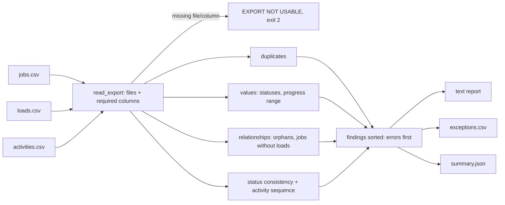

# Job Data Validation Tool

**Reconciles job, load and activity exports and lists every inconsistency with its file, line and reason.** It
turns a large export into a short exception list for a release review.

## Project Status

**Public implementation:** Runnable demo. Python (standard library only), fictional sample exports (clean and with
planted exceptions), CLI, CSV + JSON reports, 21 pytest tests, ruff lint.

**Professional relevance:** Based on QA problems handled in professional TMS / logistics testing (job and
work-order data that must agree across records before a release). This public version is independently written for
this portfolio.

**Confidentiality:** The export format, statuses and rules are invented for this portfolio. No employer schema,
column names, counting or progress formulas, or real data are used. See
[`../docs/confidentiality.md`](../docs/confidentiality.md).

---

## 1. The QA problem

Jobs, loads and activities live in different tables and are exported separately. Before a release, QA has to
confirm they still agree: no load without a job, no "completed" job with an undelivered load, no progress of 140%.
Checking thousands of rows by eye is slow, and it misses things.

## 2. Checks

| Code | Severity | Meaning |
| --- | --- | --- |
| `DUPLICATE_JOB_REF` / `DUPLICATE_LOAD_REF` / `DUPLICATE_ACTIVITY_ID` | ERROR | A reference appears twice; points to the first line |
| `UNKNOWN_STATUS` | ERROR | Status outside the documented set (also catches `on hold` vs `ON_HOLD`) |
| `PROGRESS_OUT_OF_RANGE` | ERROR | `progress_pct` missing, non-numeric, below 0 or above 100 |
| `ORPHAN_LOAD` / `ORPHAN_ACTIVITY` | ERROR | Parent job or load does not exist |
| `COMPLETED_JOB_BELOW_100` | ERROR | Job is COMPLETED but progress is under 100% |
| `COMPLETED_JOB_OPEN_LOADS` | ERROR | Job is COMPLETED but a (non-cancelled) load is not delivered |
| `STATE_CONFLICT` | ERROR | Job is PLANNED or CANCELLED but a load is already moving or delivered |
| `DELIVERED_LOAD_PENDING_ACTIVITIES` | ERROR | Load is DELIVERED but activities are still pending |
| `INVALID_SEQUENCE` / `DUPLICATE_SEQUENCE` | ERROR | Activity order cannot be determined |
| `JOB_WITHOUT_LOADS` | WARNING | Active job has no loads yet |
| `PROGRESS_100_NOT_COMPLETED` | WARNING | 100% but not marked COMPLETED |
| `SEQUENCE_GAP` | WARNING | Activity sequence is not 1..n |
| `ACTIVITY_DONE_OUT_OF_ORDER` | WARNING | A later activity is DONE while an earlier one is PENDING |

### What the tool deliberately does *not* check

It does **not** recompute progress from activity counts. A formula such as "progress = done ÷ total" might hold for
one job shape and break for another (extra activities, skipped steps, rounding), and asserting an inferred formula
would make the tool report the product as wrong when the test is wrong. The tool checks rules that hold **whatever**
the formula is. A formula check is added only once the product owner has specified it.
`test_jm_015_progress_formula_is_not_inferred` guards this.

## 3. Architecture



## 4. Setup and run

```bash
cd job-data-validation-tool
python -m venv .venv && source .venv/bin/activate     # Windows: .venv\Scripts\activate
pip install -r requirements-dev.txt
pytest                                                  # 21 tests
ruff check . && ruff format --check .

python -m job_data_validator                                   # sample with exceptions -> exit 1
python -m job_data_validator --data sample-data/clean          # exit 0
python -m job_data_validator --data path/to/export --out output
```

Exit codes: `0` no errors (warnings allowed), `1` errors found, `2` export not usable.

## 5. Sample output

`python -m job_data_validator` ([full text](sample-output/with-exceptions.report.txt) ·
[CSV](sample-output/exceptions.csv) · [JSON](sample-output/summary.json)):

```text
Job Data Reconciliation

Records checked: 13 jobs, 13 loads, 36 activities
Errors: 10   Warnings: 4

Exceptions:
  [ERROR] COMPLETED_JOB_BELOW_100 DEMO-JOB-1005 (jobs.csv line 6): COMPLETED but progress is 80%
  [ERROR] COMPLETED_JOB_OPEN_LOADS DEMO-JOB-1006 (jobs.csv line 7): COMPLETED but loads not delivered: DEMO-LOAD-2007
  [ERROR] DELIVERED_LOAD_PENDING_ACTIVITIES DEMO-LOAD-2013 (loads.csv line 14): DELIVERED but activities pending: DEMO-ACT-0035
  [ERROR] DUPLICATE_JOB_REF DEMO-JOB-1002 (jobs.csv line 12): DEMO-JOB-1002 already appears on line 3
  [ERROR] DUPLICATE_SEQUENCE DEMO-ACT-0029 (activities.csv line 30): sequence 1 used twice
  [ERROR] ORPHAN_ACTIVITY DEMO-ACT-9999 (activities.csv line 37): parent load DEMO-LOAD-9999 not found
  [ERROR] ORPHAN_LOAD DEMO-LOAD-2012 (loads.csv line 13): parent job DEMO-JOB-9999 not found
  [ERROR] PROGRESS_OUT_OF_RANGE DEMO-JOB-1009 (jobs.csv line 10): progress_pct "140" must be a number from 0 to 100
  [ERROR] STATE_CONFLICT DEMO-JOB-1008 (jobs.csv line 9): job is PLANNED but loads have moved: DEMO-LOAD-2009
  [ERROR] UNKNOWN_STATUS DEMO-JOB-1011 (jobs.csv line 13): status "ON_HOLD" is not one of PLANNED, IN_PROGRESS, COMPLETED, CANCELLED
  [WARNING] ACTIVITY_DONE_OUT_OF_ORDER DEMO-ACT-0032 (activities.csv line 33): DONE while an earlier activity is still PENDING
  [WARNING] JOB_WITHOUT_LOADS DEMO-JOB-1010 (jobs.csv line 11): active job has no loads
  [WARNING] PROGRESS_100_NOT_COMPLETED DEMO-JOB-1007 (jobs.csv line 8): progress is 100% but status is IN_PROGRESS
  [WARNING] SEQUENCE_GAP DEMO-LOAD-2008 (loads.csv line 9): activity sequence is 1, 2, 4; expected 1..3

Recommendation: HOLD - resolve errors before release
```

The recommendation is evidence for a release review, not an approval. With no errors it reads
`NO ERRORS - human review still required`.

## 6. Test coverage

JM-001 to JM-015. Each test copies the clean export and plants **one** defect:
- orphan loads and activities;
- progress out of range, with 0 and 100 as valid boundaries;
- a completed job below 100% or with an open load (cancelled loads don't block completion);
- duplicate references, state conflicts, a delivered load with pending work;
- unknown statuses and sequence problems.

Also covered: warnings don't fail the run; the shipped sample gives exactly one finding per planted case (14 codes);
an unusable export lists every missing file or column; and the progress formula is not inferred.

## 7. Known limitations

This public implementation intentionally simplifies:

- **CSV exports only,** with fixed column names;
- **status rules are this demo's own rules:** in a real product they come from the documented workflow;
- **no time-based checks** (e.g. "in transit for 30 days").
