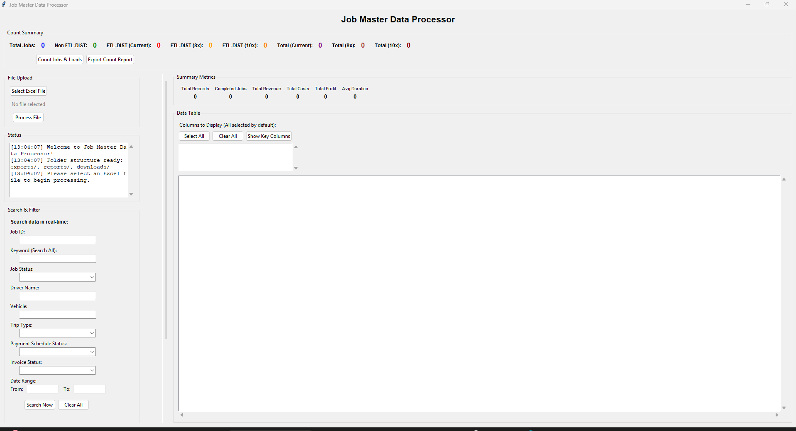
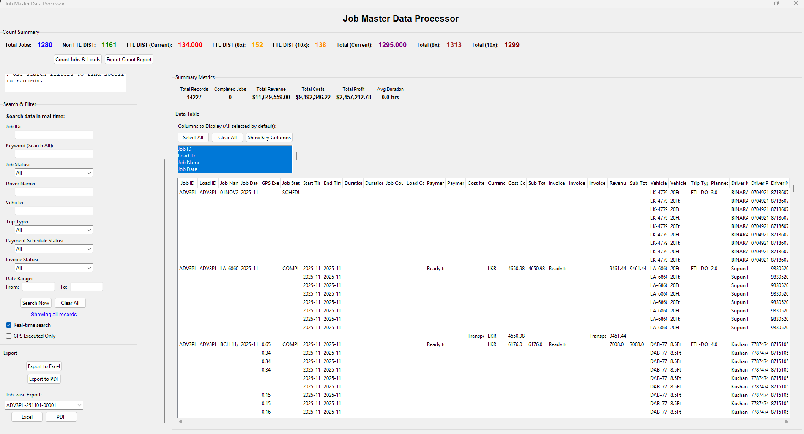

# Job Master Data Processor

A comprehensive application for processing Job Master Excel files with both web and desktop interfaces. This tool extracts and processes job data according to specific validation requirements, providing search, filtering, and export capabilities.

## What It Does

Built this to solve a testing problem: verifying job data from Transport Management System exports was taking at lest 2+ hours. Manual Excel filtering, calculating expected load counts for validation, and checking GPS/payment/invoice status across hundreds of test cases was a bottleneck.

**Core functionality:**
- Processes Excel files (.xlsx, .xls) with automatic column mapping (handles 30+ column variations)
- Real-time search and filtering across all fields
- Calculates job and load counts with three different methods (including prorated FTL-DISTRIBUTION logic)
- Exports filtered data with smart filenames that include your filters
- Shows summary metrics (revenue, costs, profit, duration)
- Bulk job checker: verify GPS/payment/invoice status for 2000+ jobs in 30 seconds

**Why it's useful for QA:**

*Test data verification:*
- Quickly validate that test scenarios processed correctly (filter by status, trip type, date range)
- Verify load calculations: app shows three calculation methods side-by-side to catch discrepancies
- Find edge cases easily: "Show me all FTL jobs with exactly 9 stops" for boundary testing

*Bug reporting:*
- Export complete job data with context embedded in filename
- Example: `JobMaster_Export_JobID-12345_Status-Failed_GPSMissing_20250118.xlsx`
- Developer gets exact test data, no back-and-forth

*Testing efficiency:*
- Before: 15-20 minutes to manually verify 10 test cases
- After: 2 minutes (upload export, filter, validate counts)
- Real-time search: type job ID from bug report, instantly see all related data

*Test evidence:*
- Multi-sheet exports: raw data + summary statistics + filters used
- Perfect for test documentation and audit trails
- Works with dev/staging/prod exports even when column names differ

**Three apps included:**
- Desktop app (main tool, full features)
- Web app (lighter, browser-based)
- Bulk job checker (check status for hundreds of jobs at once)

---

## Screenshots

**Main Interface**



**File Processing**


**Processed Data with Filters**



**Search and Filter Panel**


---

## Quick Start

### Windows (easiest)
1. Double-click `desktop_app.bat` or `web_app.bat`
2. If Python not found, install from Microsoft Store or check `INSTALL_PYTHON.md`
3. Upload the sample file `file/job-master (9).xlsx` to test
4. Click "Process File" and explore the search/filter features

### Manual setup
1. Install dependencies: `pip install -r requirements.txt`
2. Run desktop app: `python desktop_app.py`
3. Or run web app: `streamlit run app.py`

---

## Installation

**Prerequisites:**
- Python 3.8+
- pip

**Quick install:**
```bash
pip install -r requirements.txt
```

**Dependencies:**
- `pandas>=2.0.0` - Data processing
- `openpyxl>=3.1.0` - Excel handling
- `streamlit>=1.28.0` - Web interface
- `reportlab>=4.0.0` - PDF generation
- `Pillow>=10.0.0` - Image support

## How to Use

### Desktop App (main tool)

Launch: `desktop_app.bat` or `python desktop_app.py`

**Basic workflow:**
1. Click "Select Excel File" and choose your file
2. Click "Process File" to load and map the data
3. Use the search filters on the left to find specific jobs
4. View counts at the top (jobs and loads with multiple calculation methods)
5. Click "Export to Excel" to save filtered data
6. Or click "Export Count Report" for detailed load analysis

The table shows all filtered results with scrollbars. You can choose which columns to display using the column selector.

### Web App (browser-based)

Launch: `web_app.bat` or `streamlit run app.py`

Opens in your browser at `http://localhost:8501`. Similar workflow to desktop but lighter weight.(not completed)

### Bulk Job Checker

Launch: `bulk_job_checker.bat` or `python bulk_job_checker.py`

Check GPS, payment schedule, and invoice status for hundreds of jobs at once. Upload job IDs from text file, CSV, or Excel.

## Column Mapping

The application automatically maps your Excel columns to the required fields:

| Required Field | Possible Excel Column Names |
|---|---|
| Job ID | Job ID, job_id, JobID, ID |
| Job Date | Job Creation DateTime, job_date, creation_date, Job Date |
| GPS Executed | Distance: GPS, gps_distance, GPS Distance, Distance |
| Job Status | Status, job_status, Job Status |
| Job Count | Job Count, job_count, Jobs Count, Number of Jobs |
| Load Count | Load Count, load_count, Loads Count, Number of Loads |
| Start Time | Start Time: Actual, actual_start_time, Start Time |
| End Time | End Time: Actual, actual_end_time, End Time |
| Duration | Duration: Actual, actual_duration, Duration |
| Duration Variance | Duration: Variance, duration_variance, Variance |
| Invoice Status | Invoice Status, invoice_status |
| Invoice Number | Invoice Number, invoice_number, Invoice No |
| Invoice Item | Invoice Item, invoice_item |
| Sub Total Revenue | Sub Total: Revenue, subtotal_revenue, Revenue |
| Vehicle | Vehicle, vehicle_id, Vehicle ID |
| Vehicle Type | Vehicle Type, vehicle_type |
| Driver Name | Driver Name, driver_name, Driver |
| Driver Phone | Driver Phone, driver_phone, Phone |
| Driver NIC | Driver NIC, driver_nic, NIC |

## File Organization

The app creates folders automatically:

```
jobmaster/
├── file/              Sample Excel (job-master (9).xlsx included)
├── uploads/           Web app uploads
├── downloads/         Web app exports
├── exports/           Desktop app exports
├── reports/           Count reports
└── screenshots/       Application screenshots
```

**Smart filenames:**
Exports include your filters in the filename so you know what's inside.
- Example: `JobMaster_Export_JobID-12345_Status-Completed_20250118_143022.xlsx`

**Multi-sheet exports:**
Excel exports include main data, summary statistics, and a sheet showing which filters you applied.

*See FEATURES.md for more details on file organization*

## Troubleshooting

**Python not found:**
- Install from Microsoft Store or check `INSTALL_PYTHON.md`
- Try `py` instead of `python` command

**Dependencies won't install:**
- Run: `pip install -r requirements.txt`
- Or try: `python -m pip install -r requirements.txt`

**File won't upload:**
- Check it's .xlsx or .xls format
- Make sure file isn't open in Excel
- Try closing and reopening the file

**Columns not mapping:**
- Check the column mapping table above
- Your column names should be similar (not exact match needed)

**Large files slow:**
- Filter data before viewing full table
- Use column selection to show only what you need
- Close other apps to free up memory

## More Documentation

- `FEATURES.md` - Complete features guide with counting logic details
- `APP_OVERVIEW.md` - Comparison of all three apps
- `START_HERE.md` - Getting started guide
- `TROUBLESHOOTING.md` - Detailed troubleshooting

---

**Version**: 2.1.0  
**Python**: 3.8+  
**Platform**: Windows, macOS, Linux 