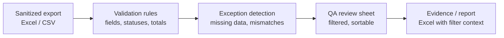

# Job Master Data Validation and Evidence Processor

## Overview

A QA tool for validating large job and work-order exports from a Transport Management System. It ingests an export, applies validation rules, highlights data quality issues, runs bulk status checks, and produces evidence-ready outputs that travel cleanly into defect reports and release reviews.

## QA Challenge

Releases must be validated against large Excel and report exports covering jobs, loads, GPS, payments, and invoices:

- Manually filtering and reconciling tens of thousands of rows is slow and error-prone.
- Load counting rules differ by trip type (e.g. distribution trips vs non-distribution trips) and must be validated under several methods.
- Status checks for GPS execution, invoicing, and payment schedule must be done across many job IDs at once.
- QA needs an audit trail (filters used, totals, exceptions) to defend release decisions.

## Solution Approach

A Python application (desktop + web + command line) that loads an export and provides search, filter, calculation-comparison, and bulk-status views. Outputs are written back as Excel with the filter context embedded in the filename, so each export is self-describing.


```mermaid
flowchart LR
    A[Sanitized export<br/>Excel / CSV] --> B[Validation rules<br/>fields, statuses, totals]
    B --> C[Exception detection<br/>missing data, mismatches]
    C --> D[QA review sheet<br/>filtered, sortable]
    D --> E[Evidence / report<br/>Excel with filter context]
```

## Key Capabilities

- **Real-time search and filter** across all columns
- **Multi-method load counting** (e.g. Non-distribution unique-load counting and distribution-trip calculations with prorated / 8x / 10x variants) presented side-by-side for comparison
- **Bulk status checker** that verifies GPS, payment-schedule, and invoice status across thousands of job IDs
- **Column mapping** that tolerates variations in export headers across environments
- **Smart exports** with filter context embedded in the filename
- **Multi-sheet output** including raw data, summary statistics, and applied filters
- **Counting-logic test mode** that documents which calculation rule was applied to each row

## Example Workflow

A fictional QA scenario, using generic names only:

1. Load a sanitized export with the columns: `Job ID`, `Trip Type`, `Planned Stops: Qty`, `Load ID`, `Status`, `Invoice Status`, `Payment Schedule Status`, `Distance: GPS`.
2. Filter to `Trip Type = FTL-DISTRIBUTION` and `Planned Stops: Qty BETWEEN 9 AND 16`.
3. Compare load counts under the three calculation methods (prorated, 8x, 10x) side by side.
4. Run a bulk status check for the resulting job IDs to confirm GPS, payment, and invoice status.
5. Export with the filename `JobMaster_Export_TripType-FTL-DISTRIBUTION_Stops-9to16_20260101.xlsx` and attach it to the test case.

Safe sanitized row examples:

```text
Job ID: JOB-1001
Load ID: LOAD-2001
Status: Completed
Invoice Status: Pending
Payment Schedule Status: Scheduled
GPS Status: Available
```

```text
Job ID: JOB-1002
Load ID: LOAD-2002
Status: In Progress
Invoice Status: Not Created
Payment Schedule Status: Pending
GPS Status: Missing
```

## QA Scenarios Supported

- Validation of load and job counting rules across trip types
- Reconciliation of GPS, invoice, and payment-schedule statuses for large job sets
- Regression of calculation changes after a release
- UAT support for new export formats or new business rules
- Edge-case testing: boundary stop counts, missing data fields, duplicate identifiers
- Evidence capture for defect reports and audit trails

## Technology Approach

- Python 3.8+ with Pandas and OpenPyXL for data processing and Excel I/O
- Tkinter desktop GUI with background threading to keep the UI responsive on large files
- Flask web interface for browser-based access
- Configurable column mapping so the tool tolerates header variations across dev / staging / production-like exports

## Evidence and Outputs

Safe public artefacts:

- [`../assets/demo-data/jobmaster-sample-export.csv`](../assets/demo-data/jobmaster-sample-export.csv) — fictional rows that follow the validation shape
- [`../assets/sample-reports/jobmaster-validation-summary.md`](../assets/sample-reports/jobmaster-validation-summary.md) — synthetic summary report
- Multi-sheet Excel exports with raw data + summary statistics + filter context in the filename
- `screenshots/jobmaster1.png` — GUI screenshot (no real data)

## QA Value

- Reduces test-data verification on TMS exports from minutes per check to seconds.
- Detects calculation defects in load counting and prorated math before release.
- Catches GPS / payment / invoice status mismatches in bulk.
- Produces evidence-ready exports that travel cleanly into defect reports and release reviews.

## Limitations

- Validation rules are scoped to the documented columns and trip types.
- Heavy customization belongs in a rules-config file rather than code.
- The tool is a QA aid, not an authoritative system of record.

## Confidentiality Note

This is a sanitized portfolio case study. Production code, real system data, confidential workflows, credentials, real customer or driver names, real financial values, and real export headers are not included. Sample identifiers such as `JOB-1001` and `LOAD-2001` are fictional.

## Documentation

See the `docs/` folder for usage guides:

- `docs/APP_OVERVIEW.md`
- `docs/CURRENT_COUNTING_LOGIC.md`
- `docs/BULK_JOB_CHECKER_GUIDE.md`
- `docs/DESKTOP_APP_TROUBLESHOOTING.md`
- `docs/TROUBLESHOOTING.md`
