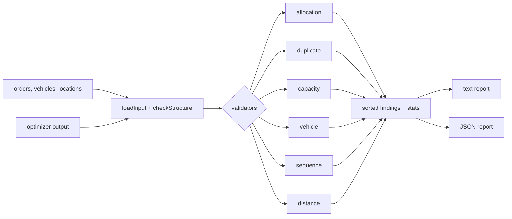

# Route Optimizer Validation Workbench

**An independent QA validation layer for route-optimizer output.** It is **not** an optimizer. It takes the
same orders, vehicles and locations the optimizer received, plus the plan it produced, and checks the plan
against transparent rules. Every finding has a code, a severity and the evidence behind it.

## Project Status

**Public implementation:** Runnable demo. TypeScript validators, fictional sample data (a clean plan and a plan
with planted defects), CLI, 19 automated tests.

**Professional relevance:** Based on QA problems handled in professional TMS / logistics testing (optimizer
output that looks plausible but drops orders, overloads vehicles or picks unsuitable ones). This public version
is independently written for this portfolio.

**Confidentiality:** No optimization algorithm, scoring formula, cost model, vehicle catalog, customer
constraint or real data. Orders, vehicles and locations are fictional. See
[`../docs/confidentiality.md`](../docs/confidentiality.md).

---

## 1. The QA problem

An optimizer's plan is easy to ship and hard to check. A plan with a short total distance can still:

- drop an order, or deliver one twice;
- overload a vehicle by weight or by volume;
- put chilled goods on a truck without refrigeration, or a truck on a vans-only street;
- report distances that cannot be true.

Re-implementing the optimizer to compare results would just copy its assumptions. This workbench instead
checks **invariants that every valid plan must satisfy**, whatever algorithm produced it.

## 2. Validators

| Validator | Finding codes | Severity |
| --- | --- | --- |
| Allocation | `ORDER_MISSING`, `ORDER_ROUTED_AND_UNASSIGNED`, `UNKNOWN_ORDER` | Critical |
| | `UNASSIGNED_WITHOUT_REASON` (unassigned needs a known reason code) | Major |
| Duplicate | `ORDER_ASSIGNED_TWICE` (same or different vehicle) | Critical |
| Capacity | `WEIGHT_OVER_CAPACITY`, `VOLUME_OVER_CAPACITY`, with the overload amount; exactly at capacity passes | Critical |
| Vehicle | `UNKNOWN_VEHICLE`, `VEHICLE_TYPE_MISMATCH` (e.g. chilled goods need a REEFER) | Critical |
| | `LOCATION_DISALLOWS_VEHICLE`, `VEHICLE_USED_TWICE` | Major |
| Sequence | `UNKNOWN_LOCATION` | Critical |
| | `STOP_LOCATION_MISMATCH`, `TOO_MANY_STOPS` | Major |
| | `LOCATION_REVISITED`, `EMPTY_ROUTE` (warnings) | Minor |
| Distance | `DISTANCE_BELOW_STRAIGHT_LINE`: a road route can never be shorter than the straight line | Critical |
| | `DISTANCE_SUSPICIOUSLY_HIGH` (> 2× straight line), `DISTANCE_NOT_REPORTED` (warnings) | Minor |

**FAIL** findings block acceptance. **WARNING** findings need a human look but are not wrong by themselves; a
detour may be legitimate.

**The verdict is never "approved".** It is `REVIEW REQUIRED` when there are findings, and
`NO ISSUES FOUND - HUMAN REVIEW STILL REQUIRED` when there are none. The release decision belongs to human QA.

## 3. Architecture



The structure check runs first. A malformed file (wrong types, duplicate IDs, missing arrays) stops with an
input error (exit code 2) instead of producing misleading findings.

## 4. Setup and run

```bash
cd route-optimizer-validation-workbench
npm ci
npm test                    # 19 tests
npm run validate            # flawed sample plan  -> exit 1
npm run validate:clean      # clean sample plan   -> exit 0
npm run validate -- --data path/to/dir --output plan.json --json report.json
```

Exit codes: `0` no blocking findings, `1` blocking findings, `2` unusable input.

## 5. Sample data

[`sample-data/`](sample-data/) holds a depot, 8 sites (one restricted to vans), 4 vehicles (two trucks, a van and
a reefer), 20 orders (two need a reefer, one is too heavy for any vehicle), and two plans:

- `optimizer-output-clean.json`: valid; the oversized order is unassigned with reason `CAPACITY`;
- `optimizer-output.json`: one planted defect per validator.

## 6. Sample output

From `npm run validate` ([full text](sample-output/flawed-plan.report.txt) · [JSON](sample-output/flawed-plan.report.json)):

```text
Route Validation Report
Run: DEMO-RUN-FLAWED

Orders in scope: 20
Orders routed: 17
Orders unassigned: 2
Missing orders: 1
Duplicate assignments: 1

Vehicles: 4 (routes: 4)

Capacity violations: 2
Vehicle compatibility issues: 2
Sequence issues: 3
Distance issues: 1

Findings:
  [CRITICAL FAIL] DISTANCE_BELOW_STRAIGHT_LINE: TRUCK-002: reported 6.6 km vs straight-line 9.4 km - physically impossible
  [CRITICAL FAIL] ORDER_ASSIGNED_TWICE: DEMO-ORD-3011 appears 2 times (TRUCK-001, TRUCK-002)
  [CRITICAL FAIL] ORDER_MISSING: DEMO-ORD-3019 is neither routed nor unassigned
  [CRITICAL FAIL] UNKNOWN_ORDER: DEMO-ORD-3999 is in the output but not in the input
  [CRITICAL FAIL] VEHICLE_TYPE_MISMATCH: DEMO-ORD-3016 needs a REEFER; TRUCK-002 is a TRUCK
  [CRITICAL FAIL] VOLUME_OVER_CAPACITY: VAN-001 capacity 10 m3, assigned 11 m3, overload 1 m3
  [CRITICAL FAIL] WEIGHT_OVER_CAPACITY: VAN-001 capacity 1500 kg, assigned 2100 kg, overload 600 kg
  [MAJOR FAIL] LOCATION_DISALLOWS_VEHICLE: SITE-EPSILON only accepts VAN; TRUCK-001 is a TRUCK
  [MAJOR FAIL] STOP_LOCATION_MISMATCH: DEMO-ORD-3005 belongs at SITE-THETA but is scheduled at SITE-GAMMA
  [MAJOR FAIL] UNASSIGNED_WITHOUT_REASON: DEMO-ORD-3020 is unassigned with no reason; expected one of ...
  [MINOR WARNING] LOCATION_REVISITED: TRUCK-001 returns to SITE-GAMMA after leaving it (stop 6)
  [MINOR WARNING] LOCATION_REVISITED: TRUCK-002 returns to SITE-DELTA after leaving it (stop 6)

Blocking findings: 10   Warnings: 2
Final Result: REVIEW REQUIRED
The release decision belongs to human QA; this report is evidence, not an approval.
```

Note the first `LOCATION_REVISITED` warning: it is a knock-on effect of the misplaced stop above it. Findings are
evidence to read together, not a list to fix line by line.

## 7. Test coverage

ROUTE-001 to ROUTE-017. Each test starts from the clean plan and injects **one** defect, then asserts that
exactly the expected finding appears. Cases covered:

- missing, duplicated, contradictory and unknown orders, and unknown reason codes;
- capacity exactly at the limit (passes) and 1 kg over (fails, reports `overload 1 kg`), and volume checked on
  its own;
- reefer-only goods, a vans-only site, unknown and reused vehicles;
- a stop at the wrong site, the stop limit, a revisited location (warning only, still `REVIEW REQUIRED`);
- impossible and suspicious distances, and configurable distance rules;
- the shipped flawed plan producing one finding per planted defect;
- malformed input rejected before any rule runs.

During development, one test first failed because of a wrong assumption *in the test*: moving a stop made the
route longer, and the validator correctly reported the unchanged distance as impossible. The test was fixed
from that evidence, not the validator.

## 8. Known limitations

This public implementation intentionally simplifies:

- **straight-line reference:** distances are compared with straight lines, not a road network;
- **no time windows, driver hours or multi-day plans;**
- **no cost or optimality check:** it finds invalid plans, it does not say whether a valid plan is the best one;
- **single depot per vehicle,** with routes that start and end there.

It exists to demonstrate how to validate algorithmic output, not to reproduce a production optimizer.
