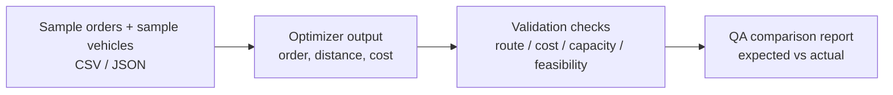

# Route Optimizer Validation Engine

## Overview

A QA reference engine for validating order-allocation and route-optimization output produced by an enterprise TMS. The engine accepts a set of orders and vehicles, computes its own expected route and cost using a transparent algorithm and real road distances, and compares the result with the product's optimizer output.

## QA Challenge

Optimizer features are easy to ship and hard to verify:

- Manual validation of multi-stop routes is impractical beyond a few stops.
- Real road distances differ from straight-line distances, and small differences compound across long routes.
- Lower total distance does not always mean lower operating cost. Cost validation must consider vehicle selection, cost per kilometre, capacity, route feasibility, and load allocation.
- QA needs a defensible, repeatable expected result per scenario.

## Solution Approach

A standalone Next.js engine that:

1. Accepts addresses, coordinates, or a CSV / JSON file.
2. Builds a distance matrix using a public road-routing service.
3. Solves the routing problem using Nearest Neighbour + 2-opt + 3-opt with a multi-start strategy.
4. Returns the optimized order, total distance, duration, and alternative routes.
5. Visualises the route on a Leaflet map for evidence and attachment.



## Key Capabilities

- Independent recomputation of routes for validation, not for production planning.
- Real road distances via a public routing service, with a Haversine fallback.
- Multiple algorithms (Nearest Neighbour, 2-opt, 3-opt, multi-start).
- Alternative routes ranked by distance for comparison.
- CSV import / export so test scenarios are repeatable.
- LRU cache for routing-service calls.
- Web Workers to keep the UI responsive on larger inputs.
- Documented support for a local OSRM instance to remove public-API rate limits.

## Example Workflow

A fictional QA scenario, using generic names and values only:

| Entity     | Capacity   | Cost per km |
| ---------- | ---------- | ----------- |
| Vehicle A  | 5,000 kg   | 120 / km    |
| Vehicle B  | 10,000 kg  | 190 / km    |

| Order   | Weight   |
| ------- | -------- |
| Order 1 | 2,000 kg |
| Order 2 | 3,000 kg |

1. Load the synthetic orders and vehicles.
2. Run the reference engine to produce an expected route, distance, and total cost.
3. Run the product's optimizer with the same inputs.
4. Compare the two outputs across distance, total cost, vehicle selection, capacity usage, and stop order.
5. Document any difference, classify it (e.g. wrong vehicle selected, infeasible route, higher cost despite lower distance), and attach the comparison as evidence.

A safe sanitized location example:

```csv
name,address
Warehouse A,0.0001,0.0001
Customer Site B,0.0002,0.0002
Customer Site C,0.0003,0.0003
```

## QA Scenarios Supported

- Multi-stop routing correctness up to 50 locations
- Vehicle allocation validation: capacity, cost per km, and feasibility
- Cost vs distance trade-off (lower distance is not always lower cost)
- Round-trip and one-way variants
- Boundary cases: overlapping locations, single-stop routes, capacity-tight allocations
- Negative cases: infeasible orders, missing coordinates, malformed CSV

## Technology Approach

- Next.js, React, TypeScript, Tailwind CSS
- Leaflet for map visualisation
- OSRM (public service or local Docker instance) for real road distances
- Web Workers for non-blocking optimization
- LRU cache for routing-service calls

## Evidence and Outputs

Safe public artefacts:

- [`../assets/demo-data/route-orders.csv`](../assets/demo-data/route-orders.csv) — synthetic order list
- [`../assets/demo-data/route-vehicles.csv`](../assets/demo-data/route-vehicles.csv) — synthetic vehicle list
- [`../assets/sample-reports/route-comparison-example.md`](../assets/sample-reports/route-comparison-example.md) — synthetic expected-vs-actual comparison
- Screenshots in `screenshots/`, demo video in `videos/`
- CSV / JSON export of any computed route for use as a test-case attachment

## QA Value

- Provides an independent reference for validating optimizer output.
- Detects defects in distance calculation, stop ordering, vehicle allocation, and cost computation.
- Catches the **cost-vs-distance trap**: optimizer output that minimises kilometres but increases total cost via wrong vehicle selection.
- Reduces route and optimizer testing effort significantly compared with manual validation.

## Limitations

- Practical limit of around 50 locations per run (public OSRM rate limits).
- No real-time traffic; static road network.
- Geocoding accuracy depends on the underlying map data.
- Time windows and complex multi-vehicle constraints are not yet modelled in the public reference.

## Confidentiality Note

This is a sanitized portfolio case study. Production code, real system data, confidential workflows, credentials, internal cost models, customer addresses, real vehicle data, and proprietary scoring formulas are not included. Sample identifiers such as `Vehicle A`, `Vehicle B`, `Order 1`, `Warehouse A`, and `Customer Site B` are fictional.

## Additional Documentation

- [ENV_SETUP.md](ENV_SETUP.md) — local OSRM setup
- [OSRM_METRICS_GUIDE.md](OSRM_METRICS_GUIDE.md) — distance calculation details
- [QUICK_START.md](QUICK_START.md) — quick start
- [CSV_FORMAT_GUIDE.md](CSV_FORMAT_GUIDE.md) — CSV import format
