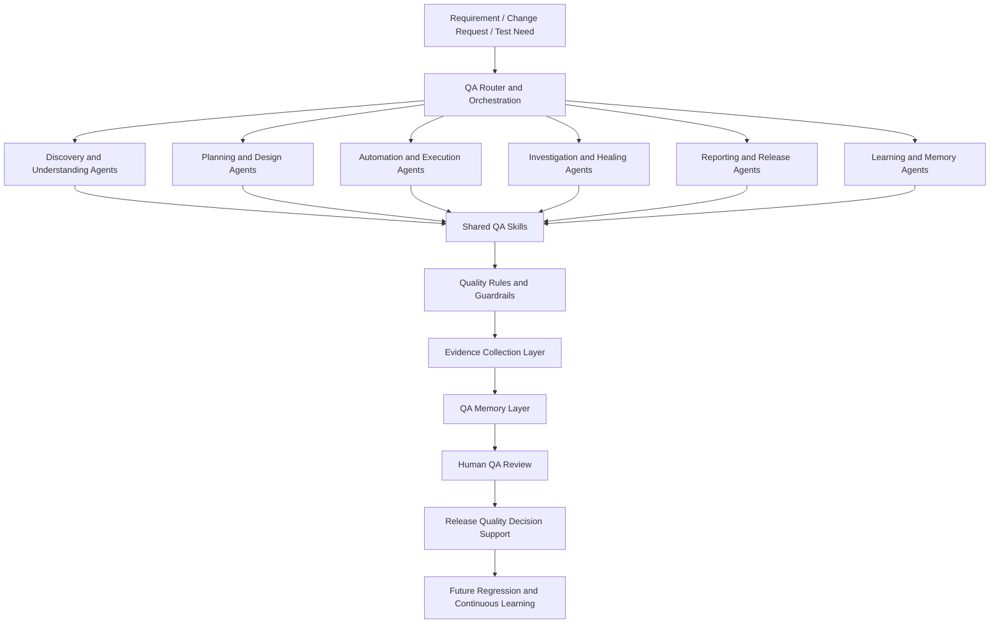
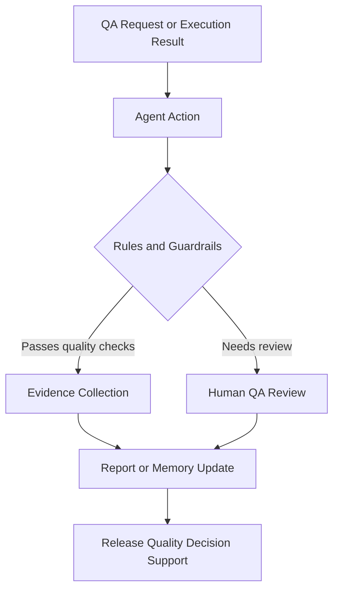
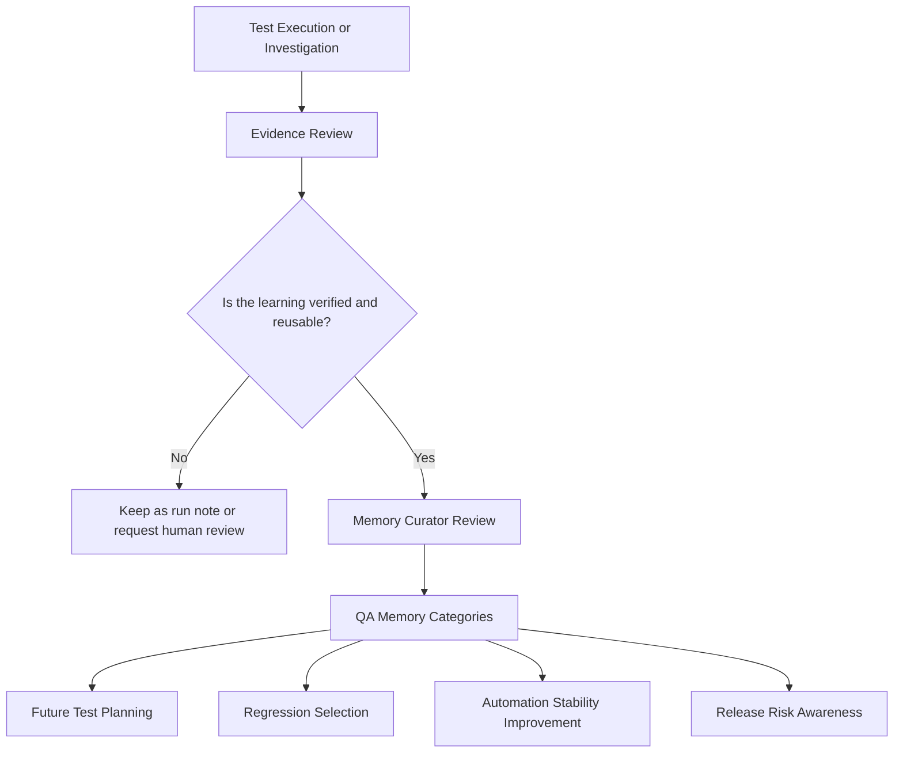

# Smart QA Agent OS — QA Automation & AI-Assisted Testing Prototype

A public-safe reference architecture for my evolving QA-assistance system, designed to make exploratory testing, workflow understanding, test design, automation planning, locator investigation, and QA knowledge management more structured, reusable, and evidence-driven.

> **Human QA stays in control.** Human QA remains responsible for requirement interpretation, test approval, defect decisions, release recommendations, and memory updates. The system assists; it does not decide.

The system currently focuses on exploratory testing support, browser and workflow discovery, requirement analysis, QA risk planning, knowledge capture, Playwright test-design assistance, BDD scenario drafting, Page Object Model planning, and locator-healing investigation.

API testing, API + UI hybrid validation, Postman/Newman workflows, k6 performance testing, CI execution, automated release-gate decisions, and broader automation execution capabilities are active development and learning tracks. They are included in the architecture as future capability areas, not presented as fully completed production features.

## Public Showcase Boundary

This portfolio presents a sanitized architecture and workflow showcase. It does not expose private source code, real customer data, production URLs, API payloads, internal screenshots, confidential business logic, private agent prompts, private rule wording, private memory content, real selectors, internal tool names, or proprietary workflows.

The public version uses fictional examples, synthetic artifacts, and high-level architecture diagrams to demonstrate the approach without exposing private implementation details.

---

## Repository Structure

| Directory | Purpose |
| --- | --- |
| [`ai-qa-operating-model.md`](ai-qa-operating-model.md) | Main AI QA Operating Model overview with layered architecture and orchestration flow |
| [`architecture/`](architecture/) | Mermaid diagrams for framework, API+UI hybrid flow, and release gate |
| [`docs/`](docs/) | Agents catalog, workflow matrix, shared skills, rules and guardrails, QA memory, example agent journey, demo script |
| [`manual-knowledge/`](manual-knowledge/) | Sanitized manual QA notes that seed agent memory (checkout flow, test plan, test data, locators, selectors, coupon rules) |
| [`module-template/`](module-template/) | Reusable scaffold for adding a new business workflow with parallel `tests/` and `qa-output/` trees |
| [`playwright-demo/`](playwright-demo/) | Playwright + TypeScript demo with POM, BDD, API, hybrid tests, fixtures, and test data |
| [`postman-newman/`](postman-newman/) | Postman collection and environment with Newman CI execution examples |
| [`k6-performance/`](k6-performance/) | k6 smoke, load, stress, and soak test scripts |
| [`prompts/`](prompts/) | Sanitized prompt templates for master orchestration, test planning, BDD/POM automation, execution/healing, memory update, and manual bug hunting |
| [`qa-graph-tool/`](qa-graph-tool/) | Architecture overview of a local visualization tool that renders the operating model as an interactive graph |
| [`qa-output/`](qa-output/) | Sample module-level QA outputs, run notes, skill-agent reports, DOM capture evidence, and sanitized Playwright results |
| [`sample-artifacts/`](sample-artifacts/) | Synthetic sample artifacts: test plan, BDD scenario, API validation result, release gate report, failure classification, memory update, evidence summary |
| [`scripts/`](scripts/) | Sample utility scripts for secret scanning, evidence cleanup, Newman runs, memory-triggered test execution, and report generation |
| [`test-data/`](test-data/) | Synthetic demo test data for users and todos |
| [`evidence-samples/`](evidence-samples/) | Evidence sample placeholders |
| [`previews/`](previews/) | HTML preview pages for operating model concepts |

---

## Maturity Statement

This repository contains a mix of actively used QA practices, implemented prototypes, public-safe examples, learning experiments, and planned capabilities. Each section is labelled by maturity. Current working and reference material comes first; planned capabilities appear later in the README.

## Current Maturity Snapshot

| Capability Area | Current Status | Public Description |
|---|---|---|
| Exploratory QA Support | Actively Used — applied in my QA work; public repository may include only sanitized examples or documentation. | Supports structured exploration, risk thinking, workflow discovery, QA investigation, and exploratory testing notes. |
| Requirement and Test Planning | Actively Used | Helps convert requirements into acceptance criteria, risks, test conditions, edge cases, and QA coverage ideas. |
| Browser and Flow Discovery | Actively Used | Supports understanding of screens, user journeys, dependencies, workflow states, and automation candidates. |
| QA Knowledge Capture | Implemented Prototype | Organises reusable QA knowledge such as flows, risks, validation rules, test-data dependencies, defects, and lessons learned. |
| Playwright Test Design | Actively Used | Supports Playwright test planning, BDD scenario drafting, Page Object Model design, reusable test-flow ideas, and test-data planning. |
| Locator Healing | Actively Used / Learning | Supports structured investigation of locator instability, DOM or workflow changes, timing issues, and safer locator-selection approaches. Suggested changes require human QA review before adoption. |
| Playwright Test Execution | In Development | Expanding runnable tests, reporting, evidence capture, and execution practices. |
| API and Hybrid Testing | In Development / Learning | Exploring API-only and API + UI validation patterns through controlled prototypes. |
| Postman and Newman | In Development / Learning | Designing collection-based API regression and reporting workflows. |
| k6 Performance Testing | Learning / Experimentation | Learning smoke, load, stress, and soak-test design using safe demo or controlled targets. |
| CI and Release Gates | Planned / In Development | Preparing CI-ready workflow design and evidence-based release-quality summaries. |

---

## Business Problem

Enterprise platforms can have large regression scopes across web workflows, APIs, reporting, data validation, GPS or map behavior, integrations, and mobile-related processes.

A single release may affect multiple workflows at once. Manual testing alone can be slow, while automation without structure can become difficult to maintain, difficult to explain, and difficult to trust.

The Smart QA Agent OS approach is designed to help QA work remain structured, evidence-driven, reusable, and continuously improving while keeping human QA judgement at the center.

---

## Current Focus

The system is currently most useful for:

1. Exploring unfamiliar or changed product areas
2. Understanding end-to-end workflows and dependencies
3. Identifying risks, missing coverage, and edge cases
4. Capturing reusable QA knowledge from exploration and testing
5. Creating structured Playwright test plans
6. Drafting BDD scenarios and Page Object Model approaches
7. Investigating locator instability and automation-maintenance risks
8. Supporting human QA review before automation or release decisions

---

## Development Direction

The next development areas are:

1. Strengthen Playwright execution and evidence reporting
2. Expand reusable test fixtures and automation patterns
3. Validate API-only testing patterns
4. Build API + UI hybrid workflow examples
5. Create safe Postman/Newman demonstration flows
6. Learn and prototype k6 smoke and basic load testing
7. Add CI-ready public demo workflows
8. Evolve release-gate reporting from a documented process into an evidence-based QA workflow

---

# AI QA Operating Model

A modular, evidence-driven QA architecture where specialised agents coordinate discovery, planning, automation design, execution support, investigation, reporting, release quality, and continuous learning.

The Smart QA Agent OS is not a single chatbot. It is a structured QA operating model made up of specialised agents, reusable QA skills, quality guardrails, evidence-first validation, and continuously updated QA memory.

Each agent has a focused responsibility. Agents use shared skills and rules, create evidence-based outputs, and update approved QA knowledge so future testing becomes more consistent and informed.

## Explore the Operating Model

- [Architecture Overview](#architecture-overview)
- [Specialised QA Agent Catalog](#specialised-qa-agent-catalog)
- [Agent Workflow Matrix](#agent-workflow-matrix)
- [Shared QA Skills](#shared-qa-skills)
- [Quality Rules and Guardrails](#quality-rules-and-guardrails)
- [Continuous QA Memory Architecture](#continuous-qa-memory-architecture)
- [Example Agent Journey](#example-agent-journey)
- [Current Maturity and Roadmap](#current-maturity-snapshot)
- [Confidentiality](#public-showcase-boundary)

## Explore Supporting Directories

- [Manual QA Knowledge](manual-knowledge/) - Sanitized manual QA notes that seed agent memory (flow, test plan, test data, locators, selectors, coupon rules)
- [Module Template](module-template/) - Reusable scaffold for adding a new business workflow with parallel tests/ and qa-output/ trees
- [Prompt Examples](prompts/) - Sanitized prompt templates for master orchestration, test planning, BDD/POM automation, execution/healing, memory update, and manual bug hunting
- [QA Graph Tool](qa-graph-tool/) - Architecture overview of a local visualization tool that renders the operating model as an interactive graph
- [QA Output](qa-output/) - Sample module-level QA outputs, run notes, skill-agent reports, DOM capture evidence, and sanitized Playwright results
- [Scripts](scripts/) - Sample utility scripts for secret scanning, evidence cleanup, Newman runs, memory-triggered test execution, and report generation

---

## Architecture Overview

| Layer | Purpose |
|---|---|
| QA Router and Orchestration | Understands the QA request and directs work to the appropriate specialist agents. |
| Specialised Agents | Perform focused activities such as discovery, planning, automation design, investigation, reporting, and learning. |
| Shared Skills | Reusable QA methods, patterns, standards, and knowledge used by multiple agents. |
| Rules and Guardrails | Ensure evidence-first verification, safe handling of data, quality standards, and controlled automation behavior. |
| Evidence and Memory | Stores verified learning, execution outcomes, known risks, reusable flows, and validation knowledge. |
| Human QA Review | Ensures important conclusions, locator changes, defects, memory updates, and release decisions are reviewed by a QA engineer. |
| Release Quality Support | Converts quality evidence into structured release recommendations and risk summaries. |

---

## Specialised QA Agent Catalog

Public-safe, capability-level descriptions only. Private agent filenames, prompts, and implementation details are not exposed.

### Discovery and Understanding Agents

#### Requirement Analyst

| Field | Detail |
| --- | --- |
| Maturity | Actively Used |
| Purpose | Converts requirements, user stories, defects, and change requests into testable acceptance criteria, risks, assumptions, and open questions. |
| Typical input | A feature request, user story, change request, defect, or release scope. |
| Typical output | Acceptance criteria, risk list, exploratory ideas, missing-information questions, and candidate test scenarios. |
| QA value | Helps QA start with clearer understanding and stronger coverage before execution begins. |
| Human QA responsibility | A QA engineer reviews the identified risks, confirms requirements, and decides final test coverage. |
| Memory interaction | Reads previous flow, risk, validation-rule, and known-issue knowledge where approved. |

---

#### Browser and Flow Discovery Agent

| Field | Detail |
| --- | --- |
| Maturity | Actively Used |
| Purpose | Supports exploratory testing by helping document screens, workflows, dependencies, user actions, expected results, and automation candidates. |
| Typical input | A new feature, changed workflow, release scope, or exploratory testing request. |
| Typical output | Workflow map, page understanding, dependencies, risk notes, scenario ideas, and automation candidates. |
| QA value | Reduces time needed to understand complex workflows and improves test coverage before automation begins. |
| Human QA responsibility | A QA engineer validates findings before they are used in test cases, defects, or memory. |
| Memory interaction | Can read approved flow knowledge and update verified workflow observations. |

---

#### Test Data Curator

| Field | Detail |
| --- | --- |
| Maturity | Actively Used |
| Purpose | Identifies required positive, negative, boundary, dependency-aware, and cleanup-aware test data conditions. |
| Typical input | A requirement, workflow, test scenario, or automation candidate. |
| Typical output | Test-data checklist, dependency notes, negative-data ideas, and precondition requirements. |
| QA value | Reduces false failures caused by missing, invalid, or incomplete test data. |
| Human QA responsibility | A QA engineer confirms that data conditions are valid for the test objective. |
| Memory interaction | Reads and updates approved test-data dependency knowledge. |

### Planning and Automation Design Agents

#### Test Case Planning Agent

| Field | Detail |
| --- | --- |
| Maturity | Actively Used |
| Purpose | Creates structured test conditions, scenarios, expected results, edge cases, and regression coverage ideas. |
| Typical input | A requirement, workflow map, product change, or risk list. |
| Typical output | Test scenarios, priority recommendations, coverage matrix, and exploratory charters. |
| QA value | Improves consistency between requirements, testing, regression coverage, and release confidence. |
| Human QA responsibility | A QA engineer reviews and finalises cases before execution. |
| Memory interaction | Uses approved flow, validation-rule, defect-pattern, and release-risk knowledge. |

---

#### Playwright Test Design Agent

| Field | Detail |
| --- | --- |
| Maturity | Actively Used |
| Purpose | Supports planning of Playwright tests using business-readable scenarios, Page Object Model responsibilities, reusable flow ideas, fixtures, test-data needs, and tags. |
| Typical input | Approved test scenarios, workflow knowledge, risk areas, and automation candidates. |
| Typical output | BDD scenario drafts, Page Object Model plan, test-flow design, fixture suggestions, tag recommendations, and automation prerequisites. |
| QA value | Helps convert manual QA understanding into structured, maintainable automation design. |
| Human QA responsibility | A QA engineer reviews every automation design before implementation or execution. |
| Memory interaction | Reads approved flow, component, test-data, and automation-stability knowledge. |

---

#### API and Hybrid Test Design Agent

| Field | Detail |
| --- | --- |
| Maturity | In Development / Learning |
| Purpose | Explores API-only and API + UI validation patterns for future automation coverage. |
| Typical input | A workflow, API behavior expectation, integration point, or proposed hybrid test scenario. |
| Typical output | High-level API test ideas, negative-test scenarios, hybrid-flow design suggestions, and validation checkpoints. |
| QA value | Supports future coverage beyond browser-only testing. |
| Human QA responsibility | A QA engineer validates API assumptions, test scope, security boundaries, and implementation choices. |
| Memory interaction | Will use approved API and integration behavior knowledge as this capability matures. |

---

#### Performance Test Design Agent

| Field | Detail |
| --- | --- |
| Maturity | Learning / Experimentation |
| Purpose | Explores smoke, load, stress, and soak-test patterns using k6 and controlled targets. |
| Typical input | A performance-sensitive workflow, endpoint category, or performance-testing question. |
| Typical output | High-level performance test plan, workload model, metric ideas, and baseline-learning notes. |
| QA value | Builds structured performance-testing understanding for future QA coverage. |
| Human QA responsibility | A QA engineer confirms safe test targets, load limits, performance expectations, and interpretation of results. |
| Memory interaction | Can capture approved performance-learning notes and baseline concepts. |

### Investigation and Healing Agents

#### Manual Bug Hunter

| Field | Detail |
| --- | --- |
| Maturity | Actively Used |
| Purpose | Supports exploratory and risk-based investigation to identify functional, workflow, usability, data, and edge-case issues. |
| Typical input | A feature under test, failed workflow, user complaint, release candidate, or risk area. |
| Typical output | Potential findings, reproduction ideas, impact notes, evidence checklist, and defect-report draft. |
| QA value | Improves exploratory coverage and helps identify risks outside predefined scripts. |
| Human QA responsibility | A QA engineer verifies every finding before it is reported as a defect. |
| Memory interaction | Reads known-risk and defect-pattern knowledge and can update verified findings. |

---

#### Locator Healing Agent

| Field | Detail |
| --- | --- |
| Maturity | Actively Used / Learning |
| Purpose | Supports investigation of failed browser automation by analysing locator stability, page or DOM changes, timing issues, visibility conditions, and workflow changes. |
| Typical input | A failed Playwright test, an unstable locator, a changed UI element, a timeout, or a browser execution result. |
| Typical output | A structured suggestion showing whether the issue may be related to a locator, timing, test data, environment, workflow change, or a possible product defect. |
| Current use | Used to support locator investigation, automation maintenance, and safer locator-selection decisions while the healing approach continues to be refined through real QA work and learning. |
| QA value | Reduces time spent manually investigating unstable automation and helps separate automation-maintenance issues from genuine product defects. |
| Human QA responsibility | The agent does not silently change locators or approve a test result. Every suggested locator or automation change requires human QA review, validation, and evidence before it is applied. |
| Memory interaction | Can update approved automation-stability knowledge with safe patterns such as recurring locator risks, stable element-identification approaches, timing dependencies, and known page-change areas. |
| Public Showcase Boundary | This describes the architecture and workflow only. It does not expose real selectors, DOM structures, private application screens, test code, or internal locator-healing rules. |

---

#### Failure Classification Agent

| Field | Detail |
| --- | --- |
| Maturity | Implemented Prototype |
| Purpose | Helps classify failed test outcomes into product defect, automation issue, locator issue, timing issue, environment issue, test-data issue, or requirement gap. |
| Typical input | A failed execution, screenshot, report, trace summary, or manual QA observation. |
| Typical output | A structured classification suggestion, evidence status, confidence level, and recommended next action. |
| QA value | Speeds up triage and reduces confusion between product failures and automation-maintenance failures. |
| Human QA responsibility | A QA engineer confirms the classification before creating a defect or changing automation. |
| Memory interaction | Reads known defect patterns and approved automation-stability knowledge. |

### Reporting, Learning, and Release Agents

#### Report Writer

| Field | Detail |
| --- | --- |
| Maturity | Actively Used / Implemented Prototype |
| Purpose | Creates structured QA summaries, exploratory reports, evidence summaries, execution notes, and stakeholder-friendly quality updates. |
| Typical input | Test results, exploratory notes, evidence, risks, findings, and release scope. |
| Typical output | QA summary, evidence report, risk summary, and recommended next actions. |
| QA value | Improves transparency and makes QA outcomes easier for teams and stakeholders to understand. |
| Human QA responsibility | A QA engineer validates report content and final conclusions. |
| Memory interaction | Can create approved run summaries and release-learning records. |

---

#### Release Gate Agent

| Field | Detail |
| --- | --- |
| Maturity | Planned / In Development |
| Purpose | Supports future evidence-based release assessment using test status, risks, blockers, known issues, and coverage information. |
| Typical input | Test results, defect status, regression notes, evidence summaries, and release scope. |
| Typical output | A draft recommendation such as proceed, proceed with known risks, monitor, hold, or block. |
| QA value | Creates a more consistent release-quality decision process. |
| Human QA responsibility | Final release decisions remain with QA leads, product owners, engineering leaders, and relevant stakeholders. |
| Memory interaction | Will use approved release history, known risks, and regression-learning data as the capability matures. |

---

#### Memory Curator

| Field | Detail |
| --- | --- |
| Maturity | Implemented Prototype |
| Purpose | Reviews verified QA findings and converts useful, reusable knowledge into structured QA memory. |
| Typical input | Approved workflow findings, test results, defect patterns, validation rules, automation lessons, and release learnings. |
| Typical output | A proposed memory update with evidence reference, confidence level, source context, and ownership. |
| QA value | Allows future QA planning and exploration to start with better context and fewer repeated investigations. |
| Human QA responsibility | Only a QA-approved and evidence-backed finding can be added to long-term memory. |
| Memory interaction | Creates or updates approved flow, rule, risk, defect, test-data, and automation-stability knowledge. |

---

## Agent Workflow Matrix

| QA Stage | Primary Agent Group | Example Output |
|---|---|---|
| Requirement understanding | Requirement and discovery agents | Acceptance criteria, risk list, assumptions, open questions |
| Exploratory discovery | Browser, flow, test-data, and bug-hunt agents | Workflow map, dependencies, exploratory charter |
| Test strategy | Strategy and planning agents | Coverage plan, priorities, test layers, regression ideas |
| Test design | Test planning and Playwright design agents | BDD draft, POM plan, test-data matrix |
| Locator investigation | Locator healing and failure classification agents | Stability assessment, possible cause, recommended next step |
| Automation development | Playwright design and future execution agents | Reusable test-design approach and implementation plan |
| API and performance design | API and performance agents | Prototype test plans and learning artifacts |
| Reporting | Report writer and QA review | Test summary, evidence notes, risk update |
| Release assessment | Release-gate agent and human QA review | Draft go / monitor / hold recommendation |
| Continuous learning | Memory curator and QA review | Approved knowledge update for future testing |

---

## Shared QA Skills

| Skill Group | Purpose | Used By |
|---|---|---|
| Requirement-to-Test Design | Converts requirements into scenarios, acceptance criteria, risk coverage, and test conditions | Requirement, planning, and strategy agents |
| Exploratory Testing | Supports structured discovery, investigation, risk-based testing, and defect exploration | Discovery, bug-hunt, and reporting agents |
| Workflow Mapping | Documents user journeys, states, dependencies, and expected outcomes | Browser discovery, planning, and automation-design agents |
| Playwright, BDD, and POM Patterns | Supports maintainable browser automation planning and reusable test design | Playwright design, locator healing, and future execution agents |
| Locator Stability Analysis | Supports investigation of unstable locators, timing dependencies, DOM changes, and safer locator approaches | Locator healing and failure-classification agents |
| API and Hybrid Validation | Supports future REST API and API + UI validation patterns | API and hybrid test-design agents |
| Postman and Newman Patterns | Supports future collection-based API regression and reporting workflows | API and reporting agents |
| Performance Testing Patterns | Supports future smoke, load, stress, and soak-test design | Performance-design agents |
| Test Data Management | Supports valid, invalid, boundary, dependency-aware, and cleanup-aware test data | Test-data, planning, and execution agents |
| Evidence and Reporting | Supports screenshots, traces, reports, execution notes, and QA summaries | Investigation, reporting, and future execution agents |
| Memory Management | Supports controlled storage, review, retrieval, and expiry of QA learning | Memory-curation and learning agents |
| Release and Regression Gate | Supports risk-based release confidence and regression-selection decisions | Release, strategy, and reporting agents |
| Security QA Awareness | Supports safe security thinking, input validation, access review, and sensitive-data awareness | Security-minded planning and API agents |
| Accessibility and Responsive QA | Supports usability, viewport, accessibility, and responsive-layout thinking | Discovery and UI-focused QA agents |
| Documentation and Knowledge Transfer | Supports maintainable QA documentation and team learning | Reporting, documentation, and learning agents |

---

## Quality Rules and Guardrails

The system uses quality rules and guardrails to keep QA work evidence-based, safe, consistent, maintainable, and subject to human review.

The public portfolio shows rule categories only. It does not expose private internal rule wording or implementation details.

| Rule Category | What It Controls |
|---|---|
| Evidence-First Verification | QA conclusions should be supported by appropriate evidence. |
| No Fake Verification | Agents must not claim browser execution, API validation, defect confirmation, or release confidence without evidence. |
| Human Review Required | Important findings, automation changes, locator updates, defects, memory updates, and release recommendations require QA review. |
| Automation Quality Rules | Encourages maintainable automation, stable waits, reusable components, clear assertions, and controlled retries. |
| BDD and POM Standards | Keeps scenarios business-readable and separates workflow intent from implementation details. |
| Locator Stability Rules | Encourages stable locator approaches and controlled review of locator-healing suggestions. |
| Test Data Rules | Requires positive, negative, boundary, dependency, cleanup, and state considerations. |
| API Validation Rules | Supports meaningful status, response, error, authentication, and contract validation when API capability is used. |
| Security and Sensitive Data Rules | Prevents exposure of credentials, private data, customer details, and unsafe testing behavior. |
| Defect Reporting Rules | Requires reproducible findings, expected versus actual behavior, severity, evidence, and retest status. |
| Memory Quality Rules | Requires evidence, source context, confidence level, ownership, and review before learning is stored. |
| Release Gate Rules | Requires transparent risk, coverage, blocker, evidence, and known-issue assessment before recommendations. |

---

## Continuous QA Memory Architecture

QA memory is a structured, evidence-backed knowledge layer that helps future QA work start with better context.

It is not a database of private customer data or hidden production details. Only approved, reusable, evidence-backed QA learning should be added.

Temporary observations, unverified assumptions, credentials, sensitive data, and confidential product information should never become long-term QA memory.

| Memory Type | Purpose |
|---|---|
| Project Memory | High-level project context, QA scope, product boundaries, and quality objectives |
| Module Memory | Module-level capabilities, risks, dependencies, and QA focus areas |
| Flow Memory | Verified user journeys, workflow stages, status transitions, and expected outcomes |
| Validation Rules Memory | Approved validation rules, calculation checks, and consistency expectations |
| Test Data Memory | Safe knowledge about valid, invalid, boundary, dependency, and cleanup needs |
| Automation Memory | Reusable automation lessons, coverage notes, stability patterns, and execution practices |
| Locator Stability Memory | Safe patterns for element identification, timing dependencies, recurring locator risks, and page-change areas |
| Flaky Area Memory | Known unstable areas, symptoms, suspected causes, and monitoring needs |
| Known Bug Memory | Verified recurring or accepted issues, workaround notes, and regression relevance |
| Defect Pattern Memory | Repeated defect types, root-cause trends, and prevention opportunities |
| Error-to-Solution Memory | Previously resolved tooling, automation, configuration, and environment problem patterns |
| Release Memory | Release-level quality summaries, known risks, blockers, and lessons learned |
| Learning Memory | General QA lessons, process improvements, and validated workflow insights |
| Glossary Memory | Consistent domain vocabulary and QA definitions |
| Run Memory | Evidence-backed summaries of individual execution or exploration runs |

---

## Example Agent Journey

### Demo Request

A user needs to create a demo order, assign an eligible vehicle, schedule the order, complete the workflow, and confirm invoice readiness.

### Example Flow

1. The QA Router identifies that the request needs requirement analysis, workflow discovery, test planning, test data, Playwright test-design support, locator awareness, reporting, and future release assessment.

2. The Requirement Analyst identifies acceptance criteria, assumptions, and risk areas.

3. The Browser and Flow Discovery Agent creates a safe high-level journey:

   Create demo order → assign eligible vehicle → schedule order → complete workflow → verify invoice readiness.

4. The Test Data Curator identifies required demo data:

   Valid order, eligible vehicle, valid location, expected workflow state, and invoice-ready condition.

5. The Test Case Planning Agent drafts scenarios and edge cases.

6. The Playwright Test Design Agent creates a BDD and Page Object Model approach.

7. If automation fails, the Locator Healing Agent and Failure Classification Agent review whether the issue is caused by locator stability, timing, test data, environment, workflow change, automation logic, or a potential product defect.

8. The Report Writer creates a structured QA summary.

9. The Memory Curator stores only verified and reusable learning after human QA review.

### Example Outcome Table

| Stage | Example Output |
|---|---|
| Requirement analysis | Testable acceptance criteria and risk list |
| Workflow discovery | End-to-end flow map |
| Test data planning | Demo data checklist |
| Test design | BDD scenario and POM plan |
| Locator investigation | Locator-stability assessment and recommended next action |
| Investigation | Failure classification and evidence checklist |
| Reporting | QA summary and risk update |
| Learning | Approved QA memory update |

---

## Human QA Ownership

Smart QA Agent OS supports QA work; it does not replace QA judgement.

Human QA review remains required for:

- Confirming requirements and acceptance criteria
- Deciding final test coverage and risk priority
- Verifying findings before reporting defects
- Reviewing Playwright design and code changes
- Approving locator updates or healing suggestions
- Validating API and performance test scope
- Approving QA memory updates
- Making final release-quality decisions

---

## Execution, CI, and Locator-Healing Notes

The planned execution model supports traces, screenshots, videos, and structured reports where implemented and supported by the test environment.

CI-ready workflow design is being prepared. Public demo workflows will be added as implementation milestones are validated.

Locator/test-healing support is actively used as a guided investigation and maintenance workflow. It is not presented as a fully autonomous runtime auto-healer; human QA review is required before any locator or test update is applied.

---

## Confidentiality and Responsible Sharing

This repository is a sanitized architecture showcase and portfolio case study.

It does not include employer source code, production data, customer information, credentials, internal endpoints, real automation scripts, private test cases, private agent prompts, private rule wording, private QA memory content, real selectors, internal screenshots, or proprietary implementation details.

All examples, workflows, artifacts, reports, diagrams, and data shown in this public project are synthetic, generic, or clearly marked as demonstration content.
