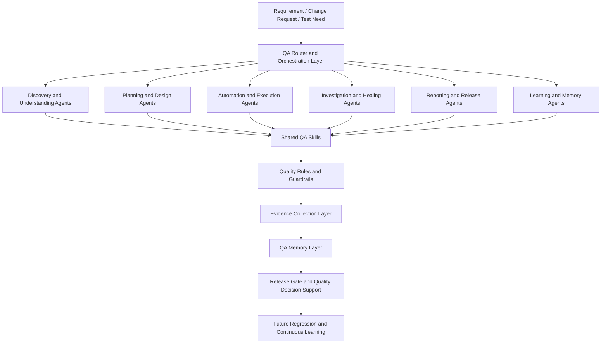
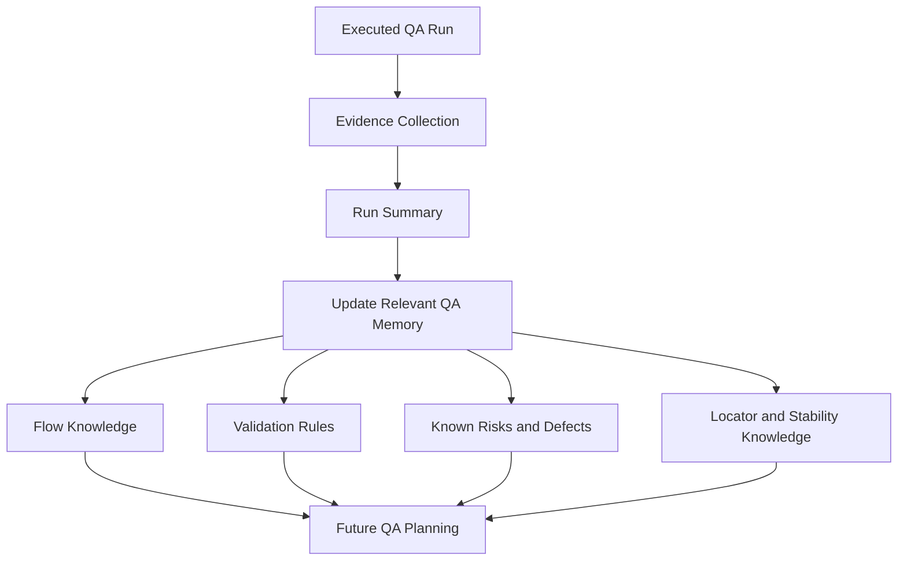
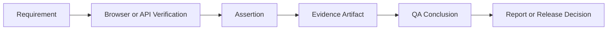

# AI QA Operating Model

A modular, evidence-driven QA architecture where specialised agents coordinate discovery, planning, automation, execution, investigation, reporting, release quality, and continuous learning.

The Smart QA Agent OS is not a single chatbot. It is a structured QA operating model made up of specialised agents, reusable QA skills, quality guardrails, evidence-first validation, and continuously updated QA memory.

Each agent has a focused responsibility. Agents use shared skills and rules, create evidence-based outputs, and update approved QA knowledge so future testing becomes more consistent and informed.

> **Interactive Architecture Walkthrough — Demonstration Only.** This page is a sanitized architecture showcase. It does not execute real agents or connect to any private system. No private prompts, source files, memory content, rules content, customer data, credentials, system endpoints, selectors, or proprietary workflows are exposed.

---

## Navigation

- [Overview](#overview)
- [Layered architecture](#layered-architecture)
- [Specialised QA Agent Catalog](docs/agents-catalog.md)
- [Agent Workflow Matrix](docs/agent-workflow-matrix.md)
- [Shared QA Skills](docs/shared-skills.md)
- [Quality Rules and Guardrails](docs/rules-guardrails.md)
- [Continuous QA Memory Architecture](docs/qa-memory.md)
- [Example Agent Journey](docs/example-agent-journey.md)
- [Sample Artifacts](sample-artifacts/)
- [Demo Walkthrough Script](docs/smart-qa-agent-os-demo-script.md)
- [Public Showcase Boundary](#public-showcase-boundary)

---

## Overview

The Smart QA Agent OS organises QA work the way a healthy QA team would: someone scopes the request, someone plans coverage, someone designs and writes tests, someone executes, someone triages failures, someone communicates results, and someone captures lessons for next time. Each of these roles is a specialised agent. The agents share skills, are governed by rules, produce evidence, and update memory.

The result is a system that:

- Treats every claim as **evidence-first**: nothing is "verified" without a supporting artefact.
- Keeps automation **maintainable** through BDD/POM and shared skills.
- Treats **failures as signals** to triage (product vs locator vs timing vs data vs environment vs requirement gap).
- Stores only **approved, verified** learning into long-term QA memory.
- Converts the run history into a **release-gate** recommendation (proceed / monitor / hold).

---

## Layered architecture

| Layer                           | Purpose                                                                                                          |
| ------------------------------- | ---------------------------------------------------------------------------------------------------------------- |
| QA Router and Orchestration     | Understands the request and directs work to the appropriate specialised QA agents                                |
| Specialised Agents              | Perform focused QA activities such as planning, automation, investigation, reporting, and learning               |
| Shared Skills                   | Reusable QA methods, patterns, standards, and domain knowledge used by multiple agents                           |
| Rules and Guardrails            | Ensure evidence-first verification, safe handling of data, quality standards, and controlled automation behavior |
| Evidence and Memory             | Stores verified learning, execution outcomes, known risks, reusable flows, and validation knowledge              |
| Release Gate                    | Converts quality evidence into a structured release recommendation and risk summary                              |

---

## End-to-end QA orchestration

```mermaid
flowchart LR
    A[Requirement or User Story] --> B[Requirement Analysis]
    B --> C[QA Strategy and Risk Planning]
    C --> D[Browser and Flow Discovery]
    D --> E[Test Design and Data Preparation]
    E --> F[UI / API / Hybrid Automation]
    F --> G[Test Execution]
    G --> H{Result}
    H -->|Passed| I[Evidence Report]
    H -->|Failed| J[Failure Classification]
    J --> K[Healing or Defect Reporting]
    K --> I
    I --> L[Release Gate Assessment]
    L --> M[QA Knowledge Memory Update]
```

## Continuous-learning loop

## Evidence-first validation model

---

## Public Showcase Boundary

This section presents the architecture and operating model only. It does not expose private agent prompts, source code, internal rules, private memory content, customer data, credentials, system endpoints, test selectors, proprietary workflows, or confidential automation assets.

All examples in the linked documents use fictional names (`Northstar Retail`, `TRK-101`, `DEMO-ORD-1001`, `Central Warehouse`, `Lakeview Store`) and synthetic values. The public portfolio cannot execute the private agents.
