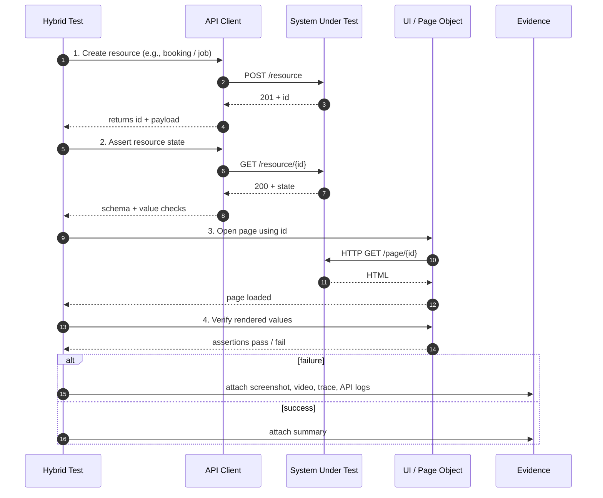

# API + UI Hybrid Test Flow

Hybrid tests cover the most realistic user journeys: data is prepared or asserted via API, and the user-facing result is verified via UI. This reduces flakiness and increases coverage.

## Why this matters

- Data setup is **fast and reliable** via API instead of brittle UI clicks.
- UI assertions remain **user-centric** so we catch real product defects.
- Evidence captured at every step makes failures easy to triage.
