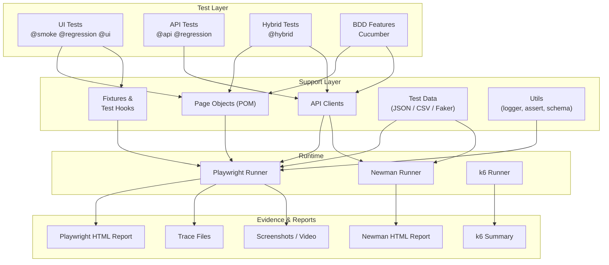

# Framework Architecture

Reusable layered architecture for the Smart QA Agent OS reference framework.

## Layers explained

- **Test Layer** — what gets executed. Tests stay thin and call into Page Objects and API Clients.
- **Support Layer** — reusable building blocks: Page Objects, fixtures, API clients, test data, and utilities.
- **Runtime** — Playwright for UI/API/hybrid, Newman for Postman collections, k6 for performance.
- **Evidence & Reports** — HTML report, trace viewer, screenshots, videos, Newman report, k6 summary.
