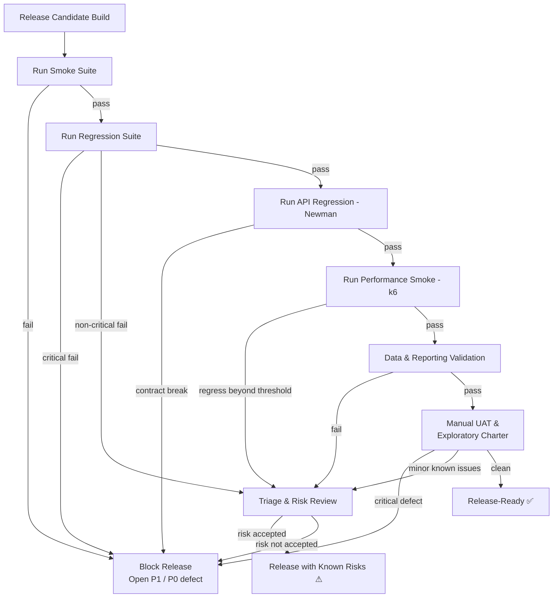

# Release-Gate Decision Flow

A documented decision flow used to determine whether a build is ready for release.

## Gate criteria summary

- **Release-Ready** — Smoke, regression, API, performance smoke, and data validation all pass; UAT clean.
- **Release with Known Risks** — Non-critical defects exist and risk is formally accepted with owner, workaround, and ETA.
- **Blocked** — Any critical defect (P0/P1) or contract break is open.
