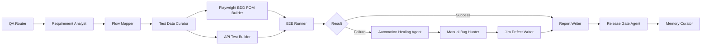

# Example Agent Journey

A fictional, sanitized walkthrough of how the Smart QA Agent OS coordinates a single user-story-level QA flow.

> **Public Showcase Boundary.** This example uses fictional names and synthetic values. It does not represent any private system, customer, workflow, or run.

## Demo scenario

- **Product (fictional):** Northstar Retail Operations Platform
- **Module (fictional):** Order Dispatch
- **User story:** "As a dispatcher, I can create an order, assign it to the available vehicle, and confirm it is dispatched with the correct status."
- **Fictional IDs:** Order `DEMO-ORD-1001`, Vehicle `TRK-101`, Driver `D-22`, Warehouse `Central Warehouse`, Store `Lakeview Store`.

## Agent journey

## Step-by-step

1. **QA Router** receives the user story and identifies the work as "feature validation + regression check". It routes to discovery, design, automation, execution, investigation, reporting, and release agents.
2. **Requirement Analyst** produces fictional acceptance criteria:
    - Given a confirmed order `DEMO-ORD-1001`, when it is assigned to `TRK-101`, then the status changes to `Dispatched` and the assigned vehicle is reflected on the order detail page.
3. **Flow Mapper** identifies the flow stages: Create order → Validate stock → Assign vehicle → Confirm dispatch → Show in vehicle queue → Audit log entry.
4. **Test Data Curator** prepares a synthetic data matrix:
    - Vehicle available, vehicle at capacity, vehicle unavailable, invalid warehouse.
5. **Playwright BDD/POM Builder** drafts BDD scenarios and POM pages for the order detail page and the dispatch confirmation dialog.
6. **API Test Builder** drafts API checks for the dispatch endpoint (positive, missing field, unauthorized, conflict).
7. **E2E Runner** executes UI and API tests. One failure is captured: the dispatch confirmation dialog occasionally times out.
8. **Automation Healing Agent** classifies the failure as a timing or environment issue, not a product defect, and adds a retry plus a deterministic wait.
9. **Manual Bug Hunter** explores around the failure area and discovers a genuine defect: when the assigned vehicle is at capacity, the UI shows `Dispatched` even though the API responded with a conflict.
10. **Jira Defect Writer** files the defect with reproduction steps, severity, evidence, and expected vs actual.
11. **Report Writer** produces a test summary: passed, failed, healed, and verified-defect counts plus evidence links.
12. **Release Gate Agent** marks the release as "Hold" because of the capacity-status defect and references the regression risk.
13. **Memory Curator** records an approved learning: "Order Dispatch — capacity-conflict edge case requires evidence that UI status matches API result."

## What the team gains

- A clear, repeatable QA narrative.
- Evidence at every step.
- A long-term reusable learning that informs the next release's regression scope.
