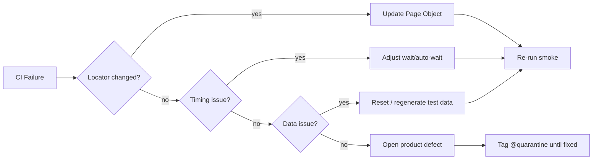

# Locator / Test-Healing Concept

This document describes locator and test-healing as a **pattern and discipline**, not as an unsupported runtime claim.

## Principles

1. **Prefer stable locators** in this order: `getByRole` / `getByLabel` / `getByTestId` → text → CSS → XPath.
2. **Centralize locators** inside Page Objects so a UI change is a one-file fix.
3. **Encapsulate flows** (e.g. `loginAs(user)`) so tests don't depend on UI structure.
4. **Tag flaky tests** with `@quarantine` and fix them in the next cycle.

## Healing workflow

## What this framework does

- Provides Page Objects with single-source locators.
- Provides fixtures for common setup so locators are reused, not duplicated.
- Documents a clear triage path for failures.

## What this framework does not claim

- It does **not** include a runtime auto-healing library.
- It does **not** auto-rewrite selectors at runtime without review.
- AI-assisted locator suggestions, when used, always require human review before merge.
