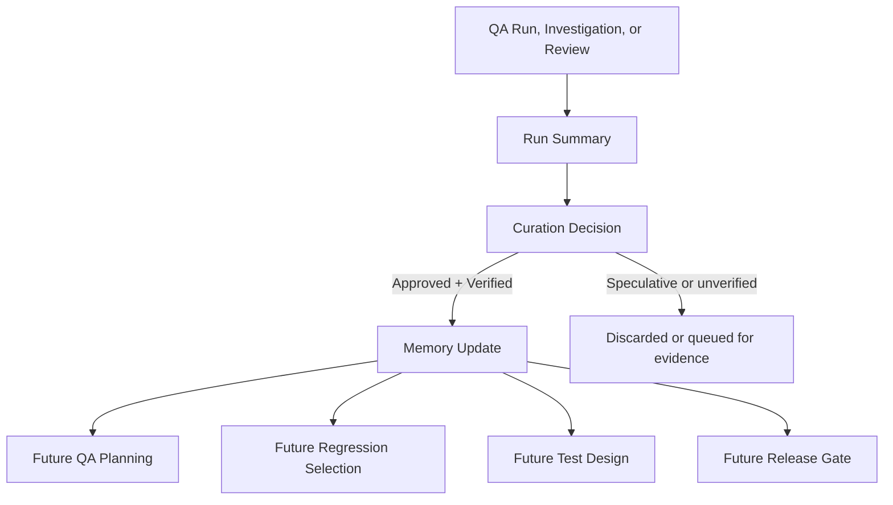

# Continuous QA Memory Architecture

QA memory keeps long-term, reviewed QA knowledge so future testing benefits from previous work.

> **Public Showcase Boundary.** Categories are described at architecture level only. No private memory content, internal entries, customer data, business processes, selectors, or workflow specifics are exposed.

## Memory categories

| Memory Category                      | Purpose                                                                            |
| ------------------------------------ | ---------------------------------------------------------------------------------- |
| Project Memory                       | Overall product context, key modules, integrations, and known risk areas           |
| Module Memory                        | Per-module behavior, dependencies, and validation expectations                     |
| Flow Memory                          | End-to-end business flows, stages, decision points, expected outcomes              |
| Page and Component Memory            | High-level UI page/component knowledge for stable automation design                |
| API and Network Memory               | API behavior, payload shapes (sanitized), risk patterns, response expectations     |
| Validation Rules Memory              | Reusable validation rules across the product                                       |
| Test Data Memory                     | Reusable test-data patterns, edge cases, and dependency-aware data sets            |
| Automation Memory                    | Patterns, fixtures, reusable steps, and standard QA automation design notes        |
| Locator Healing Memory               | Locator stability findings and safer alternatives                                  |
| Flaky Area Memory                    | Areas of the product known to be unstable and require stronger evidence            |
| Known Bugs Memory                    | Verified open defects, workarounds, and regression-risk indicators                 |
| Defect Pattern Memory                | Recurring defect categories and their detection cues                               |
| Error-to-Solution Memory             | Verified mappings from observed error symptoms to safe QA solutions                |
| Release Memory                       | Verified release outcomes, regressions caught, and post-release findings           |
| Learning Memory                      | Approved general QA learning suitable for team-wide reuse                          |
| Glossary Memory                      | Approved QA terminology used across docs and reports                               |
| Run Memory                           | Per-run summary references and execution-time context                              |

## Curation principles

- **Verified only.** Memory updates require evidence.
- **Attributed.** Each entry has a source and an owning agent or skill.
- **Reviewable.** Memory entries can be reviewed and corrected.
- **Public-safe.** Public showcase content describes structure only — never private entries.

## Memory in the run-to-release loop

