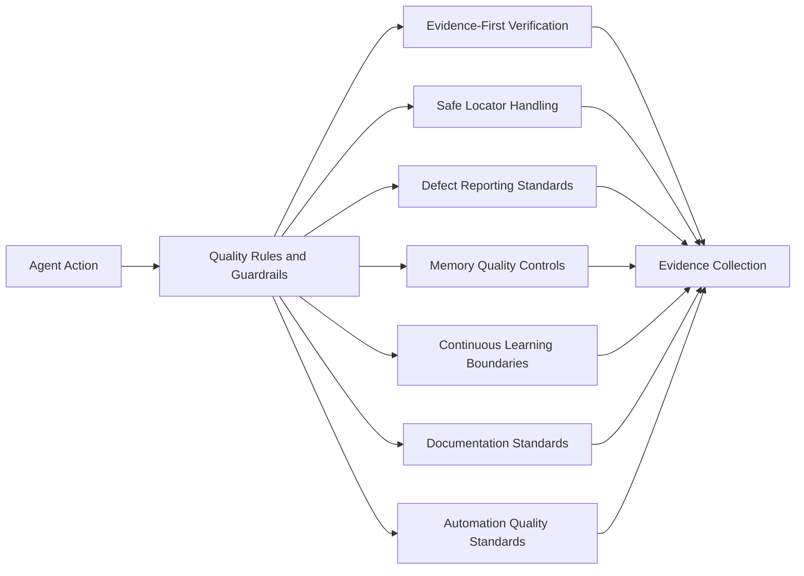

# Quality Rules and Guardrails

Rules are non-negotiable QA standards that all specialised agents follow. They protect quality, safety, traceability, and trust.

> **Public Showcase Boundary.** Only architectural descriptions are presented here. No private rule wording, internal policy content, or proprietary process details are exposed.

## Rule categories

| Rule Category                       | Intent                                                                                            |
| ----------------------------------- | ------------------------------------------------------------------------------------------------- |
| Evidence-First Verification         | No claim is treated as valid without supporting evidence (screenshot, response, log, run output)  |
| No Fake Verification                | Agents must not invent or assume a successful outcome they did not observe                        |
| Defect Reporting Standards          | Every defect must include reproduction, severity, expected vs actual, and evidence                |
| Locator and DOM Capture Rules       | Locators must prefer stable identifiers; private selectors are not exposed publicly               |
| Locator Stability Rules             | Flaky locators must be classified and replaced, not silently re-run                               |
| Automation Quality Rules            | Tests must follow agreed patterns, be readable, and avoid unsafe shortcuts                        |
| BDD and POM Standards               | Scenarios must be business-readable; pages must be reusable; steps must be small                  |
| Test Data Rules                     | Data must be valid, isolated, cleanable, and reflect realistic risk conditions                    |
| Security and Sensitive Data Rules   | No credentials, tokens, customer data, or exploit payloads in code, logs, or docs                 |
| Memory Quality Rules                | Knowledge entering long-term QA memory must be verified, sourced, and reviewed                    |
| Continuous Learning Rules           | Only approved, evidence-backed learning is curated; speculative or one-off observations are not   |
| Release Gate Rules                  | Release decisions must be supported by run evidence, risk status, and known-issue review         |
| Documentation Rules                 | Documentation must be accurate, current, and public-safe; legacy content must be marked or removed |
| Folder Structure Rules              | Project structure stays predictable across QA work so agents can find and produce artefacts safely |

## How rules show up at runtime

- Before an agent claims a result, it verifies with an artefact.
- Before automation merges, the QA Code Reviewer enforces standards.
- Before memory is updated, the Memory Curator applies quality controls.
- Before a release is approved, the Release Gate Agent applies its checklist.
