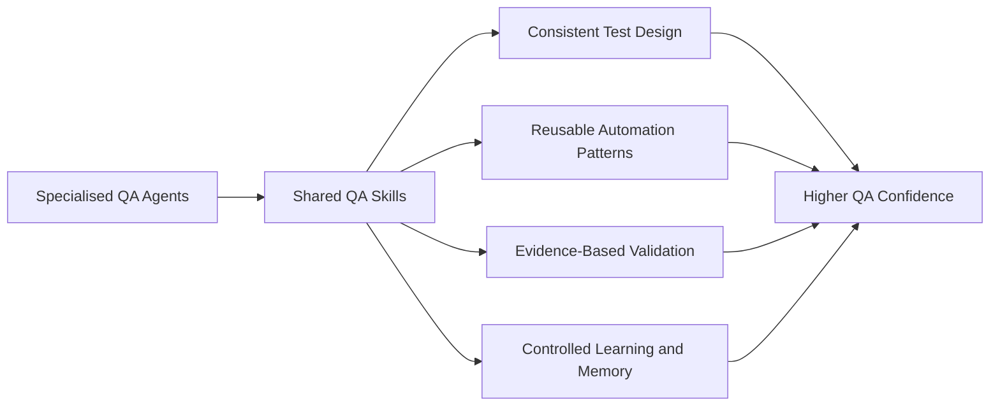

# Shared QA Skills

Skills are reusable QA capabilities used by multiple agents. They are not individual agents. A skill is a tested method, pattern, or set of rules that any specialised agent can apply.

> **Public Showcase Boundary.** Skill names and descriptions here are public, generic QA capabilities. They do not expose private skill content, internal pattern wording, or proprietary domain knowledge.

## Skill groups

| Skill Group                          | Purpose                                                                                      | Used By                                  |
| ------------------------------------ | -------------------------------------------------------------------------------------------- | ---------------------------------------- |
| Requirement-to-Test Design           | Converts requirements into scenarios, acceptance criteria, risk coverage, and test cases     | Requirement, planning, strategy agents   |
| Playwright, BDD, and POM Patterns    | Supports structured, maintainable browser automation                                         | Automation, test planner, healing agents |
| API-Only and Hybrid Validation       | Supports REST API tests and API + UI workflow verification                                   | API, Playwright, execution agents        |
| Postman and Newman Patterns          | Supports collection-based API testing and CI reporting                                       | API and reporting agents                 |
| Performance Testing Patterns         | Supports smoke, load, stress, and soak-test design                                           | k6 and performance agents                |
| QA Investigation                     | Supports exploratory testing, defect triage, evidence review, and failure analysis           | Manual bug-hunt, network, pattern agents |
| Test Data Management                 | Supports reusable, valid, negative, boundary, and dependency-aware test data                 | Test-data, planning, execution agents    |
| Evidence and Reporting               | Supports screenshots, traces, videos, structured reports, and run summaries                  | Execution, reporting, release agents     |
| Memory Management                    | Supports reliable storage, review, retrieval, and expiry of QA learning                      | Memory and learning agents               |
| Release and Regression Gate          | Supports risk-based release confidence and regression selection                              | Release, strategy, reporting agents      |
| Security QA                          | Supports safe security checks, input validation, access review, and sensitive-data awareness | Security and API agents                  |
| Accessibility and Responsive QA      | Supports device, viewport, usability, accessibility, and layout validation                   | Accessibility and UI agents              |
| Documentation and Knowledge Transfer | Supports maintainable QA documentation and team learning                                     | Documentation and onboarding agents      |

## Why "skill" instead of "agent"?

Skills can be applied by many agents. For example, **Evidence and Reporting** is used by execution, reporting, and release agents. Treating it as a skill prevents duplication and keeps responsibilities focused.
