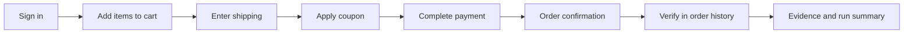

# Demo Checkout Flow — Layered Module Example

A clearly **demo-flavoured** Playwright + TypeScript module example. It uses an e-commerce checkout flow (universally recognisable) to demonstrate how a single business workflow can be organised into discoverable, reusable, evidence-friendly layers.

> **Public Showcase Boundary.** Pure demo example. Fictional product (`Acme Demo Store`), fictional IDs (`USR-DEMO`, `CART-DEMO-001`, `ORD-DEMO-1001`, `SKU-001`, coupon `WELCOME10`). No real product, real selectors, real customer data, or proprietary workflows are involved.

---

## What this demonstrates

- A single end-to-end module organised into **page objects**, **components**, **flows**, **fixtures**, **typed test data**, **selectors catalog**, **DOM snapshots**, **BDD features and steps**, **specialised specs per sub-flow**, **diagnostic and negative specs**, **utility helpers**, and **business-facing test cases**.
- Composable sub-flows (`signIn`, `addItemsToCart`, `enterShipping`, `applyCoupon`, `completePayment`, `verifyOrderConfirmation`, `verifyOrderInHistory`) that snap together into a single E2E spec.
- A **selector catalog** kept in a JSON file plus a stability note, so locators are reviewable as data.
- **DOM snapshots** captured as text so test authors and reviewers can reason about a page without opening a browser.
- **Typed test data** with TypeScript types so the data shape is enforced at compile time.
- **Test case documents** (`TC###`) written in business language and linked to the specs that cover them.

---

## Module shape

```
modules/demo-checkout-flow/
├── README.md
├── api/                 # API client helpers for hybrid checks (placeholder)
├── components/          # Reusable UI sub-component objects (CartSummary, etc.)
├── data/                # Typed test data + types.ts
├── dom/                 # Sanitized DOM snapshot text
├── features/            # BDD feature files
├── fixtures/            # Playwright fixtures (POM + BDD fixtures)
├── flows/               # Composable sub-flows used by multiple specs
├── pages/               # Page Objects per screen
├── selectors/           # Selector catalog (JSON) + selector stability notes
├── specs/               # Specialised specs per sub-flow + E2E + negative + diagnostic
├── steps/               # BDD step definitions
├── test-cases/          # Business-facing TC### documents and UI-change notes
└── utils/               # domCapture, demo-id helpers
```

---

## How it composes



Each step is a small flow under `flows/`. The full end-to-end test in `specs/demo-checkout.e2e.spec.ts` composes them in order. Specialised specs run a single sub-flow for fast feedback during development.

---

## Sub-flow specs

| Spec                                              | Sub-flow covered                                       |
| ------------------------------------------------- | ------------------------------------------------------ |
| `demo-checkout.add-to-cart.spec.ts`               | Add a product to the cart                              |
| `demo-checkout.shipping.spec.ts`                  | Enter shipping address                                 |
| `demo-checkout.coupon.spec.ts`                    | Apply a valid coupon and verify discount               |
| `demo-checkout.payment.spec.ts`                   | Submit payment                                         |
| `demo-checkout.order-history.spec.ts`             | Verify completed order in user's order history         |
| `demo-checkout.multi-item.spec.ts`                | Add several items in a single session                  |
| `demo-checkout.e2e.spec.ts`                       | Composes every sub-flow into a single end-to-end run   |
| `demo-checkout.negative.spec.ts`                  | Negative and validation scenarios                      |
| `demo-checkout.diagnostic.spec.ts`                | DOM capture and other diagnostic helpers               |

---

## Business-facing test cases

`test-cases/TC###` documents describe each scenario in plain language with steps, expected results, data, and links to the spec(s) covering them. They are the readable contract that stakeholders review alongside the executable specs.

---

## Confidentiality note

This module is a pure demo example. It does not include any private product code, real selectors, real endpoints, real customer data, or proprietary workflow logic. All identifiers are fictional and the suite never targets a real system without explicit configuration.
