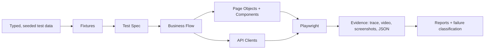
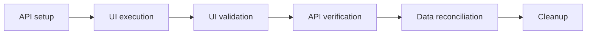
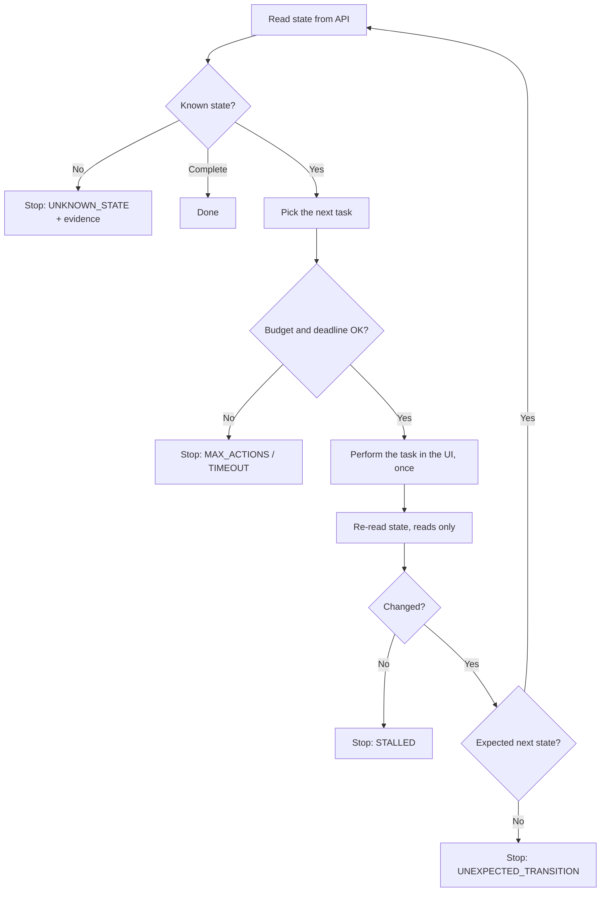
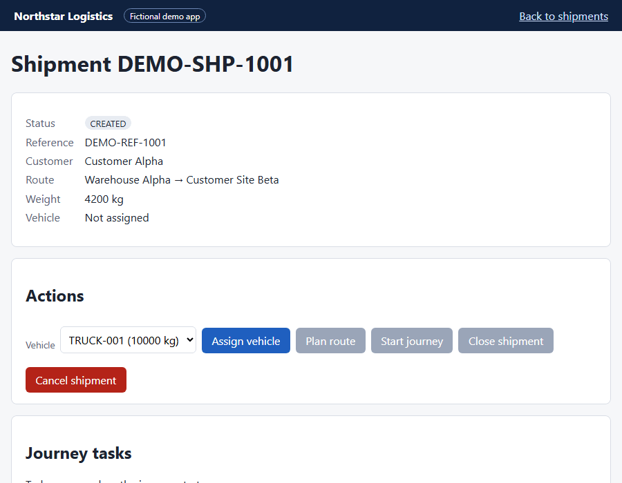
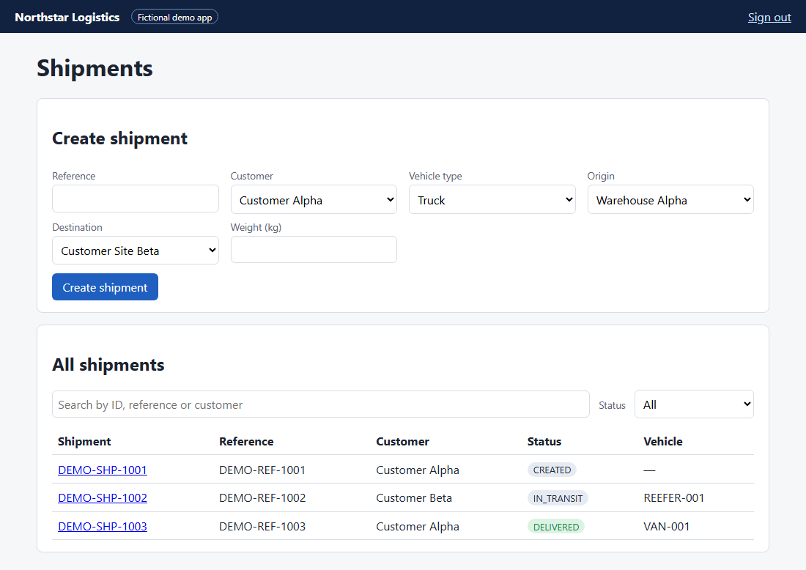
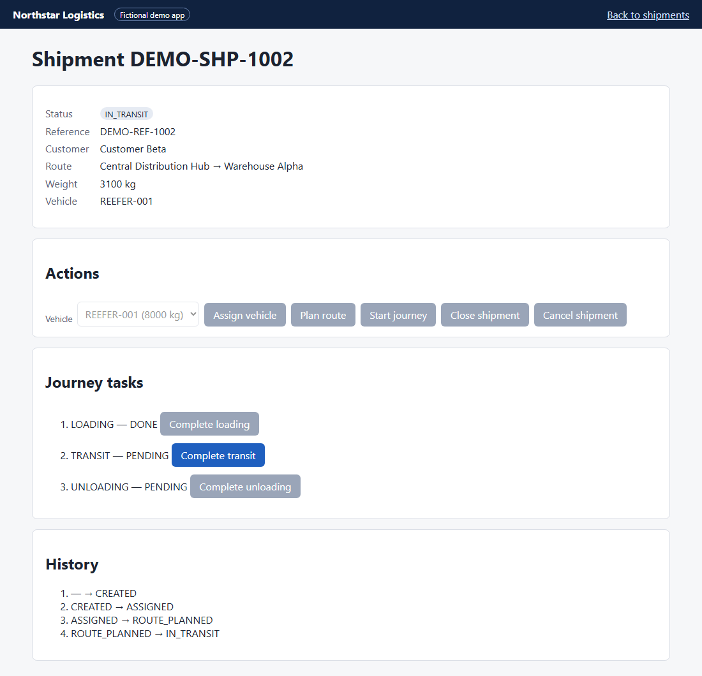

# Smart QA Automation Framework

**Playwright + TypeScript reference framework with its own system under test.** Clone it, run `npm test`, and
30 UI, API, hybrid and state-engine tests (plus an auth setup step) run against a local fictional logistics app. No credentials, VPN or
external services are needed.

## Project Status

**Public implementation:** Runnable demo. The test framework, the demo app it tests, unit tests and CI
workflows are all public code in this folder.

**Professional relevance:** Based on QA problems handled in professional TMS / logistics automation
(stateful workflows, API + UI verification, evidence-first triage). This public version is independently
written for this portfolio.

**Confidentiality:** Contains no employer-owned code, endpoints, selectors, payloads, data or business rules.
The demo domain, API and UI were designed from scratch. See [`../docs/confidentiality.md`](../docs/confidentiality.md).

---

## 1. The QA problem

Logistics workflows are long and stateful: a shipment is created, assigned to a vehicle, route-planned,
driven through journey tasks and delivered. Automating that well raises the same questions in every team:

- How do specs stay readable while pages, APIs and data change underneath them?
- How do you prove the UI and the server agree, rather than trusting the screen?
- How does automation continue from *whatever state* the system is in, without forcing it to "complete"?
- When a test fails, how do you tell a product defect from a test defect or an environment problem?

## 2. Why this public version exists

Professional automation code and systems cannot be published. This folder rebuilds the **engineering
patterns** against a small app owned by this repository: Northstar Logistics, with fictional shipments
`DEMO-SHP-…`, vehicles `TRUCK-001`, `VAN-001`, `REEFER-001`, Customer Alpha and Warehouse Alpha. Why a local
app and not a public demo site: [`../docs/demo-app-design-rationale.md`](../docs/demo-app-design-rationale.md).

## 3. Architecture



| Layer | Folder | Responsibility |
| --- | --- | --- |
| Spec | `tests/**` | States the scenario's intent, carries an ID and tags |
| Business flow | `src/flows/` | Coordinates pages into business steps; asserts each step's outcome |
| Page objects / components | `src/pages/`, `src/components/` | One screen or widget each; role, label and test-id locators only |
| API clients | `src/api/clients/` | One per resource; return raw responses so negative tests stay easy |
| Contract checks | `src/api/schemas/`, `src/api/helpers/` | Ajv JSON schemas; status + schema assertions with redacted messages |
| Fixtures | `src/fixtures/` | Auth token, clients, pages, flows, seeded data builder, automatic cleanup |
| State engine | `src/state-engine/` | Drives a workflow from its live state, with guardrails |
| Reporting | `src/reporting/` | Writes `failure-classification.json` for every failed test |
| Guards | `src/config/` | Refuses non-local targets unless explicitly allowed |
| System under test | `demo-app/` | Express 5 + plain HTML, in-memory, test hooks behind `DEMO_TEST_MODE=1` |

### Hybrid flow



### State engine



The engine (`src/state-engine/workflow-engine.ts`) has no Playwright dependency. It is unit tested with a
fake system that stalls, throws and jumps backwards. It never acts on an unknown state, never retries an
action (only reads are repeated), and never forces completion.

## 4. Setup

Requires Node.js 22.12 or newer.

```bash
cd smart-qa-automation-framework
npm ci
npx playwright install chromium
```

## 5. Run

```bash
npm test                 # all Playwright tests; the demo app starts automatically
npm run test:smoke       # @smoke subset
npm run test:api         # API project only (no browser)
npm run test:hybrid      # API + UI hybrid specs
npm run test:diagnostic  # state-engine runs with injected faults
npm run test:unit        # Vitest: utilities, state engine, demo app
npm run verify           # typecheck + lint + format check + unit tests
npm run report           # open the last HTML report

npm run demo:start:test  # run the demo app yourself: http://127.0.0.1:3000 (demo.user@example.test / demo-password)
                         # (plain `demo:start` has no test hooks; `npm test` would reuse it and fail on reset)
npm run test:postman     # Newman collection (needs the app running)
npm run perf:smoke       # k6 smoke (needs k6 and the app running)
```

`DEMO_SEED=<number>` replays the exact generated test data of an earlier run. The seed is printed per worker.

## 6. Scenarios

| ID | What it proves | Tags |
| --- | --- | --- |
| API-001 / 004 | Create and retrieve a shipment; schema-valid responses | `@api @smoke` |
| API-002 / 003 | Missing customer and unsupported vehicle type are rejected (400) | `@api @negative` |
| API-005 / 005b | Allowed status changes; a direct jump to DELIVERED is rejected (409) and changes nothing | `@api` |
| API-006 / 008 | Delete then 404; unknown IDs return 404 | `@api` |
| API-007 | Missing token, forged token and wrong password are rejected (401) | `@api @negative` |
| API-009 / 011 | Duplicate reference (409); capacity at the limit passes, above it fails (422) | `@api @negative` |
| API-010 | List responses match the contract schema | `@api` |
| UI-001…006 | Sign in, create from the form (verified by API), search, full journey to CLOSED, status-dependent actions, disabled destructive action looks disabled | `@ui` |
| NEG-001…005 | Wrong password, unauthenticated redirect, missing weight, same origin/destination, over-capacity vehicle | `@ui @negative` |
| HYBRID-001 | API create → UI find → UI act → API confirm → API change → UI shows it → cleanup | `@hybrid` |
| HYBRID-002 | UI list reconciles row by row with the API for the same filter | `@hybrid` |
| ENGINE-001…005 | Full run, resume mid-journey, `stopWhen`, injected stall (nothing forced), injected unknown state | `@diagnostic` |

## 7. Sample output

From a local run on 2026-10-02 (`npm test`, 1 worker; the count includes the auth setup step):

```text
Running 31 tests using 1 worker
  ✓  [api] › API-001 create a valid shipment @api @regression @smoke
  ...
  ✓  [chromium] › HYBRID-001 shipment created by API is progressed in the UI and confirmed by API @hybrid @regression
  ✓  [chromium] › ENGINE-004 reports a stall instead of forcing completion @diagnostic @regression
  31 passed (20.3s)
```

Evidence attached to ENGINE-004 (`workflow-evidence.json`):

```json
{
  "stop": "STALLED",
  "message": "[STALLED] CARGO_LOADING was accepted but the state stayed IN_TRANSIT|LOADING,TRANSIT,UNLOADING",
  "evidence": [{ "step": 1, "task": "CARGO_LOADING", "outcome": "stalled", "durationMs": 724,
    "before": { "status": "IN_TRANSIT", "pendingTasks": ["LOADING", "TRANSIT", "UNLOADING"] },
    "after":  { "status": "IN_TRANSIT", "pendingTasks": ["LOADING", "TRANSIT", "UNLOADING"] } }]
}
```

Failure classification, from a deliberate fault-injection run where the demo app was changed to accept duplicate
references:

```json
{ "summary": { "PRODUCT_DEFECT": 1 },
  "failures": [{ "test": "… API-009 reject a duplicate reference", "classification": "PRODUCT_DEFECT",
    "rule": "rule-not-enforced", "confirmed": false,
    "error": "/api/demo/shipments returned 201 (expected 409): {…}" }] }
```

## 7b. Screenshots

All captured from the demo app and a real local run ([`../assets/`](../assets/)):



| Shipment list | Shipment in transit |
| --- | --- |
|  |  |

The Playwright HTML report of a full local run, all passed (30 tests + auth setup):
[`playwright-report.png`](../assets/screenshots/playwright-report.png).

While these screenshots were being reviewed, two UI bugs in the demo app came to light: a disabled "Cancel
shipment" button that still looked clickable, and a squashed search box. Both were fixed, and UI-006 now guards the
first. It fails with the fix removed and passes with it.

## 8. How the tests were checked

- **Unit tests:** 116 (Vitest) covering the URL guard, redaction, schema validation, seeded data, the
  failure classifier, the state engine, and the demo app's validation, workflow and HTTP behaviour.
- **Stability:** UI, hybrid and engine specs were each run with `--repeat-each=3` with no flaky results.
- **Deliberate fault injection:** each suite was shown to fail when the app is broken on purpose (hand-made faults, not a mutation-testing tool). A 409 changed to 400 is
  caught by API-005b; enabling "Plan route" too early is caught by UI-005; accepting duplicate references is
  caught by API-009 and classified `PRODUCT_DEFECT`.
- **CI:** rehearsed in a fresh clone with `npm ci` and `CI=1`, then verified on GitHub Actions. On the first run
  (PR #3, 2026-10-02) the CI, Playwright Smoke and API Regression workflows all passed in about 2 minutes.

## 9. Engineering rules

Retries, locators, evidence and cleanup: [`docs/retry-and-evidence.md`](docs/retry-and-evidence.md).

## 10. Known limitations

This public implementation intentionally simplifies:

- **authentication:** one fake user, in-memory bearer tokens;
- **persistence:** in-memory store, reset at the start of each run;
- **route calculation and optimisation:** not modelled;
- **GPS transport:** not modelled;
- **observability and production-scale performance:** out of scope. The k6 scripts are a learning track.

It exists to demonstrate QA engineering patterns, not to reproduce a production transport platform.

## 11. More in this folder

- [`ai-agent-os/`](ai-agent-os/): the human-governed AI QA operating model, with 10 core roles.
- [`k6/`](k6/): performance scripts and threshold rationale (learning).
- [`postman/`](postman/): the Newman collection.
- [`examples/checkout-reference/`](examples/checkout-reference/): an earlier layering example (reference only).
