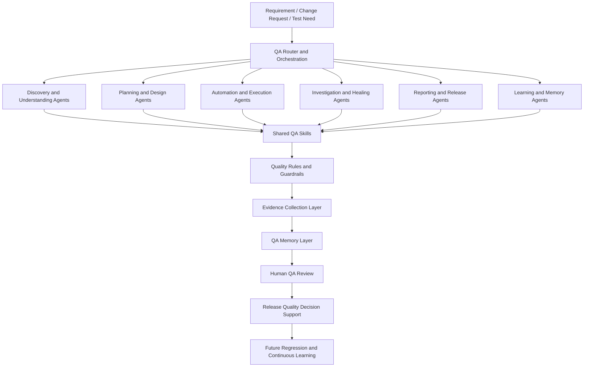
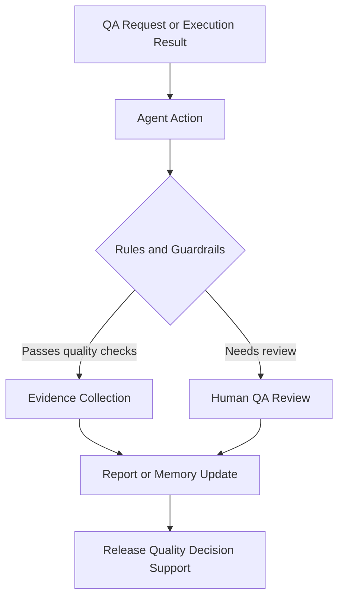
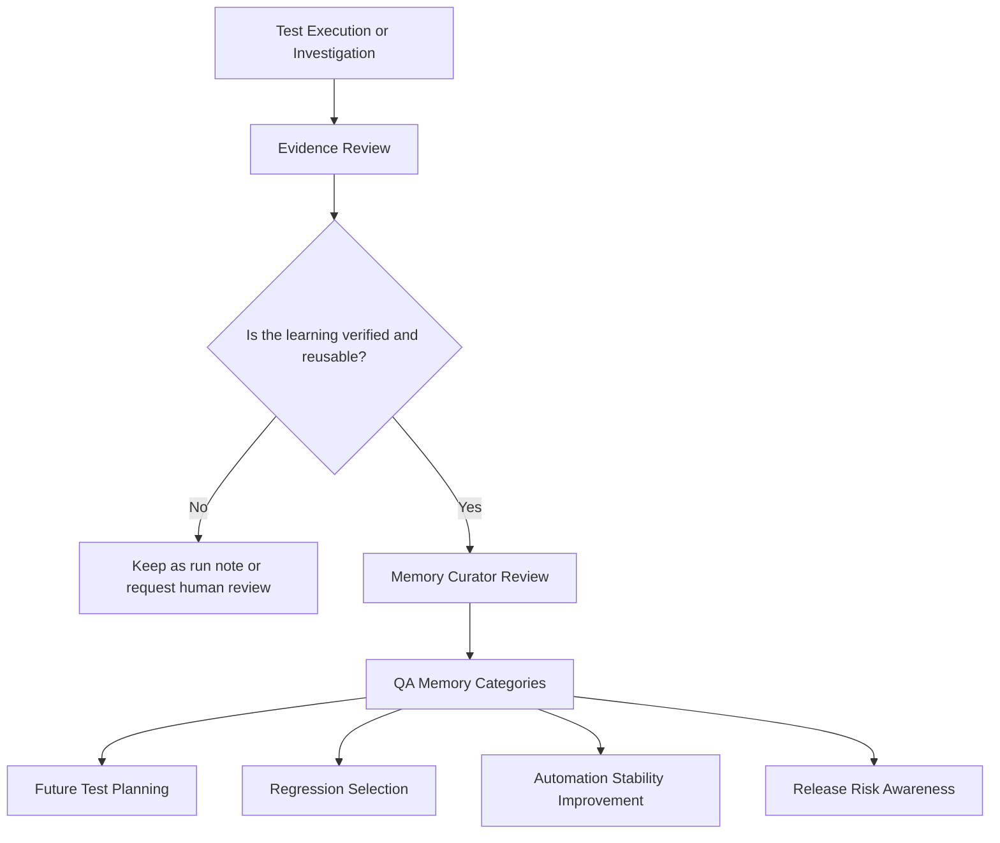

# AI QA Agent Operating Model

> Part of the [Smart QA Automation Framework](../). The runnable automation (demo app, API, UI, hybrid, state engine, CI) lives in the parent folder; this folder documents the human-governed AI QA operating model around it.

A public-safe reference architecture for my evolving QA-assistance system, designed to make exploratory testing, workflow understanding, test design, automation planning, locator investigation, and QA knowledge management more structured, reusable, and evidence-driven.

> **Human QA stays in control.** Human QA remains responsible for requirement interpretation, test approval, defect decisions, release recommendations, and memory updates. The system assists; it does not decide.

The system currently focuses on exploratory testing support, browser and workflow discovery, requirement analysis, QA risk planning, knowledge capture, Playwright test-design assistance, BDD scenario drafting, Page Object Model planning, and locator-healing investigation.

Runnable public examples of API testing, API + UI hybrid validation, Postman/Newman and a state-driven workflow engine now live in the [parent framework](../). k6 remains a learning track, and automated release-gate decisions are deliberately not automated: a human QA engineer makes them.

## Public Showcase Boundary

This portfolio presents a sanitized architecture and workflow showcase. It does not expose private source code, real customer data, production URLs, API payloads, internal screenshots, confidential business logic, private agent prompts, private rule wording, private memory content, real selectors, internal tool names, or proprietary workflows.

The public version uses fictional examples, synthetic artifacts, and high-level architecture diagrams to demonstrate the approach without exposing private implementation details.

---

## Repository Structure

| Directory | Purpose |
| --- | --- |
| [`ai-qa-operating-model.md`](ai-qa-operating-model.md) | Main AI QA Operating Model overview with layered architecture and orchestration flow |
| [`architecture/`](architecture/) | Mermaid diagrams for framework, API+UI hybrid flow, and release gate |
| [`docs/`](docs/) | Agent role details, advanced agent catalog, workflow matrix, shared skills, rules and guardrails, QA memory, example agent journey, demo script |
| [`manual-knowledge/`](manual-knowledge/) | Sanitized manual QA notes that seed agent memory (checkout flow, test plan, test data, locators, selectors, coupon rules) |
| [`module-template/`](module-template/) | Reusable scaffold for adding a new business workflow with parallel `tests/` and `qa-output/` trees |
| [`examples/checkout-reference/`](../examples/checkout-reference/) | Earlier Playwright + TypeScript layering reference (POM, components, flows, BDD). Reference only, not runnable; the runnable suite is the [parent framework](../) |
| [`postman/`](../postman/) | Postman collection for the local demo app, run with Newman |
| [`k6/`](../k6/) | k6 smoke, load, stress and soak scripts against the local demo app (learning) |
| [`prompts/`](prompts/) | Sanitized prompt templates for master orchestration, test planning, BDD/POM automation, execution/healing, memory update, and manual bug hunting |
| [`qa-graph-tool/`](qa-graph-tool/) | Architecture overview of a local visualization tool that renders the operating model as an interactive graph |
| [`qa-output/`](qa-output/) | Sample module-level QA outputs, run notes, skill-agent reports, DOM capture evidence, and sanitized Playwright results |
| [`sample-artifacts/`](sample-artifacts/) | Synthetic sample artifacts: test plan, BDD scenario, API validation result, release gate report, failure classification, memory update, evidence summary |
| [`scripts/`](scripts/) | Sample utility scripts for secret scanning, evidence cleanup, Newman runs, memory-triggered test execution, and report generation |
| [`test-data/`](test-data/) | Synthetic demo test data for users and todos |
| [`evidence-samples/`](evidence-samples/) | Evidence sample placeholders |
| [`previews/`](previews/) | HTML preview pages for operating model concepts |

---

## Maturity Statement

This repository contains a mix of actively used QA practices, implemented prototypes, public-safe examples, learning experiments, and planned capabilities. Each section is labelled by maturity. Current working and reference material comes first; planned capabilities appear later in the README.

## Current Maturity Snapshot

| Capability Area | Current Status | Public Description |
|---|---|---|
| Exploratory QA Support | Actively Used — applied in my QA work; public repository may include only sanitized examples or documentation. | Supports structured exploration, risk thinking, workflow discovery, QA investigation, and exploratory testing notes. |
| Requirement and Test Planning | Actively Used | Helps convert requirements into acceptance criteria, risks, test conditions, edge cases, and QA coverage ideas. |
| Browser and Flow Discovery | Actively Used | Supports understanding of screens, user journeys, dependencies, workflow states, and automation candidates. |
| QA Knowledge Capture | Implemented Prototype | Organises reusable QA knowledge such as flows, risks, validation rules, test-data dependencies, defects, and lessons learned. |
| Playwright Test Design | Actively Used | Supports Playwright test planning, BDD scenario drafting, Page Object Model design, reusable test-flow ideas, and test-data planning. |
| Locator Healing | Actively Used / Learning | Supports structured investigation of locator instability, DOM or workflow changes, timing issues, and safer locator-selection approaches. Suggested changes require human QA review before adoption. |
| Playwright Test Execution | Runnable Demo | 30 Playwright tests run against the local demo app, with traces, reports and failure classification ([framework](../)). |
| API and Hybrid Testing | Runnable Demo | Typed API clients, contract schemas, API-001..011 and HYBRID-001..002 in the [framework](../). |
| Postman and Newman | Runnable Demo | PM-001..009 collection against the local demo app. |
| k6 Performance Testing | Learning | Smoke, load, stress and soak scripts against the local demo app; only smoke has been run. |
| CI and Release Gates | CI: Working knowledge · Release gate: human decision | GitHub Actions workflows for checks, smoke and API regression; release decisions stay with human QA. |

---

## Business Problem

Enterprise platforms can have large regression scopes across web workflows, APIs, reporting, data validation, GPS or map behavior, integrations, and mobile-related processes.

A single release may affect multiple workflows at once. Manual testing alone can be slow, while automation without structure can become difficult to maintain, difficult to explain, and difficult to trust.

The Smart QA Agent OS approach is designed to help QA work remain structured, evidence-driven, reusable, and continuously improving while keeping human QA judgement at the center.

---

## Current Focus

The system is currently most useful for:

1. Exploring unfamiliar or changed product areas
2. Understanding end-to-end workflows and dependencies
3. Identifying risks, missing coverage, and edge cases
4. Capturing reusable QA knowledge from exploration and testing
5. Creating structured Playwright test plans
6. Drafting BDD scenarios and Page Object Model approaches
7. Investigating locator instability and automation-maintenance risks
8. Supporting human QA review before automation or release decisions

---

## Development Direction

The next development areas are:

1. Strengthen Playwright execution and evidence reporting
2. Expand reusable test fixtures and automation patterns
3. Validate API-only testing patterns
4. Build API + UI hybrid workflow examples
5. Create safe Postman/Newman demonstration flows
6. Learn and prototype k6 smoke and basic load testing
7. Add CI-ready public demo workflows
8. Evolve release-gate reporting from a documented process into an evidence-based QA workflow

---

# AI QA Operating Model

A modular, evidence-driven QA architecture where specialised agents coordinate discovery, planning, automation design, execution support, investigation, reporting, release quality, and continuous learning.

The Smart QA Agent OS is not a single chatbot. It is a structured QA operating model made up of specialised agents, reusable QA skills, quality guardrails, evidence-first validation, and continuously updated QA memory.

Each agent has a focused responsibility. Agents use shared skills and rules, create evidence-based outputs, and update approved QA knowledge so future testing becomes more consistent and informed.

## Explore the Operating Model

- [Architecture Overview](#architecture-overview)
- [Core QA Roles](#core-qa-roles)
- [Agent Workflow Matrix](#agent-workflow-matrix)
- [Shared QA Skills](#shared-qa-skills)
- [Quality Rules and Guardrails](#quality-rules-and-guardrails)
- [Continuous QA Memory Architecture](#continuous-qa-memory-architecture)
- [Example Agent Journey](#example-agent-journey)
- [Current Maturity and Roadmap](#current-maturity-snapshot)
- [Confidentiality](#public-showcase-boundary)

## Explore Supporting Directories

- [Manual QA Knowledge](manual-knowledge/) - Sanitized manual QA notes that seed agent memory (flow, test plan, test data, locators, selectors, coupon rules)
- [Module Template](module-template/) - Reusable scaffold for adding a new business workflow with parallel tests/ and qa-output/ trees
- [Prompt Examples](prompts/) - Sanitized prompt templates for master orchestration, test planning, BDD/POM automation, execution/healing, memory update, and manual bug hunting
- [QA Graph Tool](qa-graph-tool/) - Architecture overview of a local visualization tool that renders the operating model as an interactive graph
- [QA Output](qa-output/) - Sample module-level QA outputs, run notes, skill-agent reports, DOM capture evidence, and sanitized Playwright results
- [Scripts](scripts/) - Sample utility scripts for secret scanning, evidence cleanup, Newman runs, memory-triggered test execution, and report generation

---

## Architecture Overview

| Layer | Purpose |
|---|---|
| QA Router and Orchestration | Understands the QA request and directs work to the appropriate specialist agents. |
| Specialised Agents | Perform focused activities such as discovery, planning, automation design, investigation, reporting, and learning. |
| Shared Skills | Reusable QA methods, patterns, standards, and knowledge used by multiple agents. |
| Rules and Guardrails | Ensure evidence-first verification, safe handling of data, quality standards, and controlled automation behavior. |
| Evidence and Memory | Stores verified learning, execution outcomes, known risks, reusable flows, and validation knowledge. |
| Human QA Review | Ensures important conclusions, locator changes, defects, memory updates, and release decisions are reviewed by a QA engineer. |
| Release Quality Support | Converts quality evidence into structured release recommendations and risk summaries. |

---

## Core QA Roles

The operating model is organised around ten core roles. Each role supports a human QA engineer;
none of them approves tests, defects or releases on its own.

| Role | Responsibility | Human QA decides |
| --- | --- | --- |
| QA Orchestrator | Routes a request to the right workflow and keeps the run within scope | Scope and priority |
| Requirement Analyst | Turns stories and notes into acceptance criteria, risks and open questions | What the requirement means |
| Flow Mapper | Maps real user journeys, states and dependencies from exploration | Which flows matter |
| Test Architect | Designs risk-based coverage across UI, API, hybrid, regression and smoke | Coverage and depth |
| Automation Builder | Drafts Playwright specs, page objects and fixtures from verified behaviour | Whether code is merged |
| API QA Agent | Designs API checks: status, schema, negative, auth and contract | Contract expectations |
| Manual Bug Hunter | Explores like a senior manual tester to find real product issues | Whether it is a defect |
| Failure Investigation Agent | Classifies failures from traces and evidence, never by guessing | Product vs test vs environment |
| Evidence Reporter | Writes evidence-backed reports and release-readiness summaries | The release decision |
| Memory Curator | Proposes verified, reusable QA knowledge for future runs | What is stored |

Role details: [`docs/agent-role-details.md`](docs/agent-role-details.md). The full capability catalog (30+
specialised variants) is kept for reference in [`docs/advanced-agent-catalog.md`](docs/advanced-agent-catalog.md).

## Agent Workflow Matrix

| QA Stage | Primary Agent Group | Example Output |
|---|---|---|
| Requirement understanding | Requirement and discovery agents | Acceptance criteria, risk list, assumptions, open questions |
| Exploratory discovery | Browser, flow, test-data, and bug-hunt agents | Workflow map, dependencies, exploratory charter |
| Test strategy | Strategy and planning agents | Coverage plan, priorities, test layers, regression ideas |
| Test design | Test planning and Playwright design agents | BDD draft, POM plan, test-data matrix |
| Locator investigation | Locator healing and failure classification agents | Stability assessment, possible cause, recommended next step |
| Automation development | Playwright design and future execution agents | Reusable test-design approach and implementation plan |
| API and performance design | API and performance agents | Prototype test plans and learning artifacts |
| Reporting | Report writer and QA review | Test summary, evidence notes, risk update |
| Release assessment | Release-gate agent and human QA review | Draft go / monitor / hold recommendation |
| Continuous learning | Memory curator and QA review | Approved knowledge update for future testing |

---

## Shared QA Skills

| Skill Group | Purpose | Used By |
|---|---|---|
| Requirement-to-Test Design | Converts requirements into scenarios, acceptance criteria, risk coverage, and test conditions | Requirement, planning, and strategy agents |
| Exploratory Testing | Supports structured discovery, investigation, risk-based testing, and defect exploration | Discovery, bug-hunt, and reporting agents |
| Workflow Mapping | Documents user journeys, states, dependencies, and expected outcomes | Browser discovery, planning, and automation-design agents |
| Playwright, BDD, and POM Patterns | Supports maintainable browser automation planning and reusable test design | Playwright design, locator healing, and future execution agents |
| Locator Stability Analysis | Supports investigation of unstable locators, timing dependencies, DOM changes, and safer locator approaches | Locator healing and failure-classification agents |
| API and Hybrid Validation | Supports future REST API and API + UI validation patterns | API and hybrid test-design agents |
| Postman and Newman Patterns | Supports future collection-based API regression and reporting workflows | API and reporting agents |
| Performance Testing Patterns | Supports future smoke, load, stress, and soak-test design | Performance-design agents |
| Test Data Management | Supports valid, invalid, boundary, dependency-aware, and cleanup-aware test data | Test-data, planning, and execution agents |
| Evidence and Reporting | Supports screenshots, traces, reports, execution notes, and QA summaries | Investigation, reporting, and future execution agents |
| Memory Management | Supports controlled storage, review, retrieval, and expiry of QA learning | Memory-curation and learning agents |
| Release and Regression Gate | Supports risk-based release confidence and regression-selection decisions | Release, strategy, and reporting agents |
| Security QA Awareness | Supports safe security thinking, input validation, access review, and sensitive-data awareness | Security-minded planning and API agents |
| Accessibility and Responsive QA | Supports usability, viewport, accessibility, and responsive-layout thinking | Discovery and UI-focused QA agents |
| Documentation and Knowledge Transfer | Supports maintainable QA documentation and team learning | Reporting, documentation, and learning agents |

---

## Quality Rules and Guardrails

The system uses quality rules and guardrails to keep QA work evidence-based, safe, consistent, maintainable, and subject to human review.

The public portfolio shows rule categories only. It does not expose private internal rule wording or implementation details.

| Rule Category | What It Controls |
|---|---|
| Evidence-First Verification | QA conclusions should be supported by appropriate evidence. |
| No Fake Verification | Agents must not claim browser execution, API validation, defect confirmation, or release confidence without evidence. |
| Human Review Required | Important findings, automation changes, locator updates, defects, memory updates, and release recommendations require QA review. |
| Automation Quality Rules | Encourages maintainable automation, stable waits, reusable components, clear assertions, and controlled retries. |
| BDD and POM Standards | Keeps scenarios business-readable and separates workflow intent from implementation details. |
| Locator Stability Rules | Encourages stable locator approaches and controlled review of locator-healing suggestions. |
| Test Data Rules | Requires positive, negative, boundary, dependency, cleanup, and state considerations. |
| API Validation Rules | Supports meaningful status, response, error, authentication, and contract validation when API capability is used. |
| Security and Sensitive Data Rules | Prevents exposure of credentials, private data, customer details, and unsafe testing behavior. |
| Defect Reporting Rules | Requires reproducible findings, expected versus actual behavior, severity, evidence, and retest status. |
| Memory Quality Rules | Requires evidence, source context, confidence level, ownership, and review before learning is stored. |
| Release Gate Rules | Requires transparent risk, coverage, blocker, evidence, and known-issue assessment before recommendations. |

---

## Continuous QA Memory Architecture

QA memory is a structured, evidence-backed knowledge layer that helps future QA work start with better context.

It is not a database of private customer data or hidden production details. Only approved, reusable, evidence-backed QA learning should be added.

Temporary observations, unverified assumptions, credentials, sensitive data, and confidential product information should never become long-term QA memory.

| Memory Type | Purpose |
|---|---|
| Project Memory | High-level project context, QA scope, product boundaries, and quality objectives |
| Module Memory | Module-level capabilities, risks, dependencies, and QA focus areas |
| Flow Memory | Verified user journeys, workflow stages, status transitions, and expected outcomes |
| Validation Rules Memory | Approved validation rules, calculation checks, and consistency expectations |
| Test Data Memory | Safe knowledge about valid, invalid, boundary, dependency, and cleanup needs |
| Automation Memory | Reusable automation lessons, coverage notes, stability patterns, and execution practices |
| Locator Stability Memory | Safe patterns for element identification, timing dependencies, recurring locator risks, and page-change areas |
| Flaky Area Memory | Known unstable areas, symptoms, suspected causes, and monitoring needs |
| Known Bug Memory | Verified recurring or accepted issues, workaround notes, and regression relevance |
| Defect Pattern Memory | Repeated defect types, root-cause trends, and prevention opportunities |
| Error-to-Solution Memory | Previously resolved tooling, automation, configuration, and environment problem patterns |
| Release Memory | Release-level quality summaries, known risks, blockers, and lessons learned |
| Learning Memory | General QA lessons, process improvements, and validated workflow insights |
| Glossary Memory | Consistent domain vocabulary and QA definitions |
| Run Memory | Evidence-backed summaries of individual execution or exploration runs |

---

## Example Agent Journey

### Demo Request

A user needs to create a demo order, assign an eligible vehicle, schedule the order, complete the workflow, and confirm invoice readiness.

### Example Flow

1. The QA Router identifies that the request needs requirement analysis, workflow discovery, test planning, test data, Playwright test-design support, locator awareness, reporting, and future release assessment.

2. The Requirement Analyst identifies acceptance criteria, assumptions, and risk areas.

3. The Browser and Flow Discovery Agent creates a safe high-level journey:

   Create demo order → assign eligible vehicle → schedule order → complete workflow → verify invoice readiness.

4. The Test Data Curator identifies required demo data:

   Valid order, eligible vehicle, valid location, expected workflow state, and invoice-ready condition.

5. The Test Case Planning Agent drafts scenarios and edge cases.

6. The Playwright Test Design Agent creates a BDD and Page Object Model approach.

7. If automation fails, the Locator Healing Agent and Failure Classification Agent review whether the issue is caused by locator stability, timing, test data, environment, workflow change, automation logic, or a potential product defect.

8. The Report Writer creates a structured QA summary.

9. The Memory Curator stores only verified and reusable learning after human QA review.

### Example Outcome Table

| Stage | Example Output |
|---|---|
| Requirement analysis | Testable acceptance criteria and risk list |
| Workflow discovery | End-to-end flow map |
| Test data planning | Demo data checklist |
| Test design | BDD scenario and POM plan |
| Locator investigation | Locator-stability assessment and recommended next action |
| Investigation | Failure classification and evidence checklist |
| Reporting | QA summary and risk update |
| Learning | Approved QA memory update |

---

## Human QA Ownership

Smart QA Agent OS supports QA work; it does not replace QA judgement.

Human QA review remains required for:

- Confirming requirements and acceptance criteria
- Deciding final test coverage and risk priority
- Verifying findings before reporting defects
- Reviewing Playwright design and code changes
- Approving locator updates or healing suggestions
- Validating API and performance test scope
- Approving QA memory updates
- Making final release-quality decisions

---

## Execution, CI, and Locator-Healing Notes

The planned execution model supports traces, screenshots, videos, and structured reports where implemented and supported by the test environment.

CI-ready workflow design is being prepared. Public demo workflows will be added as implementation milestones are validated.

Locator/test-healing support is actively used as a guided investigation and maintenance workflow. It is not presented as a fully autonomous runtime auto-healer; human QA review is required before any locator or test update is applied.

---

## Confidentiality and Responsible Sharing

This repository is a sanitized architecture showcase and portfolio case study.

It does not include employer source code, production data, customer information, credentials, internal endpoints, real automation scripts, private test cases, private agent prompts, private rule wording, private QA memory content, real selectors, internal screenshots, or proprietary implementation details.

All examples, workflows, artifacts, reports, diagrams, and data shown in this public project are synthetic, generic, or clearly marked as demonstration content.
