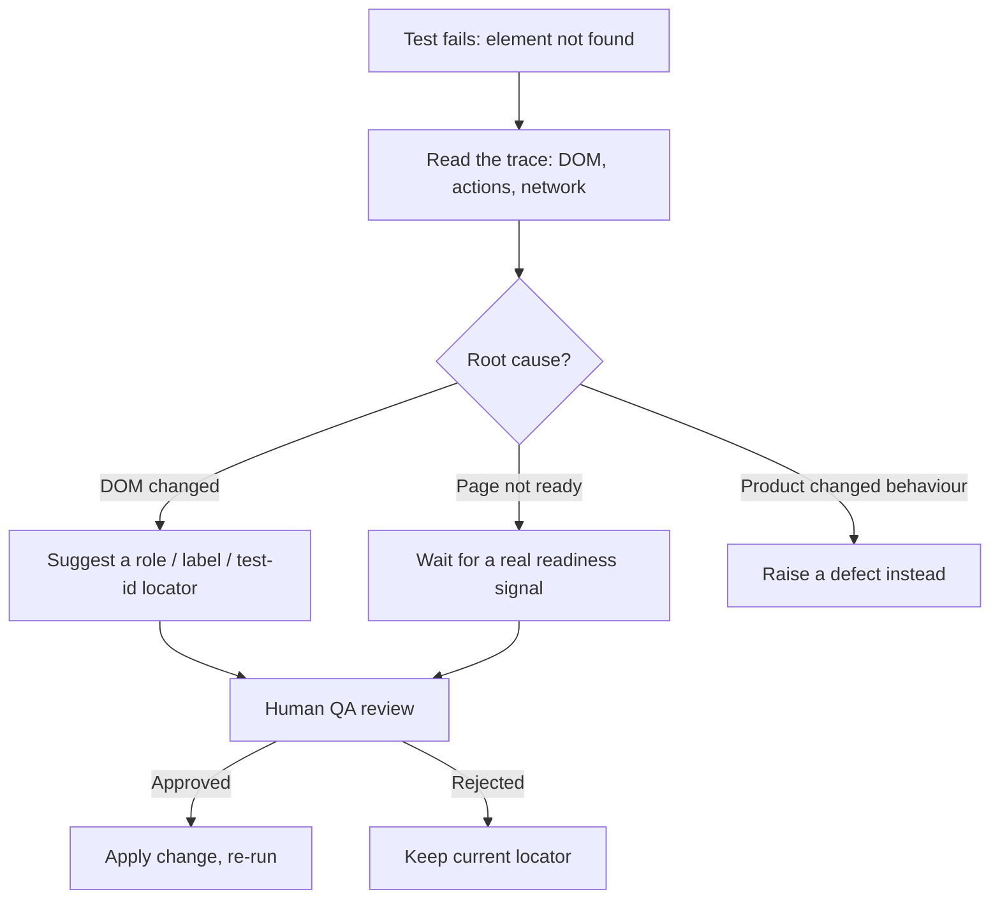

# Template: locator-healing review

> Blank template. Locator healing is a guided, human-reviewed investigation, not an autonomous auto-healer. No change
> is applied until a QA engineer approves it.

| Field | Value |
| --- | --- |
| Failing test | {{test ID and title}} |
| Run / trace | {{run ID, trace path}} |
| Element | {{what the user sees}} |
| Old locator | `{{locator}}` |
| Evidence of the change | {{DOM snapshot path or trace step}} |
| Root cause | DOM changed / timing / product defect |
| Suggested locator or wait | `{{proposal}}` |
| Risk | {{e.g. monetary or critical field: needs explicit review}} |
| Reviewer and decision | {{name}}: approved / rejected |
| Re-run result | {{n of m passed, run IDs}} |

Rule: if the evidence shows the product changed its behaviour, this is a defect, and the locator must not be
"healed" around it.
