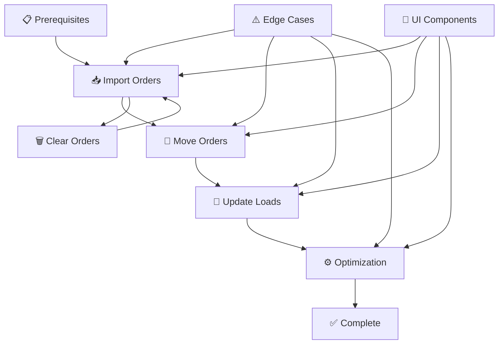

# 🗺️ Manual Load Planning & Order Import Workflow

## 🎯 **CENTRAL NODE**
# **Manual Load Planning & Order Import Workflow**

---

## 📊 **QUICK OVERVIEW**

| **📈 Metrics** | **📋 Details** | **✅ Status** |
|:---:|:---:|:---:|
| **Test Cases** | 167 Individual Cases | ✅ Complete |
| **RTM Coverage** | 189/189 Requirements | 🎯 100% |
| **Design Tests** | 8 Figma Validations | 🎨 Complete |
| **Post-Optimization** | 5 Critical Scenarios | 🔄 Complete |
| **Edge Cases** | 10 Scenarios | ⚠️ Covered |

---

## 🏗️ **CORE WORKFLOW SECTIONS**

### 🔄 **A. ORDER MANAGEMENT**
> *Core order operations and data flow*

#### 📥 **Import Orders**
- **🖼️ Modal Interface** → 1140px width, Figma compliance, shadow effects
- **📋 Order Selection** → Order Manager integration, multi-select functionality  
- **📤 File Upload** → Drag-drop interface, format validation, ≤5s performance
- **🔍 Validation** → CBM/SKU/kg fields, duplicate detection, error handling
- **🔄 Duplicate Order ID Handling** → ID001 → ID001(1) → ID001(2), sequential generation
- **⚠️ Multiple Loading Locations** → Single location acceptance, multiple locations rejection
- **✅ Select All** → Checkbox to select/deselect all visible orders
- **🔍 Search By** → Order ID, Consignee, Pickup Location, Drop-off Location filters
- **📅 Date Range** → Filter by planned delivery date and time

#### 🗑️ **Clear Orders**
- **🔘 Clear Button** → Primary styling (#7573E1), tooltip display
- **⚠️ Confirmation** → Yes (full cleanup) / No (partial cleanup) options
- **🔄 Sync** → Job File ↔ Order Manager data synchronization

#### 🔄 **Move Orders**
- **📋 Selection** → Multi-select orders, chip display, visual indicators
- **🎯 Target Load** → Available loads, capacity validation, location sequencing
- **➡️ Transfer** → Auto-grouping, location sorting, sequence preservation

---

### 🔧 **B. LOAD MANAGEMENT**
> *Load operations and system controls*

#### 🖥️ **Load Management Screen**
- **📊 Activity Cards** → Visual representation, expandable sections
- **📋 Order Chips** → Individual orders, scroll functionality (10+ orders)
- **📍 Drop Location Display** → Loading activities show drop location, unloading activities show order ID only
- **⚡ Load Actions** → Return, Import, Edit, Copy, Delete buttons

#### 🔄 **Load Operations**
- **📋 Duplicate Load** → Create copies with proper confirmation
- **🗑️ Delete Load** → Remove with validation and data flow checks
- **✅ Data Integrity** → Ensure consistency across operations

---

### ⚙️ **C. OPTIMIZATION ENGINE**
> *Route optimization and performance*

#### 🌐 **Global Optimization**
- **🎯 Job File Level** → Process all loads simultaneously
- **⏱️ Performance** → ≤2-3 minutes completion time
- **📊 Counter Tracking** → Optimization count display and monitoring

#### 📍 **Per-Load Optimization**
- **🎯 Individual Processing** → Single load optimization
- **🛣️ Route Calculation** → Advanced algorithms, lowest mileage logic
- **📍 Location Priority** → Pickup location as starting point

#### 💰 **Optimization Cargo Loading**
- **🚚 Cargo Loading** → Comes to first location after optimization
- **💳 Billing Start** → Set to first location
- **💳 Billing End** → Set to last location

#### ⚠️ **Warning System**
- **💬 Confirmation Dialog** → 515px width, Yes/No/Cancel options
- **🎨 Design Compliance** → Figma specifications and styling

#### 🔄 **Post-Optimization Workflow**
- **🔀 Manual Location Shuffling** → Re-optimize after manual location changes
- **➕ New Location Insertion** → Add locations in middle, trigger re-optimization
- **📦 Add Order Within Load** → New orders placed at end, then re-optimized
- **📋 Add Order From Main** → Import from main list, re-optimize to correct position
- **🗑️ Location Deletion** → Remove locations, re-optimize remaining route

---

## 🎨 **UI/UX COMPONENTS**

### 🔘 **Button System**
| **Type** | **Specifications** | **Colors** | **Function** |
|:---:|:---:|:---:|:---:|
| **Primary** | 115px × 29px, 4px radius | #7573E1 | Main actions |
| **Import Icon** | 20px size | #7573E1 | Import operations |
| **Edit/Copy** | Two-tone design | #CF1322 | Modification |
| **Delete** | Outlined style | Dust Red | Removal |

### 🖼️ **Modal Components**
- **Import Orders Modal** → 1140px width, #FFFFFF background, 10px radius
- **Confirmation Dialogs** → 515px width, 25px radius, 32px 44px padding

### 📊 **Display Elements**
- **Optimization Counter** → 112px width, #464646 color, Inter font
- **Order List** → #FFFFFF background, #E0E0E0 border, 10px radius

---

## ⚠️ **EDGE CASES & VALIDATIONS**

### 🚨 **Critical Edge Cases**
- **🗑️ Single Order Deletion** → Last order handling (Yes/No only)
- **🔄 Duplicate Handling** → Location vs Order duplicates
- **📤 File Upload Limits** → Multiple locations, re-upload prevention
- **⚡ Performance Limits** → 500+ orders, 1000+ orders, 20+ loads

### 🔄 **Post-Optimization Scenarios**
- **🔀 Manual Location Shuffling** → After 1st optimization, manually shuffle locations in container manager, re-optimize to correct order
- **➕ New Location Insertion** → Add new location manually in middle of existing locations, re-optimize for correct positioning
- **📦 Add Order Within Load** → Add new order + location within same load (appears at last), re-optimize to correct position
- **📋 Add Order From Main** → Add new order + location from main order list (appears at last), re-optimize to correct position
- **🗑️ Location Deletion** → Delete location from container manager, re-optimize remaining route to correct order

### ✅ **Business Rules**
- **📄 File Format** → CBM/SKU/kg mandatory, no format changes
- **📍 Location Rules** → Single loading location, pickup priority
- **🔄 Duplicate Order ID** → Sequential generation (ID001 → ID001(1) → ID001(2))
- **⚠️ Multiple Loading Locations** → Rejected due to optimizer limitation
- **⏰ Time Logic** → First location pickup time, current behavior compliance
- **⚡ Performance** → Upload ≤5s, Optimization ≤2-3min, 10 orders + scroll

---

## ♿ **COMPLIANCE & ACCESSIBILITY**

### 🔊 **Accessibility Features**
- **Screen Reader Support** → Button labels, tooltip announcements
- **Navigation Elements** → Proper structure and announcements
- **Status Messages** → Clear updates and feedback

### 🎨 **Design Compliance**
- **Figma Specifications** → Exact implementation requirements
- **Component Consistency** → Uniform behavior across system
- **Typography** → Inter font, specific weights (600, 800)

---

## 🎯 **WORKFLOW SUMMARY**

---

## 📋 **EXECUTION READINESS**

| **Component** | **Status** | **Test Cases** |
|:---:|:---:|:---:|
| **Order Management** | ✅ Ready | 52 Cases |
| **Load Management** | ✅ Ready | 27 Cases |
| **Optimization** | ✅ Ready | 20 Cases |
| **Post-Optimization** | ✅ Ready | 5 Cases |
| **UI/UX** | ✅ Ready | 12 Cases |
| **Edge Cases** | ✅ Ready | 4 Cases |

**🎯 Total: 120 Test Cases | 136 RTM Requirements | 100% Coverage**

---

**📅 Generated:** October 1, 2025 | **🕕 Updated:** 22:00:00 IST  
**✅ Status:** Complete - Ready for Test Execution

## Detailed Breakdown

### 1. Prerequisites
- **Empty Loads Creation**: System must create empty loads before order import
- **Job File Setup**: Proper job file configuration and structure
- **User Access Permissions**: Appropriate user roles and permissions
- **System Requirements**: Technical prerequisites for functionality

### 2. Import Orders
- **Drawer/Modal**: Import Orders interface with design compliance
- **Select Orders**: Integration with Order Manager for order selection
- **Import Orders**: File upload functionality with validations and performance requirements

### 3. Clear Orders
- **Clear Button**: Primary action button with design compliance
- **Confirmation Pop-up**: Yes/No options with different cleanup behaviors
- **Data Synchronization**: Proper handling between Job File and Order Manager

### 4. Move Orders
- **Order Selection**: Multi-select functionality with visual indicators
- **Target Load Selection**: Load capacity and location validation
- **Order Transfer**: Automatic grouping and sequence preservation

### 5. Update Loads
- **Load Management Screen**: Activity cards, expandable sections, order chips
- **Load Actions**: Return, Import, Edit, Copy, Delete buttons
- **Load Operations**: Duplicate and delete functionality

### 6. Optimisation
- **Global Optimization**: Job file level optimization with counter tracking
- **Per-Load Optimization**: Individual load processing and route calculation
- **Warning Popup**: Confirmation dialog with proper design compliance
- **Route Optimiser**: Lowest mileage logic with pickup location priority

### 7. Buttons & Actions
- **Primary Buttons**: Optimise, Import Orders, Update Loads with tooltips and states
- **Icon Buttons**: Import, Edit, Copy, Delete with design compliance
- **Action Buttons**: Return, Cancel, Continue with proper functionality

### 8. Edge Cases
- **Single Order Deletion**: Last order scenarios with Yes/No/Cancel options
- **Duplicate Handling**: Location and order duplicate logic
- **File Upload Edge Cases**: Multiple loading locations and re-upload prevention
- **Performance Edge Cases**: Large files and multiple loads handling

### 9. UI/UX Components
- **Modal Components**: Import Orders and confirmation dialogs with Figma compliance
- **Button Components**: Primary and icon buttons with design system compliance
- **Display Components**: Optimization counter and order list with specifications
- **Typography**: Inter font family with specific weights and sizes

### 10. Validations & Business Rules
- **File Format Validation**: CBM SKU kg fields and mandatory requirements
- **Location Validation**: Single loading location rules and pickup priority
- **Time Calculations**: Pickup time logic and remaining time calculations
- **Performance Requirements**: Upload and optimization time limits

### 11. Container Management
- **Time Constraint Validation**: L2 Required Arrival > L1 Required Leave blocking, L2 Required Arrival < L1 Required Leave blocking, L1 Leave > L2 Arrival blocking, L2 Arrival > L2 Leave blocking, Positioning Time Outside Window blocking
- **Boundary Enforcement**: Strict boundary requirements, L2 Arrival = L1 Leave blocking, L2 Leave = L2 Arrival blocking, Valid Window Setting (L1 Leave + 1 second)
- **Input Method Validation**: Calendar Picker vs Manual Typing, Invalid Time Revert Behavior, Field State Differences, Error Message Consistency
- **Auto-Propagation System**: L1 Leave Change Cascade, Sequential Edits Cascade, Multi-Location Chain Propagation (L2→L3→L4), Task Duration Changes Auto-Update, Downstream Time Recalculation
- **Data Persistence**: Auto-Propagation Persistence, Job Reload Verification, Data Drift Prevention, Field Clearing Validation
- **Conflict Resolution**: Tasks Push Conflict Detection, Auto-Resolve vs Manual Resolution, Context-Appropriate Error Messages, Save Blocking Until Resolution
- **Key Dates Validation**: Save Only When All Key Dates Valid, Block Save When Key Dates Invalid, Field Clearing by Validation, Data Integrity Maintenance
- **Error Prevention**: False Leave Error Avoidance, Wrong Context Banner Prevention, True Violation Detection Only, Validation Scope Accuracy
- **Message Consistency**: Consistent Error Message Formats, Professional Messaging, Context-Accurate Validation, Clear and Actionable Feedback

### 12. Billing Flags & Route Re-optimization
- **Billing Flags Modification**: User can change billing flags after initial optimization
- **First Location Billing Start Default**: After re-optimization, first location automatically becomes billing start
- **Last Location Billing End Default**: After re-optimization, last location automatically becomes billing end
- **Route Re-optimization Behavior**: Billing flags reset to default values on route re-optimization
- **Billing Flags Reset Logic**: Consistent and predictable billing flag behavior across re-optimization cycles

### 13. Activity Card Display - Multi-System
- **Container Management Display**: Loading activities show drop location and order ID; Unloading activities show order ID only
- **Control Tower Display**: Loading activities show drop location and order ID; Unloading activities show order ID only
- **Cross-System Consistency**: Consistent display logic across Container Management and Control Tower systems
- **Activity Type Handling**: Uniform handling of loading vs unloading activity information display
- **Standardized Information Display**: System-agnostic behavior for activity card information presentation

### 14. Distribution Management
- **File Upload Functionality**: File Format Validation (CSV, Excel, JSON), File Size Validation, Data Integrity Check, Error Handling, Success Confirmation
- **Optimization Functionality**: Route Calculation, Performance Requirements, Cost Calculation, Constraint Handling, Result Validation
- **File Format Support**: CSV Format Support, Excel Format Support, JSON Format Support, Format Compliance Check
- **Data Processing**: Required Field Validation, Data Format Validation, Corrupted Data Handling, Data Completeness Check
- **Error Management**: Network Interruption Handling, Server Error Management, Timeout Scenarios, Recovery Options
- **Performance Standards**: Processing Time Benchmarks, System Resource Management, Response Time Standards, Scalability Validation
- **Cost Optimization**: Cost Data Processing, Cost Optimization Results, Cost Constraint Validation, Cost Efficiency Verification
- **Constraint Processing**: Constraint Processing, Constraint Validation, Constraint Compliance, Constraint Scenarios
- **Result Quality**: Result Accuracy Check, Result Completeness Verification, Result Consistency Validation, Result Quality Standards

### 15. Accessibility & Compliance
- **Screen Reader Support**: Proper announcements and navigation
- **Design System Compliance**: Figma specifications and component consistency
- **Error Handling**: Network failures, optimization failures, and user guidance

---

**Generated:** October 1, 2025  
**Last Updated:** October 1, 2025 22:30:00 IST  
**Total Test Cases:** 167 Individual Test Cases  
**RTM Coverage:** 189/189 Requirements (100%)  
**Figma Design Compliance:** 8 Comprehensive Test Cases
